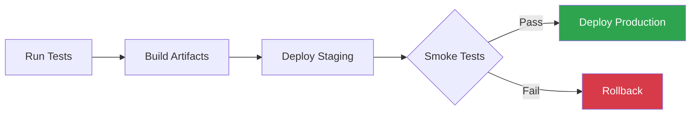

# /beautify-docs - Beautify Documentation

Transform plain or inconsistent markdown documentation into visually stunning, professional, and easy-to-navigate files.

## Arguments

$ARGUMENTS

- No args: Beautify all `.md` files in the current project
- `<file>`: Beautify a specific markdown file
- `<directory>`: Beautify all `.md` files in that directory
- `--dry-run`: Show what would change without modifying files
- `--aggressive`: Apply maximum visual enhancement (more icons, more diagrams)

## Process

### 1. Discovery

Find target markdown files based on arguments:

```bash
# Specific file
Read the target file

# Directory or project-wide
Glob for **/*.md files
Exclude: node_modules, .git, vendor, dist, build, temp, __pycache__
```

### 2. Analyze Each File

Before making changes, understand:

- **File purpose**: README, guide, API docs, changelog, spec, config docs
- **Current state**: Existing formatting quality, headings, structure
- **Content type**: Technical reference, tutorial, overview, runbook
- **Audience**: Developers, end users, operators, stakeholders
- **Project context**: What tech stack, what visual conventions already exist

### 3. Apply Beautification Rules

Work through each rule set below **in order**. Preserve all existing content meaning — only enhance presentation.

### 4. Verify

After editing, re-read the file to confirm:
- No content was lost or altered in meaning
- Markdown renders correctly (no broken syntax)
- Mermaid diagrams are syntactically valid
- Links and references still work
- Consistent style throughout the file

---

## Beautification Rules

### Rule 1: Heading Hierarchy & Icons

Add contextual icons to headings based on their content. Use a **single** emoji per heading, chosen to match the topic.

**Icon mapping** (pick the most specific match):

| Topic Pattern | Icon | Example |
|--------------|------|---------|
| Overview / Introduction / About | `📋` | `## 📋 Overview` |
| Getting Started / Quick Start / Setup | `🚀` | `## 🚀 Getting Started` |
| Installation / Install / Deploy | `📦` | `## 📦 Installation` |
| Configuration / Settings / Config | `⚙️` | `## ⚙️ Configuration` |
| Usage / How to / Examples | `💡` | `## 💡 Usage` |
| API / Endpoints / Reference | `🔌` | `## 🔌 API Reference` |
| Architecture / Design / Structure | `🏗️` | `## 🏗️ Architecture` |
| Security / Auth / Permissions | `🔒` | `## 🔒 Security` |
| Testing / Tests / QA | `🧪` | `## 🧪 Testing` |
| Performance / Optimization | `⚡` | `## ⚡ Performance` |
| Troubleshooting / FAQ / Debug | `🔧` | `## 🔧 Troubleshooting` |
| Contributing / Development | `🤝` | `## 🤝 Contributing` |
| License / Legal | `📄` | `## 📄 License` |
| Changelog / History / Updates | `📝` | `## 📝 Changelog` |
| Dependencies / Requirements | `📎` | `## 📎 Dependencies` |
| Database / Storage / Data | `🗄️` | `## 🗄️ Database` |
| Networking / Connections | `🌐` | `## 🌐 Networking` |
| Monitoring / Logging / Alerts | `📊` | `## 📊 Monitoring` |
| CI/CD / Pipelines / Workflows | `🔄` | `## 🔄 CI/CD Pipeline` |
| Commands / CLI | `⌨️` | `## ⌨️ Commands` |
| Files / Directory / Structure | `📁` | `## 📁 Project Structure` |
| Features / Capabilities | `✨` | `## ✨ Features` |
| Roadmap / Future / Plans | `🗺️` | `## 🗺️ Roadmap` |
| Notes / Important / Warning | `⚠️` | `## ⚠️ Important Notes` |
| Links / Resources / Related | `🔗` | `## 🔗 Related Resources` |
| Summary / TL;DR | `📌` | `## 📌 Summary` |

**Rules:**
- Only add icons to H2 (`##`) and H3 (`###`) headings
- H1 (`#`) gets NO icon (it's the document title)
- Don't add icons if they're already present
- Don't double-icon: `## 🚀 🚀 Getting Started` is wrong

### Rule 2: Table of Contents

Add a TOC after the title heading for files with **4 or more H2 sections**.

```markdown
## 📑 Table of Contents

- [Overview](#-overview)
- [Getting Started](#-getting-started)
- [Configuration](#️-configuration)
- [API Reference](#-api-reference)
- [Troubleshooting](#-troubleshooting)
```

**Rules:**
- Use the heading text (with icon) as link text
- Anchor links must match GitHub's auto-generated anchors
- Skip the TOC heading itself
- Place between H1 title and first H2

### Rule 3: Summary / TL;DR Block

Add a highlighted summary block near the top for files longer than 100 lines:

```markdown
> **TL;DR** — This project is a CLI tool that automates deployment of Claude Code
> skills, commands, and agents. Run `./setup-global.sh` to deploy everything,
> or `./setup-global.sh --wsl` to include WSL support.
```

Or use a blockquote callout style:

```markdown
> [!NOTE]
> **Quick Summary**: One-shot deployment of 265 skills, 74 commands, and 17 agents
> to `~/.claude/`. Supports Windows (PowerShell) and WSL/Linux (Bash).
```

### Rule 4: Badges & Labels

Add status badges at the top of README files using shield.io markdown or plain labels:

```markdown


```

Or use simple inline labels for non-README docs:

```markdown
`🟢 Production` `v3.0` `265 skills` `74 commands`
```

**Rules:**
- Only add badges to top-level READMEs and main project docs
- Use inline labels (`🟢 Active`, `🔴 Deprecated`, `🟡 Beta`) for status in tables
- Match badge colors to actual status: green=production, yellow=beta, red=deprecated

### Rule 5: Mermaid Diagrams

Add mermaid diagrams wherever structure, flow, or relationships can be visualized. **Generate these from the actual content** — don't add generic placeholders.

**When to add:**

| Content Pattern | Diagram Type | Mermaid Syntax |
|----------------|-------------|----------------|
| Step-by-step process, workflow | Flowchart | `flowchart TD` or `flowchart LR` |
| System components, services | Architecture | `flowchart TD` with subgraphs |
| Data flow, pipelines | Sequence or flowchart | `sequenceDiagram` |
| State transitions, lifecycle | State diagram | `stateDiagram-v2` |
| Timelines, milestones | Timeline | `timeline` |
| Class/module relationships | Class diagram | `classDiagram` |
| Git workflows, branching | Gitgraph | `gitGraph` |
| Entity relationships | ER diagram | `erDiagram` |
| Hierarchies, org charts | Flowchart with subgraphs | `flowchart TD` |
| Task dependencies | Gantt | `gantt` |
| User journeys | Journey | `journey` |
| Pie charts for distributions | Pie | `pie` |

**Example — convert a text workflow to a diagram:**

Before:
```markdown
## Deployment Process
1. Run tests
2. Build artifacts
3. Deploy to staging
4. Run smoke tests
5. If passed, deploy to production
6. If failed, rollback
```

After:
````markdown
## 🚀 Deployment Process



1. Run tests locally and in CI
2. Build artifacts for target environment
3. Deploy to staging for validation
4. Run smoke tests against staging
5. **Pass** → deploy to production
6. **Fail** → rollback and investigate
````

**Rules:**
- Always validate mermaid syntax mentally before writing
- Use `style` directives for color: green for success, red for failure, blue for active
- Keep diagrams focused — max 15 nodes per diagram
- Add diagram before the text explanation, not after
- Use `LR` (left-right) for linear flows, `TD` (top-down) for hierarchies

### Rule 6: Tables

Convert parallel information into tables. Upgrade existing tables.

**Convert lists to tables when items have consistent attributes:**

Before:
```markdown
- **skill-validator**: Validates SKILL.md structure. Status: completed.
- **code-reviewer**: Analyzes code changes. Status: completed.
- **test-generator**: Generates test suites. Status: completed.
```

After:
```markdown
| Agent | Description | Status |
|-------|-------------|--------|
| `skill-validator` | Validates SKILL.md structure | `🟢 Completed` |
| `code-reviewer` | Analyzes code changes | `🟢 Completed` |
| `test-generator` | Generates test suites | `🟢 Completed` |
```

**Table formatting rules:**
- Use code backticks for file names, commands, IDs
- Use status labels: `🟢 Completed`, `🟡 In Progress`, `🔴 Blocked`, `⚪ Planned`
- Align columns for readability
- Add a header row always
- Bold the most important column

### Rule 7: Code Blocks

Ensure all code blocks have:

1. **Language identifier**: ` ```bash `, ` ```python `, ` ```yaml `, etc.
2. **Comment header** for context (when the purpose isn't obvious):
   ```bash
   # Deploy all skills to ~/.claude/
   ./setup-global.sh --all --force
   ```
3. **Highlight key lines** with comments when showing long blocks

**Inline code rules:**
- File paths: `` `~/.claude/settings.json` ``
- Commands: `` `git push origin master` ``
- Variables/keys: `` `ARCHON_PROJECT_ID` ``
- Status values: `` `todo` ``, `` `doing` ``, `` `done` ``
- Don't overuse — plain text for regular words

### Rule 8: Callout Blocks

Use GitHub-flavored callout blocks for important information:

```markdown
> [!NOTE]
> Useful information that users should know, even when skimming.

> [!TIP]
> Helpful advice for doing things better or more easily.

> [!IMPORTANT]
> Key information users need to know to achieve their goal.

> [!WARNING]
> Urgent info that needs immediate user attention to avoid problems.

> [!CAUTION]
> Advises about risks or negative outcomes of certain actions.
```

**When to use:**
- `NOTE`: Background context, FYI items
- `TIP`: Best practices, shortcuts, pro tips
- `IMPORTANT`: Prerequisites, critical config, breaking changes
- `WARNING`: Data loss risks, security concerns, deprecated features
- `CAUTION`: Irreversible actions, destructive commands

### Rule 9: Checklists

Convert sequential instructions into checklists when they represent tasks a user performs:

```markdown
## ✅ Pre-deployment Checklist

- [ ] All tests passing (`npm test`)
- [ ] Environment variables configured in `.env`
- [ ] Database migrations applied
- [ ] Security review completed
- [ ] Changelog updated
- [ ] Version bumped in `package.json`
```

**Rules:**
- Use `- [ ]` for incomplete items (setup guides, requirements)
- Use `- [x]` for items that are already done (status reports)
- Group related items under descriptive subheadings
- Add inline code for commands or file references

### Rule 10: Visual Separators & Spacing

- Add `---` horizontal rules between major sections
- Add blank lines before and after code blocks, tables, and diagrams
- Use `<details>` blocks for long reference content:

```markdown
<details>
<summary>📁 Full directory structure (click to expand)</summary>

```
project/
├── src/
│   ├── api/
│   └── services/
├── tests/
└── docs/
```

</details>
```

### Rule 11: Breadcrumbs & Navigation

For files in subdirectories, add breadcrumb navigation at the top:

```markdown
[Home](../../README.md) > [Scripts](../README.md) > **Statusline**
```

Add navigation links at the bottom for related docs:

```markdown
---

## 🔗 Related

| Document | Description |
|----------|-------------|
| [Setup Guide](../setup-global.md) | Global deployment instructions |
| [Skill Guide](../skill-guide.md) | How to create skills |
| [Architecture](../architecture.md) | System design overview |

---

*Last updated: 2026-03-06*
```

### Rule 12: Directory Trees

When documenting project structure, use proper tree formatting:

```
claude-tools/
├── 📁 skills/          # 265 production skills (19 categories)
│   ├── ai-development/  # 46 skills
│   ├── frontend-ui/     # 28 skills
│   └── ...
├── 📁 commands/         # 74 slash commands (11 categories)
├── 📁 mcp-servers/      # 4 MCP server implementations
├── 📁 agents/           # 17 autonomous agents
├── 📁 scripts/          # Deployment & management
├── 📁 docs/             # Documentation
├── 📄 CLAUDE.md         # Project instructions
└── 📄 README.md         # Project overview
```

**Rules:**
- Use `├──` and `└──` for tree lines
- Add folder icons `📁` and file icons `📄` in directory trees
- Add inline comments with counts or descriptions
- Collapse deep trees with `...` or `<details>` blocks

---

## File-Type Specific Enhancements

### README.md Files

Must include (add if missing):
1. Project title (H1) with one-line description
2. Badges row (status, version, key metrics)
3. TL;DR summary block
4. Table of Contents
5. Visual architecture diagram (mermaid)
6. Quick start section with copy-paste commands
7. Feature highlights table or list
8. Footer with links, last updated date

### CHANGELOG.md Files

Format with:
- Version headings: `## [1.2.0] - 2026-03-06`
- Change type labels: `### ✨ Added`, `### 🐛 Fixed`, `### 💥 Breaking`
- Each entry as a bullet with context

### API Documentation

Include:
- Endpoint table with method badges: `🟢 GET`, `🔵 POST`, `🟡 PUT`, `🔴 DELETE`
- Request/response code blocks with language hints
- Mermaid sequence diagrams for complex flows
- Authentication section with callout blocks

### Guides / Tutorials

Include:
- Numbered step headings: `### Step 1: Install Dependencies`
- Checklists for prerequisites
- Code blocks with copy-paste commands
- Expected output blocks
- Troubleshooting section at the end

---

## Quality Checklist

After beautifying, verify:

- [ ] Every H2/H3 heading has an appropriate icon
- [ ] Files with 4+ sections have a Table of Contents
- [ ] Long files (100+ lines) have a TL;DR summary
- [ ] Processes/workflows have mermaid diagrams
- [ ] Parallel information uses tables (not long lists)
- [ ] All code blocks have language identifiers
- [ ] Important notes use callout blocks (`> [!NOTE]`, etc.)
- [ ] Setup instructions use checklists
- [ ] Subdirectory files have breadcrumb navigation
- [ ] Project structure uses tree formatting with icons
- [ ] No broken markdown syntax
- [ ] No content meaning was altered
- [ ] Consistent style throughout the file
- [ ] Visual separators between major sections

---

## Anti-Patterns (DO NOT)

- **Don't over-icon**: One icon per heading, not `## 🚀 ✨ 🎯 Getting Started`
- **Don't add generic diagrams**: Every diagram must reflect actual content
- **Don't break existing links**: Anchor changes from icons need link updates
- **Don't beautify generated files**: Skip auto-generated docs, lock files, manifests
- **Don't add badges to internal docs**: Badges are for public-facing READMEs
- **Don't create walls of tables**: Use tables for structured data, prose for narratives
- **Don't remove existing content**: Only enhance, never delete substantive text
- **Don't add images that don't exist**: Only reference images that are actually in the repo
