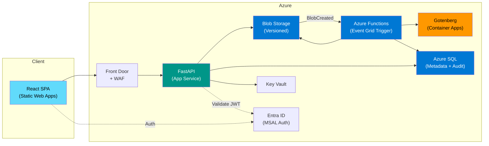
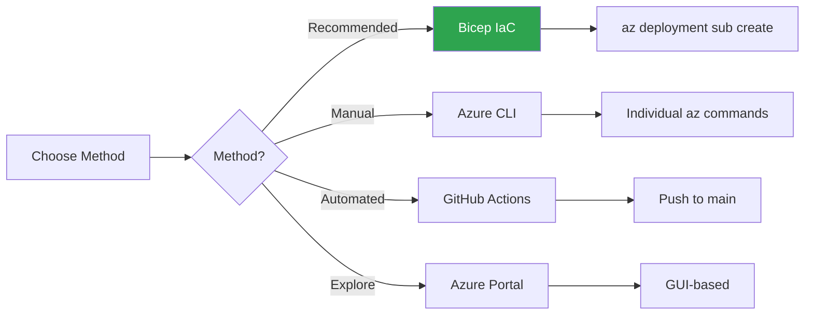

# AssuranceNet Document Management System


> **TL;DR** — Azure-native document management system replacing Oracle UCM for FSIS AssuranceNet.
> Upload, convert, merge, and version food safety investigation documents using FastAPI + React + Azure Bicep.
> Run `./scripts/setup/init-dev.sh` to set up locally, or deploy to Azure with `az deployment sub create`.

---

## 📑 Table of Contents

- [Architecture](#-architecture)
- [Quick Start](#-quick-start)
- [FSIS Demo Data](#-fsis-demo-data)
- [Project Structure](#-project-structure)
- [Deployment](#-deployment)
- [CI/CD](#-cicd)
- [Documentation](#-documentation)
- [API Endpoints](#-api-endpoints)
- [Environment Variables](#️-environment-variables)
- [License](#-license)

---

## 🏗️ Architecture



| Component | Technology | Location |
|-----------|-----------|----------|
| **Frontend** | React 18 + TypeScript + Vite | `src/frontend/` |
| **Backend API** | Python 3.11+ FastAPI | `src/backend/` |
| **PDF Pipeline** | Event Grid + Azure Functions + Gotenberg | `src/functions/` |
| **Storage** | Azure Blob Storage (versioned) | Backend services |
| **Database** | Azure SQL (SQLAlchemy + Alembic) | `src/backend/app/db/` |
| **Auth** | Microsoft Entra ID (MSAL) | Both frontend and backend |
| **IaC** | Bicep modules (dev/staging/prod) | `infra/` |
| **Compliance** | NIST 800-53 Rev 5, Splunk SIEM integration | Infrastructure layer |

---

## 🚀 Quick Start

### Prerequisites

- Python 3.11+
- Node.js 20+
- Azure CLI
- ODBC Driver 18

```bash
# Initialize development environment
./scripts/setup/init-dev.sh

# Backend
cd src/backend
source .venv/bin/activate
uvicorn app.main:app --reload

# Frontend (separate terminal)
cd src/frontend
npm run dev

# Seed with FSIS demo data (after backend is running)
./scripts/setup/seed-data.sh
```

---

## 🗄️ FSIS Demo Data

The system includes demo data sourced from the [FSIS Science & Data portal](https://www.fsis.usda.gov/science-data):

| Investigation | Content | Source |
|---|---|---|
| FY2025 Annual Sampling Program | Annual sampling plans (FY2024–FY2025) | [Sampling Program](https://www.fsis.usda.gov/science-data/sampling-program) |
| National Residue Program | Red Book, Blue Book, quarterly reports | [Chemical Residues](https://www.fsis.usda.gov/science-data/data-sets-visualizations/chemical-residues-and-contaminants) |
| Microbiology Baseline Data | Sampling summary reports (FY2021, FY2024) | [Microbiology](https://www.fsis.usda.gov/science-data/data-sets-visualizations/microbiology) |
| MPI Directory Audit | Establishment directories (CSV) | [Laboratory Data](https://www.fsis.usda.gov/science-data/data-sets-visualizations/laboratory-sampling-data) |
| STEC Sampling Results | E. coli O157:H7 and non-O157 STEC data | [Sampling Results](https://www.fsis.usda.gov/science-data/sampling-program/sampling-results-fsis-regulated-products) |

Run `./scripts/setup/seed-data.sh` to create investigations and download sample files.
See [`scripts/setup/fsis-demo-data.json`](scripts/setup/fsis-demo-data.json) for the full data configuration.

---

## 📁 Project Structure

```
ucm-azure-native-demo/
├── 📁 infra/                  # Bicep infrastructure-as-code
│   ├── 📁 modules/            # 18 modular Azure resource definitions
│   └── 📁 parameters/         # Environment-specific parameters (dev/staging/prod)
├── 📁 src/
│   ├── 📁 backend/            # FastAPI Python API
│   ├── 📁 frontend/           # React TypeScript SPA
│   └── 📁 functions/          # Azure Functions (PDF conversion)
├── 📁 docs/
│   ├── 📁 architecture/       # Architecture documentation (7 docs)
│   ├── 📁 adr/                # Architecture Decision Records (6 ADRs)
│   ├── 📁 api/                # OpenAPI specification
│   ├── 📁 diagrams/           # Excalidraw interactive diagrams
│   ├── 📁 guides/             # User, deployment, developer, operations guides
│   └── 📁 runbooks/           # Operational runbooks (4 runbooks)
├── 📁 scripts/
│   ├── 📁 migration/          # UCM to Azure migration tooling
│   └── 📁 setup/              # Dev environment setup + FSIS demo data
├── 📁 tests/
│   ├── 📁 backend/            # Python unit + integration tests
│   ├── 📁 functions/          # Azure Functions tests
│   ├── 📁 frontend/           # React component + E2E tests
│   └── 📁 infra/              # Bicep validation tests
├── 📄 CLAUDE.md               # Claude Code project instructions
├── 📄 CONTRIBUTING.md         # Contribution guidelines
├── 📄 SECURITY.md             # Security policy
└── 📄 README.md               # This file
```

---

## 📦 Deployment

Multiple deployment methods are supported. See the [Deployment Guide](docs/guides/deployment-guide.md) for complete instructions.



| Method | Command | Best For |
|---|---|---|
| **Bicep** (recommended) | `az deployment sub create --template-file infra/main.bicep --parameters infra/parameters/dev.bicepparam` | Full environment deployment |
| **Azure CLI** | Individual `az` commands per resource | Learning, single resource changes |
| **Azure PowerShell** | `New-AzResourceGroup`, `New-AzResourceGroupDeployment` | PowerShell-based workflows |
| **Azure Portal** | GUI-based resource creation | Exploration, manual verification |
| **GitHub Actions** | Push to `main` branch | Automated CI/CD |

### 🚀 Quick Deploy (Bicep)

```bash
# Login
az login
az account set --subscription <your-subscription-id>

# Validate
az deployment sub what-if --location eastus \
  --template-file infra/main.bicep \
  --parameters infra/parameters/dev.bicepparam

# Deploy
az deployment sub create --location eastus \
  --template-file infra/main.bicep \
  --parameters infra/parameters/dev.bicepparam
```

---

## 🔄 CI/CD

| Workflow | Trigger | Purpose |
|---|---|---|
| `ci.yml` | PR to main | Lint, test, security scan, Bicep validate |
| `deploy-infra.yml` | Push to main (`infra/`) | Bicep infrastructure deployment |
| `deploy-backend.yml` | Push to main (`src/backend/`) | API build + deploy to App Service |
| `deploy-frontend.yml` | Push to main (`src/frontend/`) | SPA build + deploy to Static Web App |
| `deploy-functions.yml` | Push to main (`src/functions/`) | Functions build + deploy |
| `db-migrate.yml` | Manual dispatch | Alembic database migrations |
| `integration-tests.yml` | Manual dispatch | Playwright E2E tests |

---

## 📚 Documentation

### 📖 Guides

| Guide | Audience | Description |
|-------|----------|-------------|
| [User Guide](docs/guides/user-guide.md) | FSIS Staff | End-user documentation |
| [Deployment Guide](docs/guides/deployment-guide.md) | DevOps | Step-by-step deployment (Portal, CLI, Bicep, GitHub Actions) |
| [Developer Guide](docs/guides/developer-guide.md) | Developers | Dev environment setup, coding patterns, testing |
| [Operations Guide](docs/guides/operations-guide.md) | SRE / Ops | Monitoring, alerting, maintenance, backup/recovery |
| [Best Practices](docs/guides/best-practices.md) | All | Security, infrastructure, development best practices |
| [Troubleshooting](docs/guides/troubleshooting.md) | All | Common issues with symptoms, causes, and solutions |

### 🏗️ Architecture

| Document | Description |
|----------|-------------|
| [High-Level Architecture](docs/architecture/high-level-architecture.md) | System overview and component relationships |
| [Detailed Azure Architecture](docs/architecture/azure-architecture-detail.md) | Resource groups, networking, managed identities |
| [User Workflow Diagrams](docs/architecture/workflow-diagrams.md) | Sequence diagrams for all user flows |
| [Blob Hierarchy Specification](docs/architecture/blob-hierarchy.md) | Storage container layout and naming conventions |
| [Security Architecture](docs/architecture/security-architecture.md) | Authentication, authorization, encryption |
| [Monitoring & Telemetry](docs/architecture/monitoring-telemetry.md) | OpenTelemetry, App Insights, Log Analytics |
| [Data Migration Strategy](docs/architecture/data-migration.md) | Oracle UCM to Azure migration approach |

### 📎 Reference

| Resource | Description |
|----------|-------------|
| [Architecture Decision Records](docs/adr/) | ADR-001 through ADR-006 |
| [OpenAPI Specification](docs/api/openapi-spec.yaml) | Full API contract |
| [Deployment Runbook](docs/runbooks/deployment.md) | Step-by-step deployment procedures |
| [Incident Response Runbook](docs/runbooks/incident-response.md) | Incident handling procedures |
| [Data Migration Runbook](docs/runbooks/data-migration-runbook.md) | Migration execution steps |
| [Splunk Integration Runbook](docs/runbooks/splunk-integration.md) | SIEM integration setup |

---

## 🔌 API Endpoints

| Method | Endpoint | Description |
|---|---|---|
| `🟢 GET` | `/api/v1/health` | Liveness probe |
| `🟢 GET` | `/api/v1/health/ready` | Readiness probe (DB + storage) |
| `🟢 GET` | `/api/v1/investigations/` | List investigations |
| `🔵 POST` | `/api/v1/investigations/` | Create investigation |
| `🟢 GET` | `/api/v1/investigations/{id}` | Get investigation details |
| `🟢 GET` | `/api/v1/investigations/{id}/documents` | List documents for investigation |
| `🔵 POST` | `/api/v1/documents/upload` | Upload document (multipart) |
| `🟢 GET` | `/api/v1/documents/{id}` | Get document metadata |
| `🟢 GET` | `/api/v1/documents/{id}/download` | Download original file |
| `🟢 GET` | `/api/v1/documents/{id}/pdf` | Download PDF version |
| `🟢 GET` | `/api/v1/documents/{id}/versions` | List document versions |
| `🔴 DELETE` | `/api/v1/documents/{id}` | Soft-delete document |
| `🔵 POST` | `/api/v1/investigations/{recordId}/merge-pdf` | Merge multiple PDFs |
| `🔵 POST` | `/api/v1/audit/logs` | Query audit logs (Admin) |

---

## ⚙️ Environment Variables

See [`src/backend/.env.example`](src/backend/.env.example) for the complete reference.

| Variable | Description | Default |
|---|---|---|
| `ENVIRONMENT` | Environment name (`dev`/`staging`/`prod`) | `dev` |
| `AZURE_STORAGE_ACCOUNT_NAME` | Storage account name | — |
| `AZURE_SQL_SERVER` | SQL server FQDN | — |
| `AZURE_SQL_DATABASE` | SQL database name | — |
| `AZURE_KEY_VAULT_URI` | Key Vault URI | — |
| `ENTRA_TENANT_ID` | Entra ID tenant | — |
| `ENTRA_CLIENT_ID` | API app registration client ID | — |
| `ENTRA_AUDIENCE` | JWT audience | `api://assurancenet-api` |
| `MAX_UPLOAD_SIZE_MB` | Max file upload size | `500` |
| `MAX_MERGE_FILES` | Max files in PDF merge | `50` |

---

## 📄 License

MIT

---

*Last updated: 2026-03-10*
