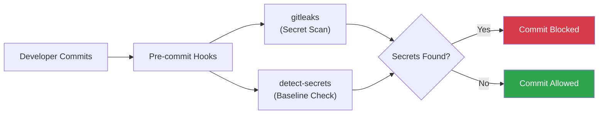

# Security Policy

> **TL;DR** — Report vulnerabilities privately (never via public issues). Pre-commit hooks enforce
> secret detection with gitleaks and detect-secrets. All contributors must follow the security checklist below.

---

## 📑 Table of Contents

- [Reporting a Vulnerability](#-reporting-a-vulnerability)
- [Security Features](#-security-features)
- [Supported Versions](#-supported-versions)
- [Security Checklist for Contributors](#-security-checklist-for-contributors)
- [Additional Resources](#-additional-resources)

---

## 🔒 Reporting a Vulnerability

We take security seriously. If you discover a security vulnerability, please report it responsibly.

### 📋 How to Report

1. **Do NOT** open a public issue for security vulnerabilities
2. Email security concerns to the repository maintainers
3. Include detailed information about the vulnerability
4. Allow reasonable time for response before public disclosure

### 📎 What to Include

- Description of the vulnerability
- Steps to reproduce
- Potential impact
- Suggested fix (if any)

### ⏱️ Response Timeline

| Phase | Timeframe |
|-------|-----------|
| **Initial Response** | Within 48 hours |
| **Status Update** | Within 7 days |
| **Resolution Target** | Within 30 days (depending on severity) |

---

## 🛡️ Security Features

This repository includes several security measures:



### 🔍 Secret Detection

| Tool | Purpose | Configuration |
|------|---------|---------------|
| **gitleaks** | Scans commits for hardcoded secrets (API keys, passwords, private keys, tokens, connection strings) | `.gitleaks.toml` |
| **detect-secrets** | Baseline-aware secret detection with support for multiple secret types | `.secrets.baseline` |

### 🔗 Pre-commit Hooks

All security tools run automatically before commits:

```yaml
# .pre-commit-config.yaml
repos:
  - repo: https://github.com/gitleaks/gitleaks
    hooks:
      - id: gitleaks

  - repo: https://github.com/Yelp/detect-secrets
    hooks:
      - id: detect-secrets
```

### ✅ Best Practices Enforced

| Practice | How |
|----------|-----|
| No secrets in code | Use environment variables |
| No sensitive files committed | `.gitignore` blocks `.env` files |
| Automated scanning | Pre-commit hooks catch issues early |
| Code review required | CODEOWNERS enforces review |

---

## 📋 Supported Versions

| Version | Supported |
|---------|-----------|
| 1.x.x | :white_check_mark: |

---

## ✅ Security Checklist for Contributors

Before submitting code:

- [ ] No hardcoded secrets, API keys, or passwords
- [ ] No sensitive file paths or personal information
- [ ] Environment variables used for configuration
- [ ] Pre-commit hooks pass locally
- [ ] No new security warnings introduced

> [!CAUTION]
> Never commit secrets, API keys, passwords, or credentials in any file. Use environment variables and `.env` files (which are gitignored) for sensitive values.

---

## 🔗 Additional Resources

| Resource | Link |
|----------|------|
| OWASP Secure Coding Practices | [owasp.org](https://owasp.org/www-project-secure-coding-practices-quick-reference-guide/) |
| GitHub Security Best Practices | [docs.github.com](https://docs.github.com/en/code-security) |
| gitleaks Documentation | [github.com/gitleaks](https://github.com/gitleaks/gitleaks) |
| detect-secrets Documentation | [github.com/Yelp/detect-secrets](https://github.com/Yelp/detect-secrets) |

---

*Last updated: 2026-03-10*
