[Home](../../README.md) > [Architecture](.) > **Detailed Azure Architecture**

# Detailed Azure Architecture

> **TL;DR:** The system is organized into five resource groups (network, app, data, security, monitoring). It uses a hub-spoke VNet with private endpoints for all data services, managed identities for authentication, and environment-specific sizing from B1/Serverless (dev) to P1v3/Gen5 (prod).

---

## Table of Contents

- [Resource Groups](#resource-groups)
- [Architecture Diagram](#architecture-diagram)
- [Networking Detail](#networking-detail)
- [Managed Identity Role Assignments](#managed-identity-role-assignments)
- [Environment Sizing](#environment-sizing)

---

## 🏗️ Resource Groups

| Resource Group | Purpose |
|---|---|
| `rg-assurancenet-network-{env}` | VNet, subnets, NSGs, Front Door |
| `rg-assurancenet-app-{env}` | App Service, Static Web App, Functions, Container Apps |
| `rg-assurancenet-data-{env}` | Storage Account, Azure SQL |
| `rg-assurancenet-security-{env}` | Key Vault, Managed Identities, Policy, Defender |
| `rg-assurancenet-monitoring-{env}` | Log Analytics, App Insights, Event Hubs, Dashboards |

---

## 🏗️ Architecture Diagram

```mermaid
graph TB
    subgraph RG_NET["rg-assurancenet-network-{env}"]
        VNET["VNet: vnet-assurancenet-{env}<br/>10.0.0.0/16"]
        SNET_BE["Subnet: snet-backend<br/>10.0.1.0/24"]
        SNET_FN["Subnet: snet-functions<br/>10.0.2.0/24"]
        SNET_PE["Subnet: snet-private-endpoints<br/>10.0.3.0/24"]
        SNET_CA["Subnet: snet-container-apps<br/>10.0.5.0/24"]
        NSG_BE["NSG: nsg-backend"]
        NSG_FN["NSG: nsg-functions"]
        NSG_PE["NSG: nsg-private-endpoints"]
        FD["Azure Front Door Premium<br/>+ WAF Policy"]
    end

    subgraph RG_APP["rg-assurancenet-app-{env}"]
        ASP["App Service Plan<br/>Linux, P1v3 prod / B1 dev"]
        APP["App Service<br/>Python 3.11, FastAPI"]
        APP_SLOT["Staging Slot"]
        SWA2["Static Web App<br/>React 18+ TypeScript"]
        FUNC["Function App<br/>Python 3.11, Event Grid Trigger"]
        CA_GOT["Container App: Gotenberg<br/>gotenberg/gotenberg:8<br/>Scale: 0-5"]
    end

    subgraph RG_DATA["rg-assurancenet-data-{env}"]
        SA["Storage Account<br/>StorageV2, Versioning Enabled"]
        CONT["Container: assurancenet-documents"]
        SQLSRV["SQL Server<br/>Azure AD Auth Only, TLS 1.2"]
        SQLDB["SQL Database<br/>Gen5 4vCores prod / Serverless dev"]
    end

    subgraph RG_SEC["rg-assurancenet-security-{env}"]
        KV2["Key Vault<br/>Standard, Soft Delete 90d"]
        MI_APP["MI: mi-app-assurancenet-{env}"]
        MI_FUNC["MI: mi-func-assurancenet-{env}"]
    end

    subgraph RG_MON["rg-assurancenet-monitoring-{env}"]
        LAW["Log Analytics Workspace<br/>90d interactive + 3yr archive"]
        AI_BE["App Insights: backend"]
        AI_FN["App Insights: functions"]
        AI_FE["App Insights: frontend"]
        EVHNS["Event Hub Namespace"]
        DASHBOARD["Azure Dashboard"]
    end

    FD --> SWA2
    FD --> APP
    APP --> APP_SLOT
    ASP --> APP
    APP -.->|VNet| SNET_BE
    FUNC -.->|VNet| SNET_FN
    CA_GOT -.->|VNet| SNET_CA
    SA --> CONT
    SQLSRV --> SQLDB
    APP -->|Read/Write| SA
    APP -->|Metadata| SQLDB
    APP -->|Secrets| KV2
    FUNC -->|Convert| CA_GOT
    FUNC -->|Store PDF| SA
    FUNC -->|Update Status| SQLDB
    MI_APP -.->|Assigned to| APP
    MI_FUNC -.->|Assigned to| FUNC
    APP -->|Telemetry| AI_BE
    FUNC -->|Telemetry| AI_FN
    SWA2 -->|Telemetry| AI_FE
    AI_BE & AI_FN & AI_FE -->|Ingest| LAW
    LAW -->|Export| EVHNS
```

---

## 🌐 Networking Detail

### 🌐 Subnet Allocation

| Subnet | CIDR | Purpose | NSG Rules |
|---|---|---|---|
| snet-backend | 10.0.1.0/24 | App Service VNet integration | HTTPS from AzureFrontDoor.Backend only |
| snet-functions | 10.0.2.0/24 | Function App VNet integration | EventGrid service tag inbound |
| snet-private-endpoints | 10.0.3.0/24 | Private Endpoints | From snet-backend and snet-functions only |
| snet-container-apps | 10.0.5.0/24 | Container Apps Environment | From snet-functions only |

> [!IMPORTANT]
> Subnet 10.0.4.0/24 is reserved for future use (e.g., additional container workloads or gateway integrations).

### 🌐 Private Endpoints

| Service | DNS Zone |
|---|---|
| Azure Blob Storage | `privatelink.blob.core.windows.net` |
| Azure SQL Database | `privatelink.database.windows.net` |
| Azure Key Vault | `privatelink.vaultcore.azure.net` |
| Azure Event Hub | `privatelink.servicebus.windows.net` |

---

## 🔒 Managed Identity Role Assignments

### 🔒 mi-app-assurancenet-{env}

| Role | Scope |
|------|-------|
| Storage Blob Data Contributor | Storage Account |
| Key Vault Secrets User | Key Vault |
| SQL db_datareader + db_datawriter | SQL Database |

### 🔒 mi-func-assurancenet-{env}

| Role | Scope |
|------|-------|
| Storage Blob Data Contributor | Storage Account |
| Key Vault Secrets User | Key Vault |
| SQL db_datawriter | SQL Database |

---

## ⚙️ Environment Sizing

| Resource | Dev | Staging | Prod |
|---|---|---|---|
| App Service Plan | B1 | P1v3 | P1v3 |
| SQL Database | Serverless | Gen5 2vCores | Gen5 4vCores |
| Storage Replication | LRS | GRS | GRS |
| Front Door | Standard | Premium | Premium |
| Gotenberg Replicas | 0-2 | 0-3 | 0-5 |
| Log Analytics Retention | 30d | 90d | 90d + 3yr archive |

> [!NOTE]
> Dev environments use cost-optimized tiers (B1, Serverless, LRS) to minimize spend. Staging mirrors production sizing for accurate performance testing.

---

**Related Architecture Docs:**
[High-Level Architecture](high-level-architecture.md) | [Workflow Diagrams](workflow-diagrams.md) | [Blob Hierarchy](blob-hierarchy.md) | [Security Architecture](security-architecture.md) | [Monitoring & Telemetry](monitoring-telemetry.md) | [Data Migration](data-migration.md)
