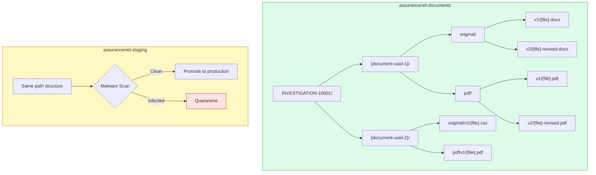

[Home](../../README.md) > [Architecture](.) > **Blob Storage Hierarchy**

# Blob Storage Hierarchy

> **TL;DR:** Documents are stored in Azure Blob Storage using a versioned, deterministic hierarchy: `{container}/{record_id}/{document_id}/original/v{N}/{filename}` for originals and `.../pdf/v{N}/{filename}.pdf` for converted PDFs. Each new upload increments the version directory (`v1`, `v2`, ...). All retrieval is metadata-driven -- the system never lists blobs to discover files. A separate staging container (`assurancenet-staging`) holds uploads during malware scanning before promotion to the production container.

---

## Table of Contents

- [Naming Convention](#naming-convention)
- [Staging Container](#staging-container)
- [Example](#example)
- [FSIS Real-World Examples](#fsis-real-world-examples)
- [Design Rationale](#design-rationale)

---

## Naming Convention

```text
{container}/
  {record_id}/
    {document_id}/
      original/
        v{N}/
          {filename}
      pdf/
        v{N}/
          {filename}.pdf
```

| Segment | Description |
|---------|-------------|
| `{container}` | `assurancenet-documents` (production) or `assurancenet-staging` (pre-scan) |
| `{record_id}` | Investigation identifier, e.g. `INVESTIGATION-10001` |
| `{document_id}` | UUID of the logical document record in Azure SQL |
| `original/` | Directory for the uploaded source file (replaces the former `blob/` directory) |
| `v{N}/` | Version directory -- `v1` for the first upload, `v2` for a re-upload, and so on |
| `{filename}` | Sanitized original filename; stored as metadata, not used for identity |
| `pdf/` | Directory for the converted PDF rendition at the same version level |

Filenames are recorded in the `DocumentVersion` metadata row. The blob path itself is deterministic and constructed from `record_id`, `document_id`, and `version_number` -- the filename is included for human readability but is never used as a lookup key.

---

## Staging Container

Uploads follow a **two-phase** process:

1. **Stage** -- The file is written to `assurancenet-staging` using the same path structure as the production container.
2. **Scan** -- Azure Defender for Storage (or an equivalent malware-scanning service) inspects the blob.
3. **Promote** -- Once the blob is clean, `BlobService.promote_from_staging()` copies it to `assurancenet-documents` and deletes the staging copy.

If malware is detected the blob is quarantined and never promoted. This keeps the production container free of unscanned content.

---

## Visual Overview



---

## Example

```text
assurancenet-documents/
  INVESTIGATION-12345/
    a1b2c3d4-e5f6-7890-abcd-ef1234567890/
      original/
        v1/
          quarterly-report.docx             # First upload
        v2/
          quarterly-report-revised.docx     # Second upload (new version)
      pdf/
        v1/
          quarterly-report.pdf              # PDF of v1
        v2/
          quarterly-report-revised.pdf      # PDF of v2
    f9e8d7c6-b5a4-3210-fedc-ba9876543210/
      original/
        v1/
          photo-evidence.jpg
      pdf/
        v1/
          photo-evidence.pdf
```

Old versions (`v1/`) remain addressable by their full blob path. The `DocumentVersion` row with `is_latest = true` tells the application which version to serve by default.

---

## FSIS Real-World Examples

Based on actual FSIS Science & Data document types from [fsis.usda.gov/science-data](https://www.fsis.usda.gov/science-data):

```text
assurancenet-documents/
  INVESTIGATION-10001/                              # FY2025 Annual Sampling Program
    a1b2c3d4-e5f6-7890-abcd-ef1234567890/
      original/
        v1/
          FSIS-Annual-Sampling-Plan-FY2025.pdf      # Already PDF - no conversion needed
      pdf/
        v1/
          FSIS-Annual-Sampling-Plan-FY2025.pdf      # Passthrough copy
    b2c3d4e5-f6a7-8901-bcde-f12345678901/
      original/
        v1/
          FSIS-Annual-Sampling-Plan-FY2024.pdf
        v2/
          FSIS-Annual-Sampling-Plan-FY2024-amended.pdf  # Corrected version uploaded later
      pdf/
        v1/
          FSIS-Annual-Sampling-Plan-FY2024.pdf
        v2/
          FSIS-Annual-Sampling-Plan-FY2024-amended.pdf

  INVESTIGATION-10002/                              # National Residue Program
    c3d4e5f6-a7b8-9012-cdef-123456789012/
      original/
        v1/
          fy2019-red-book.pdf                       # Red Book (sampling results)
      pdf/
        v1/
          fy2019-red-book.pdf
    d4e5f6a7-b8c9-0123-defa-234567890123/
      original/
        v1/
          2019-blue-book.pdf                        # Blue Book (sampling plan)
      pdf/
        v1/
          2019-blue-book.pdf

  INVESTIGATION-10005/                              # MPI Directory Audit
    e5f6a7b8-c9d0-1234-efab-345678901234/
      original/
        v1/
          MPI_Directory_by_Establishment_Number.csv # CSV - converted to PDF
      pdf/
        v1/
          MPI_Directory_by_Establishment_Number.pdf # fpdf2-converted text table
    f6a7b8c9-d0e1-2345-fabc-456789012345/
      original/
        v1/
          MPI_Directory_by_Establishment_Name.csv
        v2/
          MPI_Directory_by_Establishment_Name.csv   # Re-uploaded after data correction
      pdf/
        v1/
          MPI_Directory_by_Establishment_Name.pdf
        v2/
          MPI_Directory_by_Establishment_Name.pdf   # Re-converted from corrected CSV
```

---

## Design Rationale

| Principle | Implementation | Benefit |
|-----------|---------------|---------|
| **Investigation-scoped** | All files for an investigation live under one `{record_id}/` prefix | Maps directly to FSIS investigation records; enables bulk operations per investigation |
| **Document ID isolation** | Each logical document gets a UUID folder (`{document_id}/`) | Prevents name collisions; decouples identity from filename |
| **Original/PDF separation** | Source and converted files in distinct paths (`original/` vs `pdf/`) | Clean separation of source and output; clear semantics |
| **Version isolation** | Each upload creates a new `v{N}/` directory under both `original/` and `pdf/` | Old versions remain intact and independently addressable; no overwrites |
| **Metadata-first retrieval** | All blob paths are stored in `DocumentVersion` rows; no blob listing for discovery | Faster lookups, no eventual-consistency issues from list operations, single source of truth |
| **Malware scanning staging** | Uploads land in `assurancenet-staging` before promotion to `assurancenet-documents` | Production container never contains unscanned content; clean quarantine boundary |
| **Event Grid filtering** | `/original/` path filter triggers PDF conversion; `/pdf/` is excluded | Prevents infinite conversion loops |
| **Deterministic paths** | Paths built from `record_id` + `document_id` + `version_number` -- no randomness beyond the UUID | Reproducible, auditable, easy to reason about in logs |
| **FSIS alignment** | Record IDs follow FSIS naming patterns (`INVESTIGATION-XXXXX`) | Consistent with upstream systems |

> [!WARNING]
> Never upload files directly to the `pdf/` path. Only the PDF conversion pipeline should write to `pdf/` folders. Direct uploads to `pdf/` will bypass audit logging and integrity checks.

---

**Related Architecture Docs:**
[High-Level Architecture](high-level-architecture.md) | [Azure Architecture Detail](azure-architecture-detail.md) | [Workflow Diagrams](workflow-diagrams.md) | [Security Architecture](security-architecture.md) | [Monitoring & Telemetry](monitoring-telemetry.md) | [Data Migration](data-migration.md)
