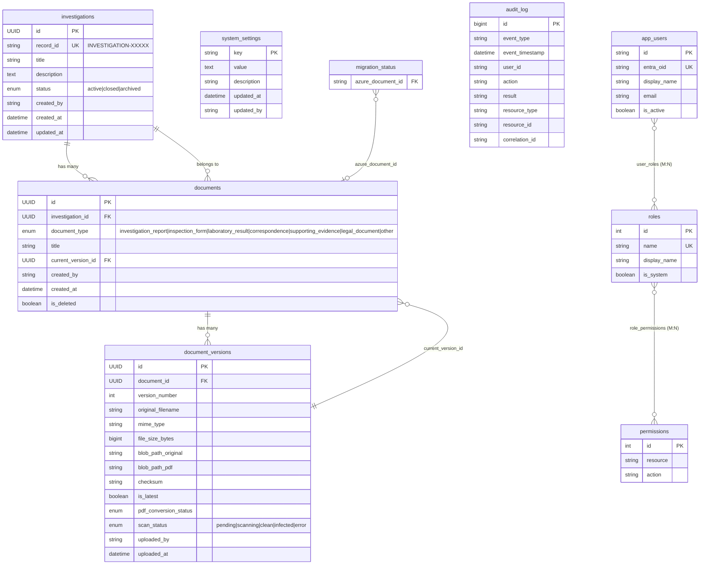
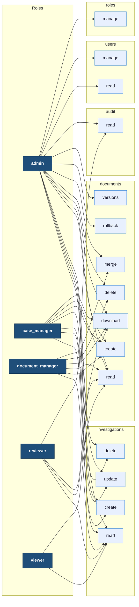
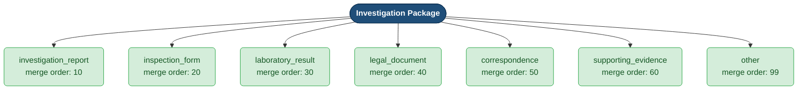

[Home](../../README.md) > [Architecture](.) > **Data Model & RBAC**

# Data Model & RBAC

> **TL;DR:** AssuranceNet uses Azure SQL with explicit document versioning (Document + DocumentVersion), admin-configurable system settings, and a granular RBAC model with 5 roles and 15 permissions.

---

## Table of Contents

- [Database Schema (ERD)](#database-schema-erd)
- [RBAC Model](#rbac-model)
- [Document Type Taxonomy](#document-type-taxonomy)

---

## Database Schema (ERD)

The schema follows an explicit versioning pattern: a `documents` row is the logical document, while each `document_versions` row is an immutable snapshot. The `current_version_id` foreign key on `documents` points back to the latest version — this is the only mutable pointer and is updated atomically on every upload or rollback.

---

## RBAC Model

Five roles span a least-privilege hierarchy from `viewer` (read-only) up to `admin` (full control). Permissions are stored as `resource:action` pairs in the `permissions` table and assigned to roles via the `role_permissions` junction table.

### Permission Matrix

| Permission | admin | case_manager | document_manager | reviewer | viewer |
|---|:---:|:---:|:---:|:---:|:---:|
| investigations:create | Y | Y | | | |
| investigations:read | Y | Y | Y | Y | Y |
| investigations:update | Y | Y | | | |
| investigations:delete | Y | Y | | | |
| documents:create | Y | Y | Y | | |
| documents:read | Y | Y | Y | Y | Y |
| documents:download | Y | Y | Y | Y | |
| documents:delete | Y | | Y | | |
| documents:merge | Y | | Y | | |
| documents:rollback | Y | | | | |
| documents:versions | Y | | | | |
| audit:read | Y | | | Y | |
| users:read | Y | | | | |
| users:manage | Y | | | | |
| roles:manage | Y | | | | |

---

## Document Type Taxonomy

Document types control both classification and PDF merge ordering. When an investigation package is merged, documents are sorted by `merge_order` so the output PDF flows logically from overview down to supporting material.

The `merge_order` values are stored in application code (`document_type_config` in `src/backend/app/models/document.py`) rather than in the database so they can be updated via deployment without a schema migration.

---

## Related Docs

- [High-Level Architecture](./high-level-architecture.md) — system component overview
- [Blob Hierarchy](./blob-hierarchy.md) — how blob paths map to `document_versions` rows
- [Security Architecture](./security-architecture.md) — Managed Identity and Key Vault integration
- [Data Migration](./data-migration.md) — Oracle UCM to Azure SQL migration strategy
- [Workflow Diagrams](./workflow-diagrams.md) — upload, merge, and rollback sequence diagrams
