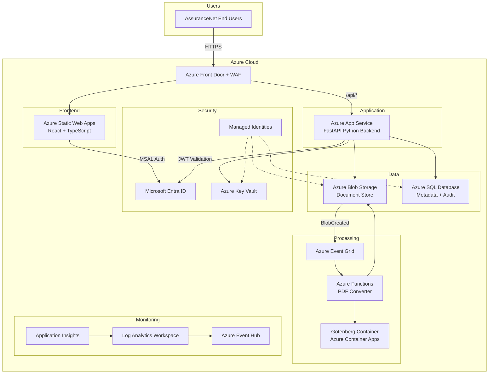

[Home](../../README.md) > [Architecture](.) > **High-Level Architecture**

# High-Level Architecture

> **TL;DR:** AssuranceNet is an Azure-native document management system replacing Oracle UCM for FSIS. It uses Azure Blob Storage for files, FastAPI for the backend API, React for the frontend, and an Event Grid + Functions pipeline for async PDF conversion. All services authenticate via Managed Identities with zero secrets.

---

## Table of Contents

- [Overview](#overview)
- [Architecture Diagram](#architecture-diagram)
- [Key Design Decisions](#key-design-decisions)
- [FSIS Data Context](#fsis-data-context)

---

## 📋 Overview

AssuranceNet Document Management is an Azure-native system replacing Oracle UCM for FSIS document storage, PDF conversion, and compliance auditing.

---

## 🏗️ Architecture Diagram

---

## ✨ Key Design Decisions

| Decision | Rationale |
|----------|-----------|
| **Azure Blob Storage** over SharePoint | 700K+ files at TB scale |
| **Event Grid + Functions** for PDF pipeline | Async, event-driven conversion |
| **Gotenberg** (LibreOffice) for Office conversion | Reliable Office format support |
| **Managed Identities** for service auth | Zero-secret service-to-service authentication |
| **Private Endpoints** for data services | Network-level isolation for all data stores |

---

## 🗄️ FSIS Data Context

This system manages document types found across FSIS Science & Data programs
([fsis.usda.gov/science-data](https://www.fsis.usda.gov/science-data)):

| Document Category | Examples | Typical Formats |
|---|---|---|
| Sampling Program Plans | Annual Sampling Plans (FY2024, FY2025) | PDF |
| Laboratory Sampling Data | Quarterly microbiological/chemical results | CSV |
| Residue Program Reports | National Residue Program "Red Book" / "Blue Book", quarterly summaries | PDF |
| Microbiology Reports | Baseline data, Salmonella/Campylobacter quarterly reports | PDF, CSV |
| Establishment Directories | MPI Directory by Establishment Number/Name | CSV |
| Inspection Task Data | Humane handling verification records, enforcement actions | CSV, PDF |
| Chemical Residue Data | Quarterly tolerance/summary reports | PDF |
| Enforcement Reports | Quarterly enforcement tables | PDF |

> [!NOTE]
> These document types inform the investigation structures, blob naming, and PDF conversion pipeline design.

---

**Related Architecture Docs:**
[Azure Architecture Detail](azure-architecture-detail.md) | [Workflow Diagrams](workflow-diagrams.md) | [Blob Hierarchy](blob-hierarchy.md) | [Security Architecture](security-architecture.md) | [Monitoring & Telemetry](monitoring-telemetry.md) | [Data Migration](data-migration.md)
