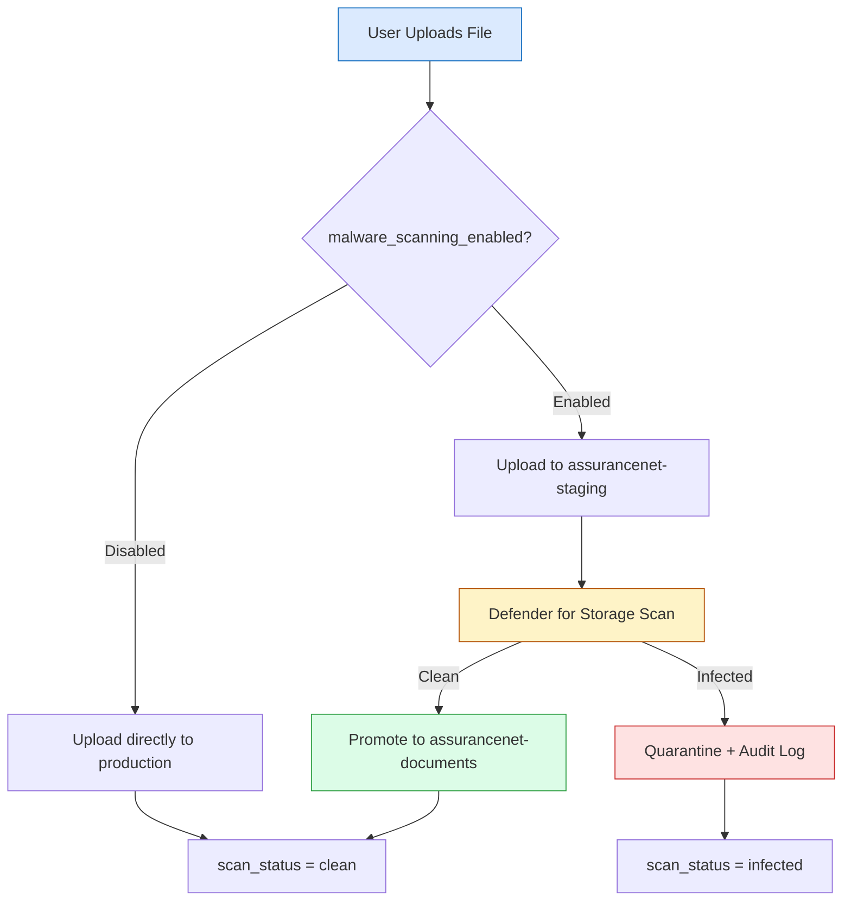
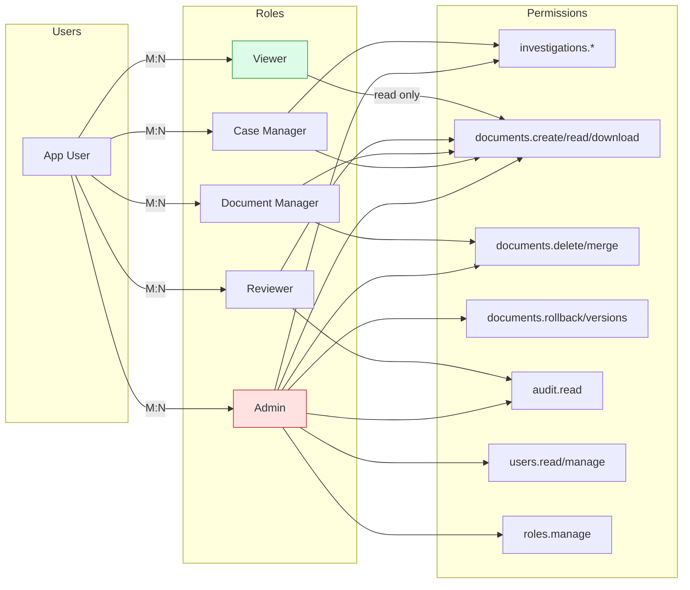

[Home](../../README.md) > [Architecture](.) > **Security Architecture**

# Security Architecture

> **TL;DR:** AssuranceNet enforces defense-in-depth security using Microsoft Entra ID for authentication, role-based access control via JWT claims, managed identities for service-to-service auth, private endpoints for network isolation, and AES-256 encryption at rest. The system complies with NIST 800-53 Rev 5 controls and FSIS data classification requirements.

---

## Table of Contents

- [Identity & Access Management](#identity--access-management)
- [Network Security](#network-security)
- [Data Protection](#data-protection)
- [NIST 800-53 Rev 5 Compliance](#nist-800-53-rev-5-compliance)
- [FSIS Compliance Context](#fsis-compliance-context)
- [Azure Policy Enforcement](#azure-policy-enforcement)

---

## 🔒 Identity & Access Management

### 🔒 Authentication

| Mechanism | Component | Details |
|-----------|-----------|---------|
| Microsoft Entra ID | All users | Primary identity provider |
| MSAL.js redirect flow | React SPA | Browser-based authentication |
| JWT validation | FastAPI middleware | Token verification on every request |
| Configurable authority | Both | Supports Commercial and GovCloud |

### 🔒 Authorization

| App Role | Permissions |
|----------|-------------|
| `Documents.Reader` | Read-only access to documents |
| `Documents.Contributor` | Upload, download, and version documents |
| `Investigations.Manager` | Full investigation and document management |
| `Admin` | System administration and configuration |

> [!NOTE]
> Roles are assigned via Entra ID group membership. Role-based endpoint access is enforced through FastAPI dependency injection.

### 🔒 Service Identity

| Principle | Implementation |
|-----------|---------------|
| User-assigned Managed Identities | App Service and Functions each have dedicated identities |
| RBAC roles | Storage Blob Data Contributor, Key Vault Secrets User |
| Zero secrets | No secrets stored in application configuration |

---

## 🌐 Network Security

| Layer | Control |
|-------|---------|
| Public entry point | Azure Front Door (sole ingress) |
| WAF Policy | OWASP 3.2 + Bot Protection + Rate Limiting |
| Compute isolation | VNet integration for App Service and Functions |
| Data isolation | Private Endpoints for Blob Storage, SQL, Key Vault, Event Hub |
| Inter-subnet control | NSGs restricting traffic between subnets |

> [!IMPORTANT]
> All data services are accessible only via private endpoints. Public network access is disabled on Storage, SQL, and Key Vault.

---

## 🔒 Data Protection

| Protection | Details |
|------------|---------|
| Encryption at rest | AES-256 (Microsoft-managed keys) |
| Encryption in transit | TLS 1.2+ enforced on all connections |
| Blob Storage | HTTPS-only, shared key access disabled |
| SQL Database | Transparent Data Encryption (TDE) enabled |

---

## 🔒 NIST 800-53 Rev 5 Compliance

| Control | Implementation |
|---------|---------------|
| AC-2 | Entra ID user lifecycle |
| AC-3 | RBAC via JWT claims |
| AC-6 | Least privilege Managed Identities |
| AU-2/3 | Comprehensive audit_log table |
| AU-11 | 90-day interactive + 3-year archive |
| IA-2 | Entra ID with MFA |
| SC-8 | TLS 1.2+ everywhere |
| SC-28 | AES-256 at rest |
| SI-4 | App Insights + Defender for Cloud |

---

## 🗄️ FSIS Compliance Context

As a USDA FSIS system, AssuranceNet handles food safety data from the
[FSIS Science & Data program](https://www.fsis.usda.gov/science-data) including:

- **Laboratory sampling results** (microbiological and chemical testing data)
- **National Residue Program** reports (chemical residue findings in meat, poultry, egg products)
- **Establishment inspection records** (MPI Directory data for all FSIS-inspected establishments)
- **Enforcement actions** (quarterly enforcement reports, humane handling violations)

### 🔒 Data Classification

| Data Type | Sensitivity | Controls |
|---|---|---|
| Sampling Plans (PDF) | Public/Internal | Standard access controls |
| Laboratory Results (CSV) | Sensitive until release | Role-based access, audit logging |
| Establishment Data (CSV) | Public | Standard access controls |
| Enforcement Actions (PDF) | Sensitive | Admin role required, audit logging |
| Investigation Documents | Internal | Investigation-scoped access, audit logging |

### 📊 Audit Requirements (NIST AU-2)

All operations on FSIS documents are logged with:

| Audit Field | Description |
|-------------|-------------|
| User identity | Entra ID object ID + UPN |
| Action performed | Upload, download, delete, merge, version access |
| Timestamp and IP address | Request origin and timing |
| Correlation ID | End-to-end request tracing |
| SIEM forwarding | Forwarded to Splunk via Event Hub |

> [!WARNING]
> Audit logging must never be disabled. All document operations require a corresponding audit record per NIST AU-2.

---

## ⚙️ Azure Policy Enforcement

| Policy Type | Details |
|-------------|---------|
| NIST SP 800-53 Rev 5 initiative | Assigned at subscription level |
| Custom deny policies | Storage without HTTPS, SQL without auditing, resources without tags |
| Microsoft Defender for Cloud | Enabled for App Service, SQL, Storage, Key Vault |
| Compliance monitoring | Continuous via Defender regulatory compliance dashboard |

---

## 🛡️ Malware Scanning Pipeline

All file uploads pass through a two-phase scanning pipeline before reaching the production storage container.

| Setting | Source | Default |
|---------|--------|---------|
| `malware_scanning_enabled` | `system_settings` DB table | `true` |
| Staging container | `assurancenet-staging` | Created via Bicep |
| Scanner | Microsoft Defender for Storage | Enabled via Bicep |

> **Note:** The scanning toggle is configurable via the Admin Settings UI — no restart required.

---

## 🔐 RBAC Permission Model

---

**Related Architecture Docs:**
[High-Level Architecture](high-level-architecture.md) | [Azure Architecture Detail](azure-architecture-detail.md) | [Workflow Diagrams](workflow-diagrams.md) | [Blob Hierarchy](blob-hierarchy.md) | [Data Model & RBAC](data-model.md) | [Monitoring & Telemetry](monitoring-telemetry.md) | [Data Migration](data-migration.md)
