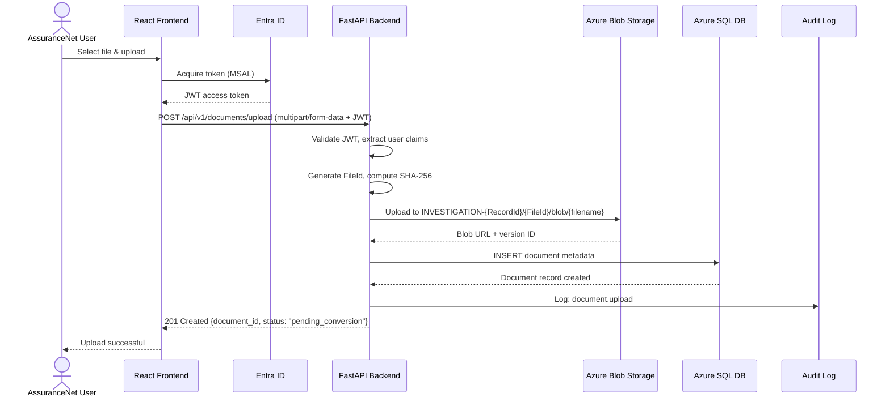
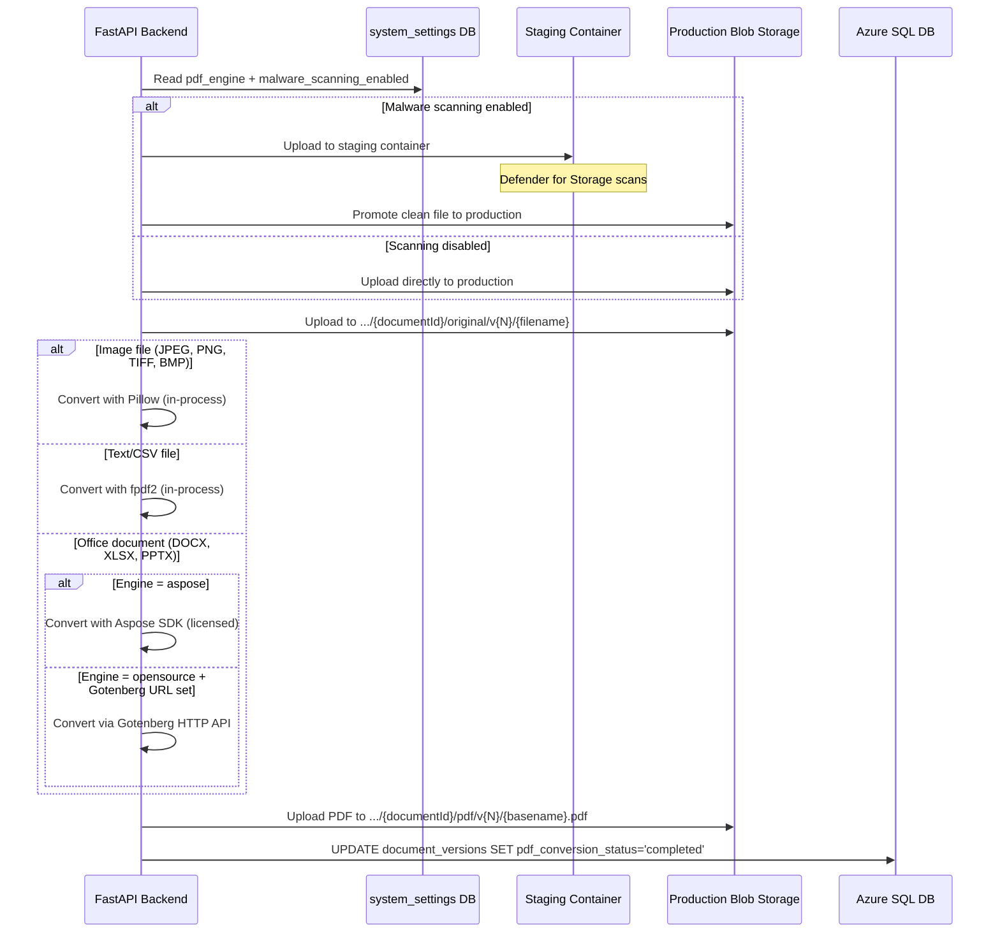
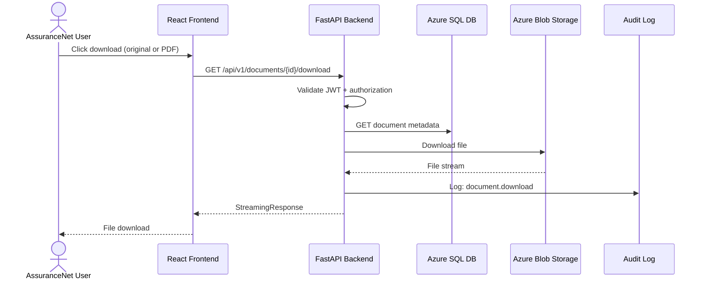
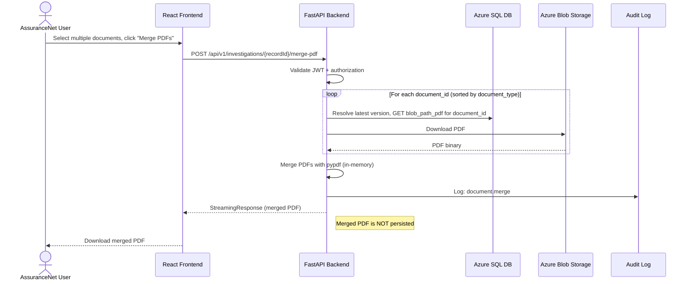
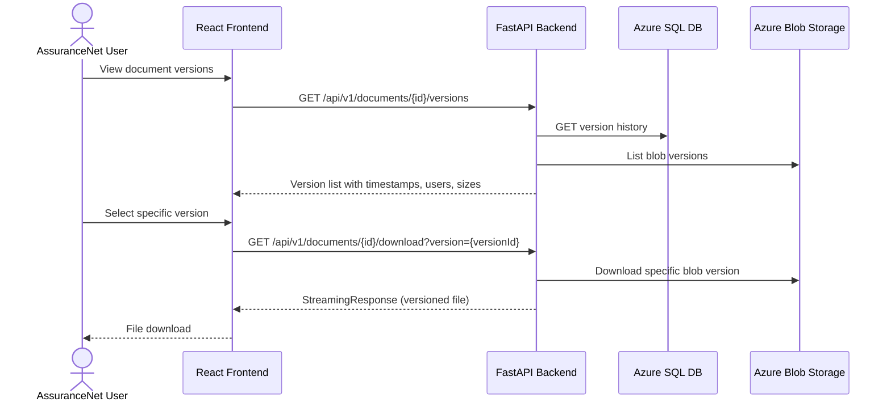
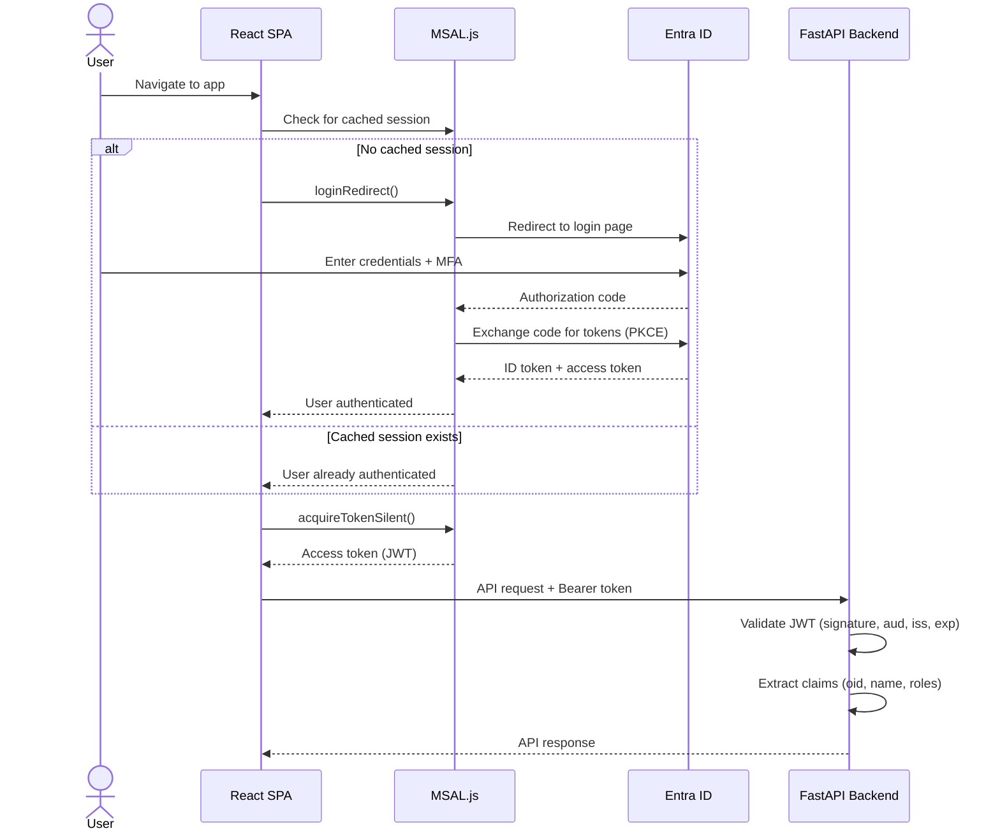
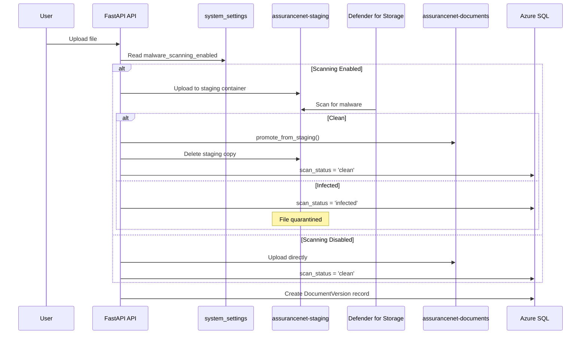
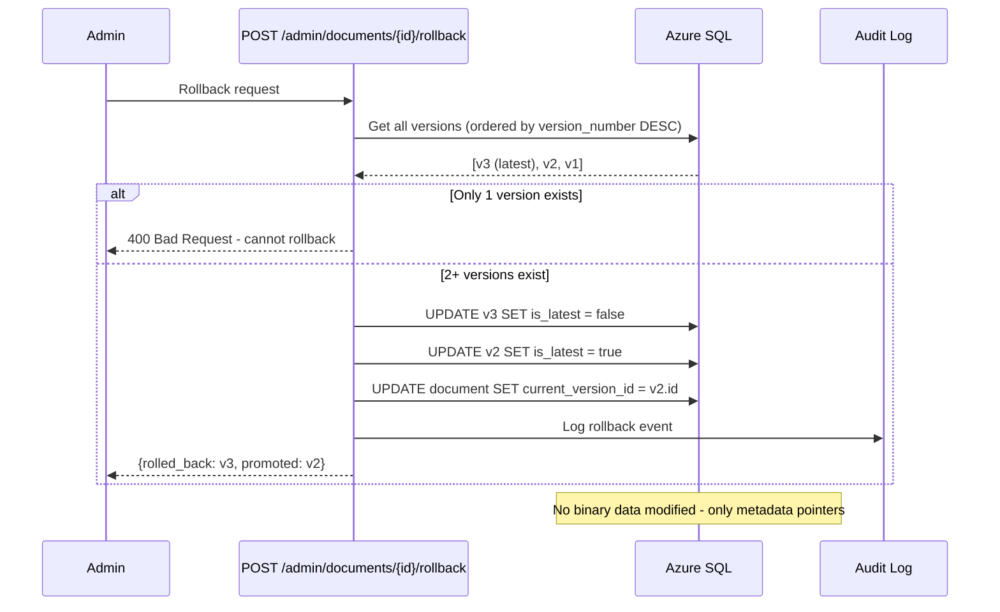
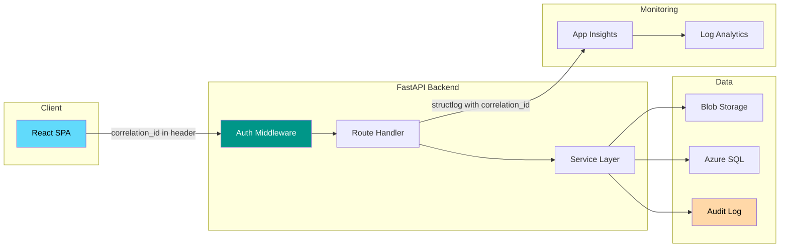

[Home](../../README.md) > [Architecture](.) > **User Workflow Diagrams**

# User Workflow Diagrams

> **TL;DR:** This document illustrates the six core workflows of AssuranceNet: document upload, async PDF conversion, document download, PDF merge, version history retrieval, and authentication. Each flow is shown as a sequence diagram with all participants and interactions.

---

## Table of Contents

- [Document Upload Flow](#document-upload-flow)
- [Async PDF Conversion Flow](#async-pdf-conversion-flow)
- [Document Download Flow](#document-download-flow)
- [PDF Merge Flow](#pdf-merge-flow)
- [Version History Flow](#version-history-flow)
- [Authentication Flow](#authentication-flow)

---

## 🏗️ Document Upload Flow



---

## ⚙️ Async PDF Conversion Flow



> [!NOTE]
> Files already in PDF format are passed through without conversion. The Event Grid filter on the `/blob/` path ensures only new uploads (not PDF outputs) trigger conversion.

---

## 🗄️ Document Download Flow



---

## ✨ PDF Merge Flow



> [!IMPORTANT]
> Merged PDFs are generated on-the-fly and are **not** persisted to Blob Storage. Each merge request re-downloads and re-merges the source PDFs.

---

## 🗄️ Version History Flow



---

## 🔒 Authentication Flow



---

## PDF Conversion Engine Selection

```mermaid
flowchart TD
    Upload[File Uploaded] --> CheckType{Check MIME Type}
    CheckType -->|application/pdf| Pass[Passthrough - no conversion]
    CheckType -->|image/*| Pillow[Pillow + img2pdf]
    CheckType -->|text/plain, text/csv, text/rtf| Fpdf2[fpdf2 text renderer]
    CheckType -->|Office: DOCX, XLSX, PPTX| ReadSettings{Read system_settings}
    ReadSettings -->|pdf_engine = aspose| Aspose[Aspose SDK]
    ReadSettings -->|pdf_engine = opensource| CheckGotenberg{gotenberg_url set?}
    CheckGotenberg -->|Yes| Gotenberg[Gotenberg HTTP API]
    CheckGotenberg -->|No| Skip[Skip - mark pending]
    Pillow --> StorePDF[Upload PDF to /pdf/v{N}/]
    Fpdf2 --> StorePDF
    Aspose --> StorePDF
    Gotenberg --> StorePDF
    StorePDF --> UpdateDB[UPDATE pdf_conversion_status = completed]
```

---

## Malware Scanning Pipeline



---

## Admin Version Rollback



---

## Request Correlation & Tracing



---

**Related Architecture Docs:**
[High-Level Architecture](high-level-architecture.md) | [Azure Architecture Detail](azure-architecture-detail.md) | [Blob Hierarchy](blob-hierarchy.md) | [Security Architecture](security-architecture.md) | [Monitoring & Telemetry](monitoring-telemetry.md) | [Data Migration](data-migration.md)
