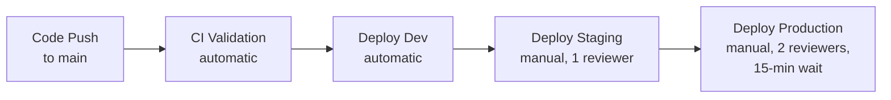

[Home](../../README.md) > [Guides](.) > **Deployment Guide**

# AssuranceNet Document Management System - Deployment Guide

> **TL;DR:** Complete deployment guide covering five methods (Portal, Azure CLI, PowerShell, Bicep, GitHub Actions CI/CD) for provisioning the AssuranceNet platform on Azure. Bicep is the recommended approach. For post-deployment operations, see [Operations Guide](operations-guide.md). For troubleshooting, see [Troubleshooting Guide](troubleshooting.md).

Comprehensive deployment guide for the AssuranceNet Document Management System, an Azure-native platform replacing Oracle Universal Content Manager (UCM). This guide covers all deployment methods from manual Portal-based provisioning through fully automated CI/CD pipelines.

**Architecture overview**: React SPA on Static Web Apps, FastAPI backend on Container Apps, with Azure SQL for metadata and Blob Storage for documents. PDF conversion runs in-process in the FastAPI backend using Pillow and fpdf2. All infrastructure is defined in Bicep.

---

## Table of Contents

1. [Prerequisites](#-1-prerequisites)
2. [Entra ID Setup](#-2-entra-id-setup)
3. [Deploy via Azure Portal (GUI)](#%EF%B8%8F-3-deploy-via-azure-portal-gui)
4. [Deploy via Azure CLI (Bash)](#%EF%B8%8F-4-deploy-via-azure-cli-bash)
5. [Deploy via Azure PowerShell](#-5-deploy-via-azure-powershell)
6. [Deploy via Bicep (Recommended)](#%EF%B8%8F-6-deploy-via-bicep-recommended)
7. [Deploy via GitHub Actions (CI/CD)](#-7-deploy-via-github-actions-cicd)
8. [Backend Deployment Details](#%EF%B8%8F-8-backend-deployment-details)
9. [Frontend Deployment Details](#-9-frontend-deployment-details)
10. [Functions Deployment Details](#-10-functions-deployment-details)
11. [Post-Deployment Verification Checklist](#-11-post-deployment-verification-checklist)
12. [Environment Configuration](#-12-environment-configuration)
13. [SSL/TLS and Custom Domains](#-13-ssltls-and-custom-domains)
14. [Rollback Procedures](#-14-rollback-procedures)
15. [Appendix A: Complete Deployment Order](#-appendix-a-complete-deployment-order)
16. [Appendix B: Estimated Monthly Costs](#-appendix-b-estimated-monthly-costs)

---

## 📋 1. Prerequisites

### 🛠️ Required Tools

| Tool | Version | Installation |
|------|---------|-------------|
| Azure CLI | 2.60+ | `winget install Microsoft.AzureCLI` or [aka.ms/installazurecli](https://aka.ms/installazurecli) |
| Bicep CLI | Latest (bundled with Azure CLI 2.60+) | `az bicep install` or `az bicep upgrade` |
| PowerShell | 7+ | `winget install Microsoft.PowerShell` |
| Python | 3.11+ | `winget install Python.Python.3.11` |
| Node.js | 20+ | `winget install OpenJS.NodeJS.LTS` |
| Git | Latest | `winget install Git.Git` |
| GitHub CLI | Latest (optional) | `winget install GitHub.cli` |

### ☁️ Azure Requirements

- **Azure subscription** with Owner or Contributor + User Access Administrator access
- **Microsoft Entra ID tenant** with Application Administrator or Global Administrator role
- **GitHub account** with repository access (for CI/CD method)
- **Registered resource providers** (register before deployment):

```bash
az provider register --namespace Microsoft.Web
az provider register --namespace Microsoft.Sql
az provider register --namespace Microsoft.Storage
az provider register --namespace Microsoft.KeyVault
az provider register --namespace Microsoft.Network
az provider register --namespace Microsoft.Cdn
az provider register --namespace Microsoft.App
az provider register --namespace Microsoft.EventGrid
az provider register --namespace Microsoft.EventHub
az provider register --namespace Microsoft.Insights
az provider register --namespace Microsoft.OperationalInsights
az provider register --namespace Microsoft.ManagedIdentity
az provider register --namespace Microsoft.Security
az provider register --namespace Microsoft.Consumption
```

### ✅ Verify Prerequisites

```bash
# Verify tool versions
az version
az bicep version
python --version
node --version
git --version

# Login and verify subscription
az login
az account show --query "{name:name, id:id, tenantId:tenantId}" -o table
```

### 📛 Resource Naming Convention

All resources follow a consistent naming pattern using `{projectName}` = `assurancenet` and `{env}` = `dev` | `staging` | `prod`:

| Resource | Naming Pattern | Example (dev) |
|----------|---------------|---------------|
| Resource Group (Network) | `rg-assurancenet-network-{env}` | `rg-assurancenet-network-dev` |
| Resource Group (App) | `rg-assurancenet-app-{env}` | `rg-assurancenet-app-dev` |
| Resource Group (Data) | `rg-assurancenet-data-{env}` | `rg-assurancenet-data-dev` |
| Resource Group (Security) | `rg-assurancenet-security-{env}` | `rg-assurancenet-security-dev` |
| Resource Group (Monitoring) | `rg-assurancenet-monitoring-{env}` | `rg-assurancenet-monitoring-dev` |
| Virtual Network | `vnet-assurancenet-{env}` | `vnet-assurancenet-dev` |
| Storage Account | `stassurancenet{env}` | `stassurancenetdev` |
| Function Storage | `stfuncassurancenet{env}` | `stfuncassurancenetdev` |
| SQL Server | `sql-assurancenet-{env}` | `sql-assurancenet-dev` |
| SQL Database | `sqldb-assurancenet-{env}` | `sqldb-assurancenet-dev` |
| Key Vault | `kv-assurancenet-{env}` | `kv-assurancenet-dev` |
| App Service Plan | `asp-assurancenet-{env}` | `asp-assurancenet-dev` |
| App Service (API) | `app-assurancenet-api-{env}` | `app-assurancenet-api-dev` |
| Static Web App | `swa-assurancenet-{env}` | `swa-assurancenet-dev` |
| Function App (optional) | `func-pdf-converter-{env}` | `func-pdf-converter-dev` |
| Function Plan (optional) | `asp-func-{env}` | `asp-func-dev` |
| Container Apps Env (API) | `cae-api-assurancenet-{env}` | `cae-api-assurancenet-dev` |
| Container App (API) | `ca-api-assurancenet-{env}` | `ca-api-assurancenet-dev` |
| Gotenberg Container (optional) | `ca-gotenberg-{env}` | `ca-gotenberg-dev` |

> **Note:** In the current architecture, the app resource group (`rg-assurancenet-app-dev`) contains exactly 4 resources: `swa-assurancenet-dev`, `acrassurancenetdev`, `ca-api-assurancenet-dev`, and `cae-api-assurancenet-dev`. The Function App, Gotenberg Container, and the separate `cae-assurancenet-dev` Container Apps Environment are not deployed by default.
| Front Door | `fd-assurancenet-{env}` | `fd-assurancenet-dev` |
| WAF Policy | `wafassurancenet{env}` | `wafassurancenetdev` |
| Log Analytics | `law-assurancenet-{env}` | `law-assurancenet-dev` |
| App Insights (Backend) | `appi-backend-{env}` | `appi-backend-dev` |
| App Insights (Functions) | `appi-functions-{env}` | `appi-functions-dev` |
| App Insights (Frontend) | `appi-frontend-{env}` | `appi-frontend-dev` |
| Event Grid Topic | `evgt-storage-{env}` | `evgt-storage-dev` |
| Event Hub Namespace | `evhns-assurancenet-splunk-{env}` | `evhns-assurancenet-splunk-dev` |
| Managed Identity (App) | `mi-app-assurancenet-{env}` | `mi-app-assurancenet-dev` |
| Managed Identity (Func) | `mi-func-assurancenet-{env}` | `mi-func-assurancenet-dev` |
| Dashboard | `dash-assurancenet-ops-{env}` | `dash-assurancenet-ops-dev` |
| Budget | `budget-assurancenet-{env}` | `budget-assurancenet-dev` |

---

## 🔐 2. Entra ID Setup

> [!IMPORTANT]
> Entra ID configuration is required before any deployment method. You must create two app registrations and, for CI/CD, federated credentials for GitHub Actions.

### 🔑 2.1 Create the API App Registration (FastAPI Backend)

1. Navigate to **Azure Portal** > **Microsoft Entra ID** > **App registrations** > **New registration**.
2. Configure:
   - **Name**: `AssuranceNet API - {env}` (e.g., `AssuranceNet API - dev`)
   - **Supported account types**: Accounts in this organizational directory only (Single tenant)
   - **Redirect URI**: Leave blank (no redirect for API)
3. Click **Register**.
4. On the app's overview page, note the **Application (client) ID** and **Directory (tenant) ID**.

#### Expose API Scopes

1. Go to **Expose an API** > **Set** the Application ID URI to: `api://assurancenet-api-{env}`
2. Click **Add a scope** and create each of the following:

| Scope Name | Display Name | Description | Who Can Consent |
|------------|-------------|-------------|-----------------|
| `Documents.Read` | Read documents | Read document metadata and content | Admins and users |
| `Documents.ReadWrite` | Read and write documents | Full document CRUD access | Admins and users |
| `Admin.AuditLog` | View audit logs | Access audit log data | Admins only |

#### Create App Roles

1. Go to **App roles** > **Create app role** for each:

| Display Name | Value | Description | Allowed Member Types |
|-------------|-------|-------------|---------------------|
| Documents Reader | `Documents.Reader` | Read-only access to documents | Users/Groups |
| Documents Contributor | `Documents.Contributor` | Read-write access to documents | Users/Groups |
| Investigations Manager | `Investigations.Manager` | Manage investigation documents | Users/Groups |
| Admin | `Admin` | Full administrative access | Users/Groups |

### 🌐 2.2 Create the SPA App Registration (React Frontend)

1. Navigate to **Microsoft Entra ID** > **App registrations** > **New registration**.
2. Configure:
   - **Name**: `AssuranceNet SPA - {env}` (e.g., `AssuranceNet SPA - dev`)
   - **Supported account types**: Accounts in this organizational directory only (Single tenant)
   - **Redirect URI**: Platform = **Single-page application (SPA)**, URI = `https://{frontend-url}/auth/callback`
     - Dev: `http://localhost:5173/auth/callback` (also add `https://swa-assurancenet-dev.azurestaticapps.net/auth/callback`)
     - Staging: `https://swa-assurancenet-staging.azurestaticapps.net/auth/callback`
     - Prod: `https://{your-custom-domain}/auth/callback`
3. Click **Register**.
4. Note the **Application (client) ID**.

#### Configure API Permissions

1. Go to **API permissions** > **Add a permission** > **My APIs** > Select **AssuranceNet API**.
2. Select **Delegated permissions** and check:
   - `Documents.Read`
   - `Documents.ReadWrite`
3. Click **Add permissions**.
4. Click **Grant admin consent for {tenant}** (requires admin role).

### 👥 2.3 Create Entra ID Admin Group for SQL

1. Navigate to **Microsoft Entra ID** > **Groups** > **New group**.
2. Configure:
   - **Group type**: Security
   - **Group name**: `AssuranceNet-SQL-Admins`
   - **Members**: Add your DBA and DevOps principals
3. Note the **Object ID** of this group (needed for `entraAdminGroupObjectId` parameter in SQL Bicep module).

### 🔗 2.4 Create OIDC Federated Credentials for GitHub Actions

For each environment (`dev`, `staging`, `prod`), create a separate app registration for GitHub Actions OIDC:

1. Navigate to **Microsoft Entra ID** > **App registrations** > **New registration**.
2. Configure:
   - **Name**: `AssuranceNet GitHub OIDC - {env}`
   - **Supported account types**: Single tenant
3. Click **Register**. Note the **Application (client) ID**.

#### Add Federated Credentials

1. Go to **Certificates & secrets** > **Federated credentials** > **Add credential**.
2. Configure:
   - **Federated credential scenario**: GitHub Actions deploying Azure resources
   - **Organization**: Your GitHub org/user
   - **Repository**: `ucm-azure-native-demo`
   - **Entity type**: Environment
   - **GitHub environment name**: `dev` (or `staging`, `production`)
   - **Name**: `github-actions-{env}`
3. Repeat for each environment.

#### Assign RBAC Roles

For each OIDC app registration, assign the following roles at the subscription level:

```bash
# Set variables
OIDC_APP_ID="<Application (client) ID from step above>"
SUBSCRIPTION_ID="<your-subscription-id>"

# Get the service principal object ID
SP_OBJECT_ID=$(az ad sp show --id $OIDC_APP_ID --query id -o tsv)

# Assign Contributor role (for resource deployment)
az role assignment create \
  --assignee-object-id $SP_OBJECT_ID \
  --assignee-principal-type ServicePrincipal \
  --role "Contributor" \
  --scope "/subscriptions/$SUBSCRIPTION_ID"

# Assign User Access Administrator (for role assignments in Bicep)
az role assignment create \
  --assignee-object-id $SP_OBJECT_ID \
  --assignee-principal-type ServicePrincipal \
  --role "User Access Administrator" \
  --scope "/subscriptions/$SUBSCRIPTION_ID"
```

---

## 🖥️ 3. Deploy via Azure Portal (GUI)

This section walks through creating every resource manually in the Azure Portal. Deploy resources in the order shown below to satisfy dependencies.

> [!NOTE]
> The Bicep method (Section 6) is strongly recommended over manual Portal creation. Use this section for understanding or for one-off resource creation.

### 📁 3.1 Create Resource Groups

Navigate to **Azure Portal** > **Resource groups** > **Create** for each:

| Resource Group | Region | Tags |
|---------------|--------|------|
| `rg-assurancenet-network-dev` | East US | Project=AssuranceNet, Environment=dev, ManagedBy=bicep |
| `rg-assurancenet-app-dev` | East US | Project=AssuranceNet, Environment=dev, ManagedBy=bicep |
| `rg-assurancenet-data-dev` | East US | Project=AssuranceNet, Environment=dev, ManagedBy=bicep |
| `rg-assurancenet-security-dev` | East US | Project=AssuranceNet, Environment=dev, ManagedBy=bicep |
| `rg-assurancenet-monitoring-dev` | East US | Project=AssuranceNet, Environment=dev, ManagedBy=bicep |

### 📊 3.2 Monitoring (Deploy First)

Monitoring is deployed early because other resources send diagnostic logs here.

#### Log Analytics Workspace

1. Go to **Log Analytics workspaces** > **Create**.
2. Resource group: `rg-assurancenet-monitoring-dev`
3. Name: `law-assurancenet-dev`
4. Region: East US
5. Pricing tier: Per-GB (2018)
6. Retention: 90 days
7. Daily cap: 5 GB (dev) / unlimited (prod)
8. Click **Review + create**.

#### Application Insights (Backend)

1. Go to **Application Insights** > **Create**.
2. Resource group: `rg-assurancenet-monitoring-dev`
3. Name: `appi-backend-dev`
4. Region: East US
5. Resource Mode: Workspace-based
6. Log Analytics Workspace: `law-assurancenet-dev`
7. Click **Review + create**.

Repeat for `appi-functions-dev` and `appi-frontend-dev`.

### 🌐 3.3 Virtual Network and Subnets

1. Go to **Virtual networks** > **Create**.
2. Resource group: `rg-assurancenet-network-dev`
3. Name: `vnet-assurancenet-dev`
4. Region: East US
5. Address space: `10.0.0.0/16`
6. Add subnets:

| Subnet Name | Address Range | Delegation | NSG |
|------------|--------------|-----------|-----|
| `snet-backend` | `10.0.1.0/24` | Microsoft.Web/serverFarms | `nsg-backend-dev` |
| `snet-functions` | `10.0.2.0/24` | Microsoft.Web/serverFarms | `nsg-functions-dev` |
| `snet-private-endpoints` | `10.0.3.0/24` | None | `nsg-private-endpoints-dev` |
| `snet-container-apps` | `10.0.5.0/24` | Microsoft.App/environments | `nsg-container-apps-dev` |

#### Network Security Groups

Create NSGs **before** creating the VNet (or before associating subnets):

**nsg-backend-dev** (in `rg-assurancenet-network-dev`):
- Inbound Rule: AllowFrontDoorInbound - Priority 100, Source: AzureFrontDoor.Backend, Dest Port: 443, Allow
- Inbound Rule: DenyAllInbound - Priority 4096, Source: Any, Dest Port: Any, Deny

**nsg-functions-dev**:
- Inbound Rule: AllowEventGridInbound - Priority 100, Source: AzureEventGrid, Dest Port: 443, Allow
- Inbound Rule: DenyAllInbound - Priority 4096, Deny

**nsg-private-endpoints-dev**:
- Inbound Rule: AllowBackendSubnet - Priority 100, Source: 10.0.1.0/24, Dest Port: Any, Allow
- Inbound Rule: AllowFunctionsSubnet - Priority 110, Source: 10.0.2.0/24, Dest Port: Any, Allow
- Inbound Rule: DenyAllInbound - Priority 4096, Deny

**nsg-container-apps-dev**:
- Inbound Rule: AllowFunctionsSubnet - Priority 100, Source: 10.0.2.0/24, Dest Port: 3000, Allow
- Inbound Rule: DenyAllInbound - Priority 4096, Deny

### 🪪 3.4 Managed Identities

1. Go to **Managed Identities** > **Create**.
2. Resource group: `rg-assurancenet-security-dev`
3. Create two:
   - Name: `mi-app-assurancenet-dev` (for App Service)
   - Name: `mi-func-assurancenet-dev` (for Functions)
4. Note the **Client ID** and **Principal ID** for each.

### 🔐 3.5 Key Vault

1. Go to **Key Vaults** > **Create**.
2. Resource group: `rg-assurancenet-security-dev`
3. Name: `kv-assurancenet-dev`
4. Region: East US
5. Pricing tier: Standard
6. Enable **RBAC authorization** (not access policies)
7. Enable soft delete (90-day retention)
8. Enable purge protection
9. Networking: Private endpoint only, Bypass Azure Services
10. Create private endpoint in `snet-private-endpoints` subnet.
11. Create private DNS zone: `privatelink.vaultcore.azure.net`.

### 💾 3.6 Storage Account

1. Go to **Storage accounts** > **Create**.
2. Resource group: `rg-assurancenet-data-dev`
3. Name: `stassurancenetdev`
4. Region: East US
5. Performance: Standard
6. Redundancy: LRS (dev/staging) or GRS (prod)
7. Advanced:
   - Require secure transfer: Enabled
   - Minimum TLS: 1.2
   - Allow blob public access: Disabled
   - Allow storage account key access: Disabled
8. Networking: Private endpoint only, Bypass Azure Services
9. Data protection:
   - Enable blob versioning
   - Enable blob change feed (90-day retention)
   - Enable soft delete for blobs (30 days)
   - Enable soft delete for containers (30 days)
10. Create container: `assurancenet-documents` (Private access)
11. Create container: `dead-letter` (Private access)
12. Create private endpoint for Blob in `snet-private-endpoints`.
13. Create private DNS zone: `privatelink.blob.core.windows.net`.

#### Assign RBAC Roles

1. On the storage account, go to **Access Control (IAM)** > **Add role assignment**.
2. Role: **Storage Blob Data Contributor**
3. Assign to: `mi-app-assurancenet-dev` and `mi-func-assurancenet-dev`

### 🗄️ 3.7 Azure SQL Server and Database

#### SQL Server

1. Go to **SQL servers** > **Create**.
2. Resource group: `rg-assurancenet-data-dev`
3. Server name: `sql-assurancenet-dev`
4. Region: East US
5. Authentication: **Microsoft Entra-only authentication**
6. Entra admin: `AssuranceNet-SQL-Admins` group
7. Minimum TLS: 1.2
8. Public network access: Disabled

#### SQL Database

1. On the SQL server, click **Create database**.
2. Database name: `sqldb-assurancenet-dev`
3. Compute + storage:
   - Dev: General Purpose Serverless Gen5 1 vCore, auto-pause at 60 min, 32 GB max
   - Prod: General Purpose Provisioned Gen5 4 vCores, zone redundant, 100 GB max
4. Backup redundancy: Local (dev) / Geo (prod)
5. Enable TDE (Transparent Data Encryption)
6. Create private endpoint for SQL in `snet-private-endpoints`.
7. Create private DNS zone: `privatelink.database.windows.net`.

### ⚙️ 3.8 App Service Plan and Web App

#### App Service Plan

1. Go to **App Service plans** > **Create**.
2. Resource group: `rg-assurancenet-app-dev`
3. Name: `asp-assurancenet-dev`
4. OS: Linux
5. Region: East US
6. SKU: B1 (dev) / P1v3 (prod)

#### App Service (API)

1. Go to **App Services** > **Create** > **Web App**.
2. Resource group: `rg-assurancenet-app-dev`
3. Name: `app-assurancenet-api-dev`
4. Runtime: Python 3.11
5. OS: Linux
6. Plan: `asp-assurancenet-dev`
7. Identity: User-assigned = `mi-app-assurancenet-dev`
8. Networking: VNet integration with `snet-backend`
9. HTTPS Only: Enabled
10. FTP State: Disabled
11. Minimum TLS: 1.2
12. Startup Command: `gunicorn app.main:app -k uvicorn.workers.UvicornWorker --bind 0.0.0.0:8000`
13. Application settings (see [Section 12](#12-environment-configuration) for full list)

**For prod only**: Create a deployment slot named `staging` with the same configuration.

### 🌍 3.9 Static Web App

1. Go to **Static Web Apps** > **Create**.
2. Resource group: `rg-assurancenet-app-dev`
3. Name: `swa-assurancenet-dev`
4. Plan type: Standard
5. Region: East US
6. Deployment source: Other (manual deployment)
7. Staging environments: Enabled

### ⚡ 3.10 Function App

#### Function App Plan

1. Go to **App Service plans** > **Create**.
2. Resource group: `rg-assurancenet-app-dev`
3. Name: `asp-func-dev`
4. OS: Linux
5. SKU: Elastic Premium EP1
6. Maximum burst: 5 workers

#### Function-Specific Storage Account

1. Go to **Storage accounts** > **Create**.
2. Name: `stfuncassurancenetdev`
3. Resource group: `rg-assurancenet-app-dev`
4. Standard LRS, HTTPS only, TLS 1.2

#### Function App

> **Note:** The Azure Functions PDF converter is optional. In the current architecture, PDF conversion runs in-process in the FastAPI backend container. Deploy Functions only if you need Event Grid-triggered async conversion for high-volume scenarios.

1. Go to **Function App** > **Create**.
2. Resource group: `rg-assurancenet-app-dev`
3. Name: `func-pdf-converter-dev`
4. Runtime: Python 3.11
5. OS: Linux
6. Plan: `asp-func-dev`
7. Storage account: `stfuncassurancenetdev`
8. Identity: User-assigned = `mi-func-assurancenet-dev`
9. Networking: VNet integration with `snet-functions`
10. Application settings (see [Section 12](#12-environment-configuration))

### 🐳 3.11 Container Apps (Gotenberg)

> **Note:** Gotenberg is optional. PDF conversion runs in-process in the backend API using Pillow (images) and fpdf2 (text/CSV). Gotenberg is only needed if you configure the opensource engine with Office document support via the Admin Settings UI. The separate `cae-assurancenet-dev` Container Apps Environment has been removed; only `cae-api-assurancenet-dev` (hosting the API) is deployed.

#### Container Apps Environment

1. Go to **Container Apps Environments** > **Create**.
2. Resource group: `rg-assurancenet-app-dev`
3. Name: `cae-assurancenet-dev`
4. Region: East US
5. Virtual Network: `vnet-assurancenet-dev`, Subnet: `snet-container-apps`
6. Internal only: Yes
7. Log destination: Log Analytics = `law-assurancenet-dev`

#### Gotenberg Container App

1. Go to **Container Apps** > **Create**.
2. Container Apps Environment: `cae-assurancenet-dev`
3. Name: `ca-gotenberg-dev`
4. Image source: Docker Hub
5. Image: `gotenberg/gotenberg:8`
6. CPU: 1.0, Memory: 2 Gi
7. Command override: `gotenberg`, `--api-timeout=120s`, `--libreoffice-restart-after=10`, `--log-level=info`
8. Ingress: Enabled, Internal only, Target port: 3000, Transport: HTTP
9. Scale: Min replicas 0, Max replicas 5, HTTP concurrent requests rule: 5

### 📡 3.12 Event Grid

1. Go to **Event Grid System Topics** > **Create**.
2. Topic type: Storage Accounts
3. Source: `stassurancenetdev`
4. Name: `evgt-storage-dev`
5. Resource group: `rg-assurancenet-data-dev`

#### Event Subscription

> **Note:** This Event Grid subscription is only needed if you deployed the optional Azure Functions PDF converter. In the current architecture, PDF conversion runs in-process in the FastAPI backend and does not require Event Grid.

1. On the system topic, click **+ Event Subscription**.
2. Name: `evgs-pdf-convert`
3. Event types: Blob Created
4. Endpoint type: Azure Function
5. Endpoint: `func-pdf-converter-dev` > `pdf_converter`
6. Subject filter begins with: `/blobServices/default/containers/assurancenet-documents`
7. Advanced filters:
   - Subject contains `/blob/`
   - Subject does not end with `.pdf`
8. Dead-letter: `stassurancenetdev` > `dead-letter` container
9. Retry policy: Max 3 attempts, 1440 min TTL

### 🛡️ 3.13 Front Door and WAF

#### WAF Policy

1. Go to **Web Application Firewall policies** > **Create**.
2. Name: `wafassurancenetdev`
3. SKU: Premium
4. Policy mode: Prevention
5. Managed rules:
   - Microsoft Default Rule Set 2.1 (Block)
   - Microsoft Bot Manager Rule Set 1.1 (Block)
6. Custom rules:
   - Rate limit rule: Priority 100, threshold 1000 requests/minute, Block

#### Front Door Profile

1. Go to **Front Door and CDN profiles** > **Create**.
2. Name: `fd-assurancenet-dev`
3. Tier: Premium
4. Endpoint: `ep-assurancenet-dev`

#### Origin Groups and Routes

**API Origin Group** (`og-api`):
- Origin: `app-assurancenet-api-dev.azurewebsites.net`
- Health probe: GET `/api/v1/health` every 30s over HTTPS
- Route: `/api/*` -> HTTPS only

**Frontend Origin Group** (`og-frontend`):
- Origin: `swa-assurancenet-dev.azurestaticapps.net`
- Health probe: GET `/` every 60s over HTTPS
- Route: `/*` -> HTTPS only (catch-all)

#### Security Policy

1. On the Front Door profile, go to **Security policies** > **Add**.
2. Name: `sp-waf`
3. WAF Policy: `wafassurancenetdev`
4. Domains: `ep-assurancenet-dev`
5. Patterns: `/*`

### 📬 3.14 Event Hub Namespace (Splunk Integration)

1. Go to **Event Hubs** > **Create namespace**.
2. Resource group: `rg-assurancenet-monitoring-dev`
3. Name: `evhns-assurancenet-splunk-dev`
4. Region: East US
5. Pricing tier: Standard, 2 throughput units
6. Auto-inflate: Enabled, max 10 TUs
7. Minimum TLS: 1.2
8. Public access: Disabled

#### Event Hubs

Create two event hubs within the namespace:
- `evh-audit-logs`: 4 partitions, 7-day retention
- `evh-diagnostic-logs`: 4 partitions, 3-day retention

#### Consumer Group

On `evh-audit-logs`, create consumer group `splunk` with metadata: "Splunk Add-on for Microsoft Cloud Services"

Create a private endpoint in `snet-private-endpoints` with DNS zone `privatelink.servicebus.windows.net`.

### 📦 3.15 Additional Resources

#### Operational Dashboard

1. Go to **Dashboard** > **New dashboard** > **Upload** or create via Portal.
2. Name: `dash-assurancenet-ops-dev`
3. Add tiles for API Requests, Latency Percentiles, Error rates from Log Analytics.

#### Budget

1. Go to **Cost Management** > **Budgets** > **Add**.
2. Name: `budget-assurancenet-dev`
3. Amount: $500/month (dev) / $1,500 (staging) / $5,000 (prod)
4. Alert at 80% and 100% actual, 100% forecasted
5. Contact: `assurancenet-ops@fsis.usda.gov`

---

## ⌨️ 4. Deploy via Azure CLI (Bash)

Complete Azure CLI commands to provision all resources. Replace `{env}` with `dev`, `staging`, or `prod`.

### 4.1 Set Variables

```bash
# Configuration
ENV="dev"
LOCATION="eastus"
PROJECT="assurancenet"
TAGS="Project=AssuranceNet ManagedBy=bicep Application=UCM-Migration CostCenter=FSIS-IT Environment=$ENV"

# Resource Group Names
RG_NETWORK="rg-${PROJECT}-network-${ENV}"
RG_APP="rg-${PROJECT}-app-${ENV}"
RG_DATA="rg-${PROJECT}-data-${ENV}"
RG_SECURITY="rg-${PROJECT}-security-${ENV}"
RG_MONITORING="rg-${PROJECT}-monitoring-${ENV}"

# Login
az login
az account set --subscription "<your-subscription-id>"
```

### 4.2 Resource Groups

```bash
az group create --name $RG_NETWORK --location $LOCATION --tags $TAGS
az group create --name $RG_APP --location $LOCATION --tags $TAGS
az group create --name $RG_DATA --location $LOCATION --tags $TAGS
az group create --name $RG_SECURITY --location $LOCATION --tags $TAGS
az group create --name $RG_MONITORING --location $LOCATION --tags $TAGS
```

### 4.3 Monitoring

```bash
# Log Analytics Workspace
az monitor log-analytics workspace create \
  --resource-group $RG_MONITORING \
  --workspace-name "law-${PROJECT}-${ENV}" \
  --location $LOCATION \
  --retention-time 90 \
  --sku PerGB2018 \
  --tags $TAGS

LAW_ID=$(az monitor log-analytics workspace show \
  --resource-group $RG_MONITORING \
  --workspace-name "law-${PROJECT}-${ENV}" \
  --query id -o tsv)

# Application Insights - Backend
az monitor app-insights component create \
  --app "appi-backend-${ENV}" \
  --location $LOCATION \
  --resource-group $RG_MONITORING \
  --application-type web \
  --kind web \
  --workspace $LAW_ID \
  --tags $TAGS

BACKEND_APPI_CONN=$(az monitor app-insights component show \
  --app "appi-backend-${ENV}" \
  --resource-group $RG_MONITORING \
  --query connectionString -o tsv)

# Application Insights - Functions
az monitor app-insights component create \
  --app "appi-functions-${ENV}" \
  --location $LOCATION \
  --resource-group $RG_MONITORING \
  --application-type web \
  --kind web \
  --workspace $LAW_ID \
  --tags $TAGS

FUNC_APPI_CONN=$(az monitor app-insights component show \
  --app "appi-functions-${ENV}" \
  --resource-group $RG_MONITORING \
  --query connectionString -o tsv)

# Application Insights - Frontend
az monitor app-insights component create \
  --app "appi-frontend-${ENV}" \
  --location $LOCATION \
  --resource-group $RG_MONITORING \
  --application-type web \
  --kind web \
  --workspace $LAW_ID \
  --tags $TAGS
```

### 4.4 Networking

```bash
# NSGs
az network nsg create --name "nsg-backend-${ENV}" --resource-group $RG_NETWORK --location $LOCATION --tags $TAGS

az network nsg rule create --nsg-name "nsg-backend-${ENV}" --resource-group $RG_NETWORK \
  --name AllowFrontDoorInbound --priority 100 --direction Inbound --access Allow \
  --protocol Tcp --source-address-prefixes AzureFrontDoor.Backend \
  --source-port-ranges '*' --destination-address-prefixes '*' --destination-port-ranges 443

az network nsg rule create --nsg-name "nsg-backend-${ENV}" --resource-group $RG_NETWORK \
  --name DenyAllInbound --priority 4096 --direction Inbound --access Deny \
  --protocol '*' --source-address-prefixes '*' \
  --source-port-ranges '*' --destination-address-prefixes '*' --destination-port-ranges '*'

az network nsg create --name "nsg-functions-${ENV}" --resource-group $RG_NETWORK --location $LOCATION --tags $TAGS

az network nsg rule create --nsg-name "nsg-functions-${ENV}" --resource-group $RG_NETWORK \
  --name AllowEventGridInbound --priority 100 --direction Inbound --access Allow \
  --protocol Tcp --source-address-prefixes AzureEventGrid \
  --source-port-ranges '*' --destination-address-prefixes '*' --destination-port-ranges 443

az network nsg rule create --nsg-name "nsg-functions-${ENV}" --resource-group $RG_NETWORK \
  --name DenyAllInbound --priority 4096 --direction Inbound --access Deny \
  --protocol '*' --source-address-prefixes '*' \
  --source-port-ranges '*' --destination-address-prefixes '*' --destination-port-ranges '*'

az network nsg create --name "nsg-private-endpoints-${ENV}" --resource-group $RG_NETWORK --location $LOCATION --tags $TAGS

az network nsg rule create --nsg-name "nsg-private-endpoints-${ENV}" --resource-group $RG_NETWORK \
  --name AllowBackendSubnet --priority 100 --direction Inbound --access Allow \
  --protocol Tcp --source-address-prefixes 10.0.1.0/24 \
  --source-port-ranges '*' --destination-address-prefixes '*' --destination-port-ranges '*'

az network nsg rule create --nsg-name "nsg-private-endpoints-${ENV}" --resource-group $RG_NETWORK \
  --name AllowFunctionsSubnet --priority 110 --direction Inbound --access Allow \
  --protocol Tcp --source-address-prefixes 10.0.2.0/24 \
  --source-port-ranges '*' --destination-address-prefixes '*' --destination-port-ranges '*'

az network nsg rule create --nsg-name "nsg-private-endpoints-${ENV}" --resource-group $RG_NETWORK \
  --name DenyAllInbound --priority 4096 --direction Inbound --access Deny \
  --protocol '*' --source-address-prefixes '*' \
  --source-port-ranges '*' --destination-address-prefixes '*' --destination-port-ranges '*'

az network nsg create --name "nsg-container-apps-${ENV}" --resource-group $RG_NETWORK --location $LOCATION --tags $TAGS

az network nsg rule create --nsg-name "nsg-container-apps-${ENV}" --resource-group $RG_NETWORK \
  --name AllowFunctionsSubnet --priority 100 --direction Inbound --access Allow \
  --protocol Tcp --source-address-prefixes 10.0.2.0/24 \
  --source-port-ranges '*' --destination-address-prefixes '*' --destination-port-ranges 3000

az network nsg rule create --nsg-name "nsg-container-apps-${ENV}" --resource-group $RG_NETWORK \
  --name DenyAllInbound --priority 4096 --direction Inbound --access Deny \
  --protocol '*' --source-address-prefixes '*' \
  --source-port-ranges '*' --destination-address-prefixes '*' --destination-port-ranges '*'

# Virtual Network
az network vnet create \
  --name "vnet-${PROJECT}-${ENV}" \
  --resource-group $RG_NETWORK \
  --location $LOCATION \
  --address-prefix 10.0.0.0/16 \
  --tags $TAGS

# Subnets
az network vnet subnet create \
  --name snet-backend \
  --resource-group $RG_NETWORK \
  --vnet-name "vnet-${PROJECT}-${ENV}" \
  --address-prefixes 10.0.1.0/24 \
  --network-security-group "nsg-backend-${ENV}" \
  --delegations Microsoft.Web/serverFarms

az network vnet subnet create \
  --name snet-functions \
  --resource-group $RG_NETWORK \
  --vnet-name "vnet-${PROJECT}-${ENV}" \
  --address-prefixes 10.0.2.0/24 \
  --network-security-group "nsg-functions-${ENV}" \
  --delegations Microsoft.Web/serverFarms

az network vnet subnet create \
  --name snet-private-endpoints \
  --resource-group $RG_NETWORK \
  --vnet-name "vnet-${PROJECT}-${ENV}" \
  --address-prefixes 10.0.3.0/24 \
  --network-security-group "nsg-private-endpoints-${ENV}"

az network vnet subnet create \
  --name snet-container-apps \
  --resource-group $RG_NETWORK \
  --vnet-name "vnet-${PROJECT}-${ENV}" \
  --address-prefixes 10.0.5.0/24 \
  --network-security-group "nsg-container-apps-${ENV}" \
  --delegations Microsoft.App/environments

# Get subnet IDs
BACKEND_SUBNET_ID=$(az network vnet subnet show --name snet-backend --vnet-name "vnet-${PROJECT}-${ENV}" --resource-group $RG_NETWORK --query id -o tsv)
FUNCTIONS_SUBNET_ID=$(az network vnet subnet show --name snet-functions --vnet-name "vnet-${PROJECT}-${ENV}" --resource-group $RG_NETWORK --query id -o tsv)
PE_SUBNET_ID=$(az network vnet subnet show --name snet-private-endpoints --vnet-name "vnet-${PROJECT}-${ENV}" --resource-group $RG_NETWORK --query id -o tsv)
CA_SUBNET_ID=$(az network vnet subnet show --name snet-container-apps --vnet-name "vnet-${PROJECT}-${ENV}" --resource-group $RG_NETWORK --query id -o tsv)
```

### 4.5 Managed Identities

```bash
az identity create \
  --name "mi-app-${PROJECT}-${ENV}" \
  --resource-group $RG_SECURITY \
  --location $LOCATION \
  --tags $TAGS

az identity create \
  --name "mi-func-${PROJECT}-${ENV}" \
  --resource-group $RG_SECURITY \
  --location $LOCATION \
  --tags $TAGS

# Get identity details
APP_MI_ID=$(az identity show --name "mi-app-${PROJECT}-${ENV}" --resource-group $RG_SECURITY --query id -o tsv)
APP_MI_CLIENT_ID=$(az identity show --name "mi-app-${PROJECT}-${ENV}" --resource-group $RG_SECURITY --query clientId -o tsv)
APP_MI_PRINCIPAL_ID=$(az identity show --name "mi-app-${PROJECT}-${ENV}" --resource-group $RG_SECURITY --query principalId -o tsv)

FUNC_MI_ID=$(az identity show --name "mi-func-${PROJECT}-${ENV}" --resource-group $RG_SECURITY --query id -o tsv)
FUNC_MI_CLIENT_ID=$(az identity show --name "mi-func-${PROJECT}-${ENV}" --resource-group $RG_SECURITY --query clientId -o tsv)
FUNC_MI_PRINCIPAL_ID=$(az identity show --name "mi-func-${PROJECT}-${ENV}" --resource-group $RG_SECURITY --query principalId -o tsv)
```

### 4.6 Key Vault

```bash
az keyvault create \
  --name "kv-${PROJECT}-${ENV}" \
  --resource-group $RG_SECURITY \
  --location $LOCATION \
  --enable-rbac-authorization true \
  --enable-soft-delete true \
  --retention-days 90 \
  --enable-purge-protection true \
  --default-action Deny \
  --bypass AzureServices \
  --tags $TAGS

KV_URI=$(az keyvault show --name "kv-${PROJECT}-${ENV}" --resource-group $RG_SECURITY --query properties.vaultUri -o tsv)

# Private endpoint for Key Vault
az network private-endpoint create \
  --name "pe-kv-${ENV}" \
  --resource-group $RG_SECURITY \
  --vnet-name "vnet-${PROJECT}-${ENV}" \
  --subnet snet-private-endpoints \
  --private-connection-resource-id $(az keyvault show --name "kv-${PROJECT}-${ENV}" --resource-group $RG_SECURITY --query id -o tsv) \
  --group-id vault \
  --connection-name "pe-kv-${ENV}" \
  --location $LOCATION

# Private DNS zone for Key Vault
az network private-dns zone create \
  --resource-group $RG_SECURITY \
  --name privatelink.vaultcore.azure.net

az network private-dns link vnet create \
  --resource-group $RG_SECURITY \
  --zone-name privatelink.vaultcore.azure.net \
  --name "link-kv-${ENV}" \
  --virtual-network "vnet-${PROJECT}-${ENV}" \
  --registration-enabled false

az network private-endpoint dns-zone-group create \
  --resource-group $RG_SECURITY \
  --endpoint-name "pe-kv-${ENV}" \
  --name default \
  --private-dns-zone privatelink.vaultcore.azure.net \
  --zone-name privatelink-kv
```

### 4.7 Storage Account

```bash
STORAGE_NAME="st${PROJECT//[-]/}${ENV}"

az storage account create \
  --name $STORAGE_NAME \
  --resource-group $RG_DATA \
  --location $LOCATION \
  --sku Standard_LRS \
  --kind StorageV2 \
  --access-tier Hot \
  --https-only true \
  --min-tls-version TLS1_2 \
  --allow-blob-public-access false \
  --allow-shared-key-access false \
  --default-action Deny \
  --bypass AzureServices \
  --tags $TAGS

# For prod, use --sku Standard_GRS instead

# Enable versioning and soft delete
az storage account blob-service-properties update \
  --account-name $STORAGE_NAME \
  --resource-group $RG_DATA \
  --enable-versioning true \
  --enable-change-feed true \
  --change-feed-retention-days 90 \
  --enable-delete-retention true \
  --delete-retention-days 30 \
  --enable-container-delete-retention true \
  --container-delete-retention-days 30

# Create containers (requires role assignment to your user first)
az role assignment create \
  --assignee $(az ad signed-in-user show --query id -o tsv) \
  --role "Storage Blob Data Contributor" \
  --scope $(az storage account show --name $STORAGE_NAME --resource-group $RG_DATA --query id -o tsv)

az storage container create \
  --name assurancenet-documents \
  --account-name $STORAGE_NAME \
  --auth-mode login

az storage container create \
  --name dead-letter \
  --account-name $STORAGE_NAME \
  --auth-mode login

# RBAC for managed identities
STORAGE_ID=$(az storage account show --name $STORAGE_NAME --resource-group $RG_DATA --query id -o tsv)

az role assignment create \
  --assignee-object-id $APP_MI_PRINCIPAL_ID \
  --assignee-principal-type ServicePrincipal \
  --role "Storage Blob Data Contributor" \
  --scope $STORAGE_ID

az role assignment create \
  --assignee-object-id $FUNC_MI_PRINCIPAL_ID \
  --assignee-principal-type ServicePrincipal \
  --role "Storage Blob Data Contributor" \
  --scope $STORAGE_ID

# Private endpoint for Blob
az network private-endpoint create \
  --name "pe-blob-${ENV}" \
  --resource-group $RG_DATA \
  --vnet-name "vnet-${PROJECT}-${ENV}" \
  --subnet snet-private-endpoints \
  --private-connection-resource-id $STORAGE_ID \
  --group-id blob \
  --connection-name "pe-blob-${ENV}" \
  --location $LOCATION

az network private-dns zone create \
  --resource-group $RG_DATA \
  --name privatelink.blob.core.windows.net

az network private-dns link vnet create \
  --resource-group $RG_DATA \
  --zone-name privatelink.blob.core.windows.net \
  --name "link-blob-${ENV}" \
  --virtual-network "vnet-${PROJECT}-${ENV}" \
  --registration-enabled false

az network private-endpoint dns-zone-group create \
  --resource-group $RG_DATA \
  --endpoint-name "pe-blob-${ENV}" \
  --name default \
  --private-dns-zone privatelink.blob.core.windows.net \
  --zone-name privatelink-blob
```

### 4.8 Azure SQL

```bash
SQL_SERVER="sql-${PROJECT}-${ENV}"
SQL_DB="sqldb-${PROJECT}-${ENV}"
ENTRA_ADMIN_GROUP_NAME="AssuranceNet-SQL-Admins"
ENTRA_ADMIN_GROUP_OID="<your-admin-group-object-id>"

# SQL Server (Entra-only auth)
az sql server create \
  --name $SQL_SERVER \
  --resource-group $RG_DATA \
  --location $LOCATION \
  --enable-ad-only-auth \
  --external-admin-principal-type Group \
  --external-admin-name $ENTRA_ADMIN_GROUP_NAME \
  --external-admin-sid $ENTRA_ADMIN_GROUP_OID \
  --minimal-tls-version 1.2 \
  --enable-public-network false

# SQL Database (dev - serverless)
az sql db create \
  --name $SQL_DB \
  --server $SQL_SERVER \
  --resource-group $RG_DATA \
  --edition GeneralPurpose \
  --family Gen5 \
  --capacity 1 \
  --compute-model Serverless \
  --auto-pause-delay 60 \
  --min-capacity 0.5 \
  --max-size 32GB \
  --backup-storage-redundancy Local \
  --zone-redundant false

# For prod, use:
# az sql db create \
#   --name $SQL_DB \
#   --server $SQL_SERVER \
#   --resource-group $RG_DATA \
#   --edition GeneralPurpose \
#   --family Gen5 \
#   --capacity 4 \
#   --compute-model Provisioned \
#   --max-size 100GB \
#   --backup-storage-redundancy Geo \
#   --zone-redundant true

# Enable auditing
az sql server audit-policy update \
  --name $SQL_SERVER \
  --resource-group $RG_DATA \
  --state Enabled \
  --lats Enabled

# Enable threat detection
az sql server threat-policy update \
  --name $SQL_SERVER \
  --resource-group $RG_DATA \
  --state Enabled

SQL_SERVER_ID=$(az sql server show --name $SQL_SERVER --resource-group $RG_DATA --query id -o tsv)
SQL_FQDN=$(az sql server show --name $SQL_SERVER --resource-group $RG_DATA --query fullyQualifiedDomainName -o tsv)

# Private endpoint for SQL
az network private-endpoint create \
  --name "pe-sql-${ENV}" \
  --resource-group $RG_DATA \
  --vnet-name "vnet-${PROJECT}-${ENV}" \
  --subnet snet-private-endpoints \
  --private-connection-resource-id $SQL_SERVER_ID \
  --group-id sqlServer \
  --connection-name "pe-sql-${ENV}" \
  --location $LOCATION

az network private-dns zone create \
  --resource-group $RG_DATA \
  --name privatelink.database.windows.net

az network private-dns link vnet create \
  --resource-group $RG_DATA \
  --zone-name privatelink.database.windows.net \
  --name "link-sql-${ENV}" \
  --virtual-network "vnet-${PROJECT}-${ENV}" \
  --registration-enabled false

az network private-endpoint dns-zone-group create \
  --resource-group $RG_DATA \
  --endpoint-name "pe-sql-${ENV}" \
  --name default \
  --private-dns-zone privatelink.database.windows.net \
  --zone-name privatelink-sql
```

### 4.9 App Service

```bash
# App Service Plan
az appservice plan create \
  --name "asp-${PROJECT}-${ENV}" \
  --resource-group $RG_APP \
  --location $LOCATION \
  --sku B1 \
  --is-linux \
  --tags $TAGS

# For prod, use --sku P1v3

# App Service (API)
az webapp create \
  --name "app-${PROJECT}-api-${ENV}" \
  --resource-group $RG_APP \
  --plan "asp-${PROJECT}-${ENV}" \
  --runtime "PYTHON:3.11" \
  --assign-identity $APP_MI_ID \
  --tags $TAGS

az webapp update \
  --name "app-${PROJECT}-api-${ENV}" \
  --resource-group $RG_APP \
  --https-only true

az webapp config set \
  --name "app-${PROJECT}-api-${ENV}" \
  --resource-group $RG_APP \
  --ftps-state Disabled \
  --min-tls-version 1.2 \
  --http20-enabled true \
  --startup-file "gunicorn app.main:app -k uvicorn.workers.UvicornWorker --bind 0.0.0.0:8000"

az webapp config appsettings set \
  --name "app-${PROJECT}-api-${ENV}" \
  --resource-group $RG_APP \
  --settings \
    ENVIRONMENT=$ENV \
    AZURE_CLIENT_ID=$APP_MI_CLIENT_ID \
    APPLICATIONINSIGHTS_CONNECTION_STRING="$BACKEND_APPI_CONN" \
    AZURE_STORAGE_ACCOUNT_NAME=$STORAGE_NAME \
    AZURE_SQL_SERVER=$SQL_FQDN \
    AZURE_SQL_DATABASE=$SQL_DB \
    AZURE_KEY_VAULT_URI=$KV_URI \
    SCM_DO_BUILD_DURING_DEPLOYMENT=true

# VNet integration
az webapp vnet-integration add \
  --name "app-${PROJECT}-api-${ENV}" \
  --resource-group $RG_APP \
  --vnet "vnet-${PROJECT}-${ENV}" \
  --subnet snet-backend

# Staging slot (prod only)
# az webapp deployment slot create \
#   --name "app-${PROJECT}-api-${ENV}" \
#   --resource-group $RG_APP \
#   --slot staging
```

### 4.10 Static Web App

```bash
az staticwebapp create \
  --name "swa-${PROJECT}-${ENV}" \
  --resource-group $RG_APP \
  --location $LOCATION \
  --sku Standard \
  --tags $TAGS
```

### 4.11 Function App

> **Note:** The Azure Functions PDF converter is optional. In the current architecture, PDF conversion runs in-process in the FastAPI backend container. Deploy Functions only if you need Event Grid-triggered async conversion for high-volume scenarios.

```bash
# Function-specific storage
FUNC_STORAGE="stfunc${PROJECT//[-]/}${ENV}"

az storage account create \
  --name $FUNC_STORAGE \
  --resource-group $RG_APP \
  --location $LOCATION \
  --sku Standard_LRS \
  --kind StorageV2 \
  --https-only true \
  --min-tls-version TLS1_2 \
  --allow-blob-public-access false \
  --tags $TAGS

# Function App Service Plan (Elastic Premium)
az functionapp plan create \
  --name "asp-func-${ENV}" \
  --resource-group $RG_APP \
  --location $LOCATION \
  --sku EP1 \
  --is-linux \
  --max-burst 5 \
  --tags $TAGS

# Function App
az functionapp create \
  --name "func-pdf-converter-${ENV}" \
  --resource-group $RG_APP \
  --plan "asp-func-${ENV}" \
  --storage-account $FUNC_STORAGE \
  --runtime python \
  --runtime-version 3.11 \
  --functions-version 4 \
  --os-type Linux \
  --assign-identity $FUNC_MI_ID \
  --tags $TAGS

az functionapp config set \
  --name "func-pdf-converter-${ENV}" \
  --resource-group $RG_APP \
  --ftps-state Disabled \
  --min-tls-version 1.2

az functionapp update \
  --name "func-pdf-converter-${ENV}" \
  --resource-group $RG_APP \
  --set httpsOnly=true

az functionapp config appsettings set \
  --name "func-pdf-converter-${ENV}" \
  --resource-group $RG_APP \
  --settings \
    AZURE_CLIENT_ID=$FUNC_MI_CLIENT_ID \
    APPLICATIONINSIGHTS_CONNECTION_STRING="$FUNC_APPI_CONN" \
    AZURE_STORAGE_ACCOUNT_NAME=$STORAGE_NAME \
    ENVIRONMENT=$ENV

# VNet integration
az functionapp vnet-integration add \
  --name "func-pdf-converter-${ENV}" \
  --resource-group $RG_APP \
  --vnet "vnet-${PROJECT}-${ENV}" \
  --subnet snet-functions
```

### 4.12 Container Apps (Gotenberg)

> **Note:** Gotenberg is optional. PDF conversion runs in-process in the backend API using Pillow (images) and fpdf2 (text/CSV). Gotenberg is only needed if you configure the opensource engine with Office document support via the Admin Settings UI. The separate `cae-assurancenet-dev` Container Apps Environment shown below has been removed from the default deployment; only `cae-api-assurancenet-dev` (hosting the API) is deployed.

```bash
# Container Apps Environment
LAW_CUSTOMER_ID=$(az monitor log-analytics workspace show \
  --resource-group $RG_MONITORING \
  --workspace-name "law-${PROJECT}-${ENV}" \
  --query customerId -o tsv)

LAW_SHARED_KEY=$(az monitor log-analytics workspace get-shared-keys \
  --resource-group $RG_MONITORING \
  --workspace-name "law-${PROJECT}-${ENV}" \
  --query primarySharedKey -o tsv)

az containerapp env create \
  --name "cae-${PROJECT}-${ENV}" \
  --resource-group $RG_APP \
  --location $LOCATION \
  --infrastructure-subnet-resource-id $CA_SUBNET_ID \
  --internal-only true \
  --logs-workspace-id $LAW_CUSTOMER_ID \
  --logs-workspace-key $LAW_SHARED_KEY \
  --tags $TAGS

# Gotenberg Container App
az containerapp create \
  --name "ca-gotenberg-${ENV}" \
  --resource-group $RG_APP \
  --environment "cae-${PROJECT}-${ENV}" \
  --image gotenberg/gotenberg:8 \
  --cpu 1.0 \
  --memory 2Gi \
  --min-replicas 0 \
  --max-replicas 5 \
  --ingress internal \
  --target-port 3000 \
  --transport http \
  --command "gotenberg" "--api-timeout=120s" "--libreoffice-restart-after=10" "--log-level=info" \
  --scale-rule-name http-scaler \
  --scale-rule-type http \
  --scale-rule-http-concurrency 5 \
  --tags $TAGS
```

### 4.13 Event Grid

> **Note:** The Event Grid subscription targeting the Function App is only needed if you deployed the optional Azure Functions PDF converter. In the current architecture, PDF conversion runs in-process in the FastAPI backend and does not require Event Grid.

```bash
# System Topic
az eventgrid system-topic create \
  --name "evgt-storage-${ENV}" \
  --resource-group $RG_DATA \
  --location $LOCATION \
  --topic-type Microsoft.Storage.StorageAccounts \
  --source $STORAGE_ID \
  --tags $TAGS

# Event Subscription (only if using Azure Functions PDF converter)
FUNC_APP_ID=$(az functionapp show --name "func-pdf-converter-${ENV}" --resource-group $RG_APP --query id -o tsv)

az eventgrid system-topic event-subscription create \
  --name "evgs-pdf-convert" \
  --resource-group $RG_DATA \
  --system-topic-name "evgt-storage-${ENV}" \
  --endpoint-type azurefunction \
  --endpoint "${FUNC_APP_ID}/functions/pdf_converter" \
  --included-event-types Microsoft.Storage.BlobCreated \
  --subject-begins-with "/blobServices/default/containers/assurancenet-documents" \
  --advanced-filter subject StringNotEndsWith .pdf \
  --deadletter-endpoint "${STORAGE_ID}/blobServices/default/containers/dead-letter" \
  --max-delivery-attempts 3 \
  --event-ttl 1440
```

### 4.14 Front Door and WAF

```bash
# WAF Policy
az network front-door waf-policy create \
  --name "waf${PROJECT//[-]/}${ENV}" \
  --resource-group $RG_NETWORK \
  --sku Premium_AzureFrontDoor \
  --mode Prevention \
  --tags $TAGS

# Add managed rule sets
az network front-door waf-policy managed-rules add \
  --policy-name "waf${PROJECT//[-]/}${ENV}" \
  --resource-group $RG_NETWORK \
  --type Microsoft_DefaultRuleSet \
  --version 2.1 \
  --action Block

az network front-door waf-policy managed-rules add \
  --policy-name "waf${PROJECT//[-]/}${ENV}" \
  --resource-group $RG_NETWORK \
  --type Microsoft_BotManagerRuleSet \
  --version 1.1 \
  --action Block

# Front Door Profile
az afd profile create \
  --profile-name "fd-${PROJECT}-${ENV}" \
  --resource-group $RG_NETWORK \
  --sku Premium_AzureFrontDoor \
  --tags $TAGS

# Endpoint
az afd endpoint create \
  --endpoint-name "ep-${PROJECT}-${ENV}" \
  --profile-name "fd-${PROJECT}-${ENV}" \
  --resource-group $RG_NETWORK \
  --enabled-state Enabled

APP_HOSTNAME=$(az webapp show --name "app-${PROJECT}-api-${ENV}" --resource-group $RG_APP --query defaultHostName -o tsv)
SWA_HOSTNAME=$(az staticwebapp show --name "swa-${PROJECT}-${ENV}" --resource-group $RG_APP --query defaultHostname -o tsv)

# API Origin Group
az afd origin-group create \
  --origin-group-name og-api \
  --profile-name "fd-${PROJECT}-${ENV}" \
  --resource-group $RG_NETWORK \
  --probe-request-type GET \
  --probe-protocol Https \
  --probe-path "/api/v1/health" \
  --probe-interval-in-seconds 30 \
  --sample-size 4 \
  --successful-samples-required 3 \
  --additional-latency-in-milliseconds 50

az afd origin create \
  --origin-name origin-api \
  --origin-group-name og-api \
  --profile-name "fd-${PROJECT}-${ENV}" \
  --resource-group $RG_NETWORK \
  --host-name $APP_HOSTNAME \
  --origin-host-header $APP_HOSTNAME \
  --http-port 80 \
  --https-port 443 \
  --priority 1 \
  --weight 1000 \
  --enabled-state Enabled \
  --enforce-certificate-name-check true

# Frontend Origin Group
az afd origin-group create \
  --origin-group-name og-frontend \
  --profile-name "fd-${PROJECT}-${ENV}" \
  --resource-group $RG_NETWORK \
  --probe-request-type GET \
  --probe-protocol Https \
  --probe-path "/" \
  --probe-interval-in-seconds 60 \
  --sample-size 4 \
  --successful-samples-required 3 \
  --additional-latency-in-milliseconds 50

az afd origin create \
  --origin-name origin-frontend \
  --origin-group-name og-frontend \
  --profile-name "fd-${PROJECT}-${ENV}" \
  --resource-group $RG_NETWORK \
  --host-name $SWA_HOSTNAME \
  --origin-host-header $SWA_HOSTNAME \
  --http-port 80 \
  --https-port 443 \
  --priority 1 \
  --weight 1000 \
  --enabled-state Enabled \
  --enforce-certificate-name-check true

# Routes
az afd route create \
  --route-name route-api \
  --endpoint-name "ep-${PROJECT}-${ENV}" \
  --profile-name "fd-${PROJECT}-${ENV}" \
  --resource-group $RG_NETWORK \
  --origin-group og-api \
  --patterns-to-match "/api/*" \
  --supported-protocols Https \
  --forwarding-protocol HttpsOnly \
  --https-redirect Enabled \
  --link-to-default-domain Enabled

az afd route create \
  --route-name route-frontend \
  --endpoint-name "ep-${PROJECT}-${ENV}" \
  --profile-name "fd-${PROJECT}-${ENV}" \
  --resource-group $RG_NETWORK \
  --origin-group og-frontend \
  --patterns-to-match "/*" \
  --supported-protocols Https \
  --forwarding-protocol HttpsOnly \
  --https-redirect Enabled \
  --link-to-default-domain Enabled

# Security Policy (WAF association)
WAF_POLICY_ID=$(az network front-door waf-policy show --name "waf${PROJECT//[-]/}${ENV}" --resource-group $RG_NETWORK --query id -o tsv)

az afd security-policy create \
  --security-policy-name sp-waf \
  --profile-name "fd-${PROJECT}-${ENV}" \
  --resource-group $RG_NETWORK \
  --domains "/subscriptions/$(az account show --query id -o tsv)/resourceGroups/$RG_NETWORK/providers/Microsoft.Cdn/profiles/fd-${PROJECT}-${ENV}/afdEndpoints/ep-${PROJECT}-${ENV}" \
  --waf-policy $WAF_POLICY_ID
```

### 4.15 Event Hub Namespace

```bash
az eventhubs namespace create \
  --name "evhns-${PROJECT}-splunk-${ENV}" \
  --resource-group $RG_MONITORING \
  --location $LOCATION \
  --sku Standard \
  --capacity 2 \
  --enable-auto-inflate true \
  --maximum-throughput-units 10 \
  --minimum-tls-version 1.2 \
  --public-network-access Disabled \
  --tags $TAGS

# Event Hubs
az eventhubs eventhub create \
  --name evh-audit-logs \
  --namespace-name "evhns-${PROJECT}-splunk-${ENV}" \
  --resource-group $RG_MONITORING \
  --partition-count 4 \
  --message-retention 7

az eventhubs eventhub create \
  --name evh-diagnostic-logs \
  --namespace-name "evhns-${PROJECT}-splunk-${ENV}" \
  --resource-group $RG_MONITORING \
  --partition-count 4 \
  --message-retention 3

# Splunk consumer group
az eventhubs eventhub consumer-group create \
  --name splunk \
  --eventhub-name evh-audit-logs \
  --namespace-name "evhns-${PROJECT}-splunk-${ENV}" \
  --resource-group $RG_MONITORING \
  --user-metadata "Splunk Add-on for Microsoft Cloud Services"

# Private endpoint
EVHNS_ID=$(az eventhubs namespace show --name "evhns-${PROJECT}-splunk-${ENV}" --resource-group $RG_MONITORING --query id -o tsv)

az network private-endpoint create \
  --name "pe-eh-${ENV}" \
  --resource-group $RG_MONITORING \
  --vnet-name "vnet-${PROJECT}-${ENV}" \
  --subnet snet-private-endpoints \
  --private-connection-resource-id $EVHNS_ID \
  --group-id namespace \
  --connection-name "pe-eh-${ENV}" \
  --location $LOCATION

az network private-dns zone create \
  --resource-group $RG_MONITORING \
  --name privatelink.servicebus.windows.net

az network private-dns link vnet create \
  --resource-group $RG_MONITORING \
  --zone-name privatelink.servicebus.windows.net \
  --name "link-eh-${ENV}" \
  --virtual-network "vnet-${PROJECT}-${ENV}" \
  --registration-enabled false

az network private-endpoint dns-zone-group create \
  --resource-group $RG_MONITORING \
  --endpoint-name "pe-eh-${ENV}" \
  --name default \
  --private-dns-zone privatelink.servicebus.windows.net \
  --zone-name privatelink-eh
```

### 4.16 Microsoft Defender for Cloud

```bash
az security pricing create --name AppServices --tier Standard
az security pricing create --name SqlServers --tier Standard
az security pricing create --name StorageAccounts --tier Standard --subplan DefenderForStorageV2
az security pricing create --name KeyVaults --tier Standard
```

---

## 💻 5. Deploy via Azure PowerShell

Complete PowerShell commands for all resources. Replace `$Env` with `dev`, `staging`, or `prod`.

### 5.1 Set Variables and Connect

```powershell
# Configuration
$Env = "dev"
$Location = "eastus"
$Project = "assurancenet"
$Tags = @{
    Project     = "AssuranceNet"
    ManagedBy   = "bicep"
    Application = "UCM-Migration"
    CostCenter  = "FSIS-IT"
    Environment = $Env
}

# Resource Group Names
$RgNetwork    = "rg-$Project-network-$Env"
$RgApp        = "rg-$Project-app-$Env"
$RgData       = "rg-$Project-data-$Env"
$RgSecurity   = "rg-$Project-security-$Env"
$RgMonitoring = "rg-$Project-monitoring-$Env"

# Connect
Connect-AzAccount
Set-AzContext -Subscription "<your-subscription-id>"
```

### 5.2 Resource Groups

```powershell
New-AzResourceGroup -Name $RgNetwork -Location $Location -Tag $Tags
New-AzResourceGroup -Name $RgApp -Location $Location -Tag $Tags
New-AzResourceGroup -Name $RgData -Location $Location -Tag $Tags
New-AzResourceGroup -Name $RgSecurity -Location $Location -Tag $Tags
New-AzResourceGroup -Name $RgMonitoring -Location $Location -Tag $Tags
```

### 5.3 Monitoring

```powershell
# Log Analytics Workspace
$Law = New-AzOperationalInsightsWorkspace `
    -ResourceGroupName $RgMonitoring `
    -Name "law-$Project-$Env" `
    -Location $Location `
    -Sku PerGB2018 `
    -RetentionInDays 90 `
    -Tag $Tags

# Application Insights - Backend
$BackendAppi = New-AzApplicationInsights `
    -ResourceGroupName $RgMonitoring `
    -Name "appi-backend-$Env" `
    -Location $Location `
    -Kind web `
    -WorkspaceResourceId $Law.ResourceId `
    -Tag $Tags

# Application Insights - Functions
$FuncAppi = New-AzApplicationInsights `
    -ResourceGroupName $RgMonitoring `
    -Name "appi-functions-$Env" `
    -Location $Location `
    -Kind web `
    -WorkspaceResourceId $Law.ResourceId `
    -Tag $Tags

# Application Insights - Frontend
$FrontendAppi = New-AzApplicationInsights `
    -ResourceGroupName $RgMonitoring `
    -Name "appi-frontend-$Env" `
    -Location $Location `
    -Kind web `
    -WorkspaceResourceId $Law.ResourceId `
    -Tag $Tags
```

### 5.4 Networking

```powershell
# NSGs
$NsgBackendRules = @(
    New-AzNetworkSecurityRuleConfig -Name AllowFrontDoorInbound -Priority 100 `
        -Direction Inbound -Access Allow -Protocol Tcp `
        -SourceAddressPrefix AzureFrontDoor.Backend -SourcePortRange * `
        -DestinationAddressPrefix * -DestinationPortRange 443
    New-AzNetworkSecurityRuleConfig -Name DenyAllInbound -Priority 4096 `
        -Direction Inbound -Access Deny -Protocol * `
        -SourceAddressPrefix * -SourcePortRange * `
        -DestinationAddressPrefix * -DestinationPortRange *
)
$NsgBackend = New-AzNetworkSecurityGroup -Name "nsg-backend-$Env" `
    -ResourceGroupName $RgNetwork -Location $Location `
    -SecurityRules $NsgBackendRules -Tag $Tags

$NsgFunctionsRules = @(
    New-AzNetworkSecurityRuleConfig -Name AllowEventGridInbound -Priority 100 `
        -Direction Inbound -Access Allow -Protocol Tcp `
        -SourceAddressPrefix AzureEventGrid -SourcePortRange * `
        -DestinationAddressPrefix * -DestinationPortRange 443
    New-AzNetworkSecurityRuleConfig -Name DenyAllInbound -Priority 4096 `
        -Direction Inbound -Access Deny -Protocol * `
        -SourceAddressPrefix * -SourcePortRange * `
        -DestinationAddressPrefix * -DestinationPortRange *
)
$NsgFunctions = New-AzNetworkSecurityGroup -Name "nsg-functions-$Env" `
    -ResourceGroupName $RgNetwork -Location $Location `
    -SecurityRules $NsgFunctionsRules -Tag $Tags

$NsgPeRules = @(
    New-AzNetworkSecurityRuleConfig -Name AllowBackendSubnet -Priority 100 `
        -Direction Inbound -Access Allow -Protocol Tcp `
        -SourceAddressPrefix 10.0.1.0/24 -SourcePortRange * `
        -DestinationAddressPrefix * -DestinationPortRange *
    New-AzNetworkSecurityRuleConfig -Name AllowFunctionsSubnet -Priority 110 `
        -Direction Inbound -Access Allow -Protocol Tcp `
        -SourceAddressPrefix 10.0.2.0/24 -SourcePortRange * `
        -DestinationAddressPrefix * -DestinationPortRange *
    New-AzNetworkSecurityRuleConfig -Name DenyAllInbound -Priority 4096 `
        -Direction Inbound -Access Deny -Protocol * `
        -SourceAddressPrefix * -SourcePortRange * `
        -DestinationAddressPrefix * -DestinationPortRange *
)
$NsgPe = New-AzNetworkSecurityGroup -Name "nsg-private-endpoints-$Env" `
    -ResourceGroupName $RgNetwork -Location $Location `
    -SecurityRules $NsgPeRules -Tag $Tags

$NsgCaRules = @(
    New-AzNetworkSecurityRuleConfig -Name AllowFunctionsSubnet -Priority 100 `
        -Direction Inbound -Access Allow -Protocol Tcp `
        -SourceAddressPrefix 10.0.2.0/24 -SourcePortRange * `
        -DestinationAddressPrefix * -DestinationPortRange 3000
    New-AzNetworkSecurityRuleConfig -Name DenyAllInbound -Priority 4096 `
        -Direction Inbound -Access Deny -Protocol * `
        -SourceAddressPrefix * -SourcePortRange * `
        -DestinationAddressPrefix * -DestinationPortRange *
)
$NsgCa = New-AzNetworkSecurityGroup -Name "nsg-container-apps-$Env" `
    -ResourceGroupName $RgNetwork -Location $Location `
    -SecurityRules $NsgCaRules -Tag $Tags

# Subnets
$BackendDelegation = New-AzDelegation -Name "Microsoft.Web.serverFarms" -ServiceName "Microsoft.Web/serverFarms"
$FunctionsDelegation = New-AzDelegation -Name "Microsoft.Web.serverFarms" -ServiceName "Microsoft.Web/serverFarms"
$CaDelegation = New-AzDelegation -Name "Microsoft.App.environments" -ServiceName "Microsoft.App/environments"

$SubnetBackend = New-AzVirtualNetworkSubnetConfig -Name snet-backend `
    -AddressPrefix 10.0.1.0/24 `
    -NetworkSecurityGroup $NsgBackend `
    -Delegation $BackendDelegation

$SubnetFunctions = New-AzVirtualNetworkSubnetConfig -Name snet-functions `
    -AddressPrefix 10.0.2.0/24 `
    -NetworkSecurityGroup $NsgFunctions `
    -Delegation $FunctionsDelegation

$SubnetPe = New-AzVirtualNetworkSubnetConfig -Name snet-private-endpoints `
    -AddressPrefix 10.0.3.0/24 `
    -NetworkSecurityGroup $NsgPe

$SubnetCa = New-AzVirtualNetworkSubnetConfig -Name snet-container-apps `
    -AddressPrefix 10.0.5.0/24 `
    -NetworkSecurityGroup $NsgCa `
    -Delegation $CaDelegation

# VNet
$Vnet = New-AzVirtualNetwork `
    -Name "vnet-$Project-$Env" `
    -ResourceGroupName $RgNetwork `
    -Location $Location `
    -AddressPrefix 10.0.0.0/16 `
    -Subnet $SubnetBackend, $SubnetFunctions, $SubnetPe, $SubnetCa `
    -Tag $Tags
```

### 5.5 Managed Identities

```powershell
$AppMi = New-AzUserAssignedIdentity `
    -ResourceGroupName $RgSecurity `
    -Name "mi-app-$Project-$Env" `
    -Location $Location `
    -Tag $Tags

$FuncMi = New-AzUserAssignedIdentity `
    -ResourceGroupName $RgSecurity `
    -Name "mi-func-$Project-$Env" `
    -Location $Location `
    -Tag $Tags
```

### 5.6 Key Vault

```powershell
New-AzKeyVault `
    -VaultName "kv-$Project-$Env" `
    -ResourceGroupName $RgSecurity `
    -Location $Location `
    -EnableRbacAuthorization `
    -EnableSoftDelete `
    -SoftDeleteRetentionInDays 90 `
    -EnablePurgeProtection `
    -NetworkRuleSet @{ DefaultAction = "Deny"; Bypass = "AzureServices" } `
    -Tag $Tags
```

### 5.7 Storage Account

```powershell
$StorageName = "st$($Project -replace '-','')$Env"

$StorageAccount = New-AzStorageAccount `
    -ResourceGroupName $RgData `
    -Name $StorageName `
    -Location $Location `
    -SkuName Standard_LRS `
    -Kind StorageV2 `
    -AccessTier Hot `
    -EnableHttpsTrafficOnly $true `
    -MinimumTlsVersion TLS1_2 `
    -AllowBlobPublicAccess $false `
    -AllowSharedKeyAccess $false `
    -Tag $Tags

# For prod, use -SkuName Standard_GRS

# Enable versioning, soft delete, change feed
Update-AzStorageBlobServiceProperty `
    -ResourceGroupName $RgData `
    -StorageAccountName $StorageName `
    -IsVersioningEnabled $true `
    -EnableChangeFeed $true `
    -ChangeFeedRetentionInDays 90

# Create containers
$StorageContext = $StorageAccount.Context
New-AzStorageContainer -Name "assurancenet-documents" -Context $StorageContext -Permission Off
New-AzStorageContainer -Name "dead-letter" -Context $StorageContext -Permission Off

# RBAC
New-AzRoleAssignment `
    -ObjectId $AppMi.PrincipalId `
    -RoleDefinitionName "Storage Blob Data Contributor" `
    -Scope $StorageAccount.Id

New-AzRoleAssignment `
    -ObjectId $FuncMi.PrincipalId `
    -RoleDefinitionName "Storage Blob Data Contributor" `
    -Scope $StorageAccount.Id
```

### 5.8 Azure SQL

```powershell
$SqlServerName = "sql-$Project-$Env"
$SqlDbName = "sqldb-$Project-$Env"

$SqlServer = New-AzSqlServer `
    -ServerName $SqlServerName `
    -ResourceGroupName $RgData `
    -Location $Location `
    -ExternalAdminName "AssuranceNet-SQL-Admins" `
    -EnableActiveDirectoryOnlyAuthentication `
    -MinimalTlsVersion 1.2 `
    -PublicNetworkAccess Disabled `
    -Tag $Tags

# SQL Database (dev - serverless)
New-AzSqlDatabase `
    -DatabaseName $SqlDbName `
    -ServerName $SqlServerName `
    -ResourceGroupName $RgData `
    -Edition GeneralPurpose `
    -ComputeModel Serverless `
    -ComputeGeneration Gen5 `
    -VCore 1 `
    -MinimumCapacity 0.5 `
    -MaxSizeBytes 34359738368 `
    -AutoPauseDelayInMinutes 60 `
    -BackupStorageRedundancy Local `
    -ZoneRedundant:$false `
    -Tag $Tags

# For prod:
# New-AzSqlDatabase `
#     -DatabaseName $SqlDbName `
#     -ServerName $SqlServerName `
#     -ResourceGroupName $RgData `
#     -Edition GeneralPurpose `
#     -ComputeModel Provisioned `
#     -ComputeGeneration Gen5 `
#     -VCore 4 `
#     -MaxSizeBytes 107374182400 `
#     -BackupStorageRedundancy Geo `
#     -ZoneRedundant `
#     -Tag $Tags
```

### 5.9 App Service

```powershell
# App Service Plan
$AppPlan = New-AzAppServicePlan `
    -Name "asp-$Project-$Env" `
    -ResourceGroupName $RgApp `
    -Location $Location `
    -Tier Basic `
    -WorkerSize Small `
    -Linux `
    -Tag $Tags

# For prod, use -Tier PremiumV3 -WorkerSize Small

# Web App
$WebApp = New-AzWebApp `
    -Name "app-$Project-api-$Env" `
    -ResourceGroupName $RgApp `
    -AppServicePlan "asp-$Project-$Env" `
    -Tag $Tags

# Configure settings
Set-AzWebApp `
    -Name "app-$Project-api-$Env" `
    -ResourceGroupName $RgApp `
    -HttpsOnly $true `
    -AppSettings @{
        ENVIRONMENT                         = $Env
        AZURE_CLIENT_ID                     = $AppMi.ClientId
        APPLICATIONINSIGHTS_CONNECTION_STRING = $BackendAppi.ConnectionString
        AZURE_STORAGE_ACCOUNT_NAME          = $StorageName
        AZURE_SQL_SERVER                    = $SqlServer.FullyQualifiedDomainName
        AZURE_SQL_DATABASE                  = $SqlDbName
        AZURE_KEY_VAULT_URI                 = "https://kv-$Project-$Env.vault.azure.net/"
        SCM_DO_BUILD_DURING_DEPLOYMENT      = "true"
    }
```

### 5.10 Deploy Remaining Resources

For Static Web App, Function App, Container Apps, Event Grid, Front Door, and Event Hub, the PowerShell commands follow the same patterns as above. Alternatively, the **Bicep deployment method** (Section 6) can be used from PowerShell:

```powershell
# Deploy all resources at once using Bicep (recommended)
New-AzSubscriptionDeployment `
    -Location eastus `
    -TemplateFile infra/main.bicep `
    -TemplateParameterFile infra/parameters/dev.bicepparam `
    -Name "deploy-$Env-$(Get-Date -Format 'yyyyMMdd-HHmmss')"
```

---

## 🏗️ 6. Deploy via Bicep (Recommended)

The recommended deployment method uses the project's Bicep templates in the `infra/` directory. All modules are orchestrated by `infra/main.bicep` with environment-specific parameters.

### 📂 6.1 Understand the Bicep Structure

```
📂 infra/
├── 📄 main.bicep                    # Main orchestrator (subscription-scoped)
├── 📂 parameters/
│   ├── 📄 dev.bicepparam            # Dev environment parameters
│   ├── 📄 staging.bicepparam        # Staging environment parameters
│   └── 📄 prod.bicepparam           # Production environment parameters
└── 📂 modules/
    ├── 📄 resource-group.bicep      # Resource group creation
    ├── 📄 networking.bicep          # VNet, subnets, NSGs
    ├── 📄 monitoring.bicep          # Log Analytics, App Insights
    ├── 📄 managed-identity.bicep    # User-assigned managed identities
    ├── 📄 key-vault.bicep           # Key Vault with private endpoint
    ├── 📄 storage.bicep             # Blob Storage with versioning
    ├── 📄 sql-database.bicep        # Azure SQL Server + Database
    ├── 📄 app-service.bicep         # App Service Plan + Web App
    ├── 📄 static-web-app.bicep      # Static Web App
    ├── 📄 functions.bicep           # Function App for PDF conversion (optional)
    ├── 📄 container-apps.bicep      # Container Apps (API + optional Gotenberg)
    ├── 📄 event-grid.bicep          # Event Grid system topic + subscription (optional)
    ├── 📄 front-door.bicep          # Front Door + WAF
    ├── 📄 event-hub.bicep           # Event Hub for Splunk
    ├── 📄 dashboard.bicep           # Operational dashboard
    ├── 📄 policy.bicep              # NIST 800-53 R5 policy assignments
    ├── 📄 defender.bicep            # Microsoft Defender plans
    └── 📄 budgets.bicep             # Cost management budgets
```

### ✅ 6.2 Validate Before Deploying

```bash
# Build and validate Bicep syntax
az bicep build --file infra/main.bicep

# What-if analysis (see changes before deploying)
az deployment sub what-if \
  --location eastus \
  --template-file infra/main.bicep \
  --parameters infra/parameters/dev.bicepparam
```

### 🚀 6.3 Deploy Dev Environment

```bash
az deployment sub create \
  --location eastus \
  --template-file infra/main.bicep \
  --parameters infra/parameters/dev.bicepparam \
  --name "deploy-dev-$(date +%Y%m%d-%H%M%S)"
```

### 🚀 6.4 Deploy Staging Environment

```bash
az deployment sub what-if \
  --location eastus \
  --template-file infra/main.bicep \
  --parameters infra/parameters/staging.bicepparam

az deployment sub create \
  --location eastus \
  --template-file infra/main.bicep \
  --parameters infra/parameters/staging.bicepparam \
  --name "deploy-staging-$(date +%Y%m%d-%H%M%S)"
```

### 🚀 6.5 Deploy Production Environment

> [!IMPORTANT]
> Always run `what-if` before deploying to production. Review the output carefully before proceeding.

```bash
# Always run what-if first for prod
az deployment sub what-if \
  --location eastus \
  --template-file infra/main.bicep \
  --parameters infra/parameters/prod.bicepparam

# Review the what-if output carefully, then deploy
az deployment sub create \
  --location eastus \
  --template-file infra/main.bicep \
  --parameters infra/parameters/prod.bicepparam \
  --name "deploy-prod-$(date +%Y%m%d-%H%M%S)"
```

### 🔍 6.6 Verify Deployment

```bash
# Check deployment status
az deployment sub show \
  --name "<deployment-name>" \
  --query "{status:properties.provisioningState, outputs:properties.outputs}" \
  -o json

# List all deployment outputs
az deployment sub show \
  --name "<deployment-name>" \
  --query properties.outputs -o table
```

### 6.7 Deploy via PowerShell (Bicep)

```powershell
# Dev
New-AzSubscriptionDeployment `
    -Location eastus `
    -TemplateFile infra/main.bicep `
    -TemplateParameterFile infra/parameters/dev.bicepparam `
    -Name "deploy-dev-$(Get-Date -Format 'yyyyMMdd-HHmmss')"

# Staging
New-AzSubscriptionDeployment `
    -Location eastus `
    -TemplateFile infra/main.bicep `
    -TemplateParameterFile infra/parameters/staging.bicepparam `
    -Name "deploy-staging-$(Get-Date -Format 'yyyyMMdd-HHmmss')"

# Production
New-AzSubscriptionDeployment `
    -Location eastus `
    -TemplateFile infra/main.bicep `
    -TemplateParameterFile infra/parameters/prod.bicepparam `
    -Name "deploy-prod-$(Get-Date -Format 'yyyyMMdd-HHmmss')"
```

### 📋 6.8 Environment Differences

| Parameter | Dev | Staging | Prod |
|-----------|-----|---------|------|
| Storage SKU | Standard_LRS | Standard_LRS | Standard_GRS |
| SQL Compute | Serverless Gen5 1 vCore | Serverless Gen5 1 vCore | Provisioned Gen5 4 vCores |
| SQL Auto-pause | 60 min | 60 min | Disabled |
| SQL Max Size | 32 GB | 32 GB | 100 GB |
| SQL Backup | Local | Local | Geo-redundant |
| SQL Zone Redundant | No | No | Yes |
| App Service SKU | B1 (Basic) | B1 (Basic) | P1v3 (PremiumV3) |
| App Service Always On | No | No | Yes |
| Staging Slot | No | No | Yes |
| Log Analytics Daily Cap | 5 GB | 5 GB | Unlimited |
| NIST Policy Enforcement | DoNotEnforce | DoNotEnforce | Default (Enforced) |
| Budget | $500/mo | $1,500/mo | $5,000/mo |
| Extra Tags | - | - | Compliance=NIST-800-53-R5 |

---

## 🔄 7. Deploy via GitHub Actions (CI/CD)

The project includes five deployment workflows and one migration workflow.

### 🔑 7.1 Configure GitHub Secrets

Navigate to your repository's **Settings** > **Secrets and variables** > **Actions**.

#### Repository-Level Secrets

| Secret | Description |
|--------|-------------|
| `AZURE_SUBSCRIPTION_ID` | Azure subscription ID |

#### Environment-Level Secrets

Create three GitHub environments (`dev`, `staging`, `production`) and set these secrets per environment:

| Secret | Description | Example |
|--------|-------------|---------|
| `AZURE_CLIENT_ID` | OIDC app registration client ID | `xxxxxxxx-xxxx-xxxx-xxxx-xxxxxxxxxxxx` |
| `AZURE_TENANT_ID` | Entra ID tenant ID | `xxxxxxxx-xxxx-xxxx-xxxx-xxxxxxxxxxxx` |
| `AZURE_SUBSCRIPTION_ID` | Azure subscription ID | `xxxxxxxx-xxxx-xxxx-xxxx-xxxxxxxxxxxx` |
| `ENTRA_TENANT_ID` | Entra ID tenant (for frontend MSAL) | Same as AZURE_TENANT_ID |
| `ENTRA_SPA_CLIENT_ID` | SPA app registration client ID | `xxxxxxxx-xxxx-xxxx-xxxx-xxxxxxxxxxxx` |
| `API_SCOPE` | API scope for MSAL | `api://assurancenet-api-dev/Documents.ReadWrite` |
| `SWA_DEPLOYMENT_TOKEN` | Static Web App deployment token | (from Azure Portal) |
| `SQL_SERVER_FQDN` | SQL Server FQDN | `sql-assurancenet-dev.database.windows.net` |
| `SQL_DATABASE_NAME` | SQL Database name | `sqldb-assurancenet-dev` |

To get the SWA deployment token:
```bash
az staticwebapp secrets list \
  --name swa-assurancenet-dev \
  --resource-group rg-assurancenet-app-dev \
  --query properties.apiKey -o tsv
```

#### Configure Environment Protection Rules

For **staging** environment:
- Required reviewers: Add at least 1 reviewer
- Wait timer: None

For **production** environment:
- Required reviewers: Add at least 2 reviewers
- Wait timer: 15 minutes (optional)
- Deployment branches: `main` only

### 7.2 Workflow: Deploy Infrastructure (`deploy-infra.yml`)

**Trigger**: Push to `main` branch with changes in `infra/**`, or manual dispatch.

**Pipeline**: Validate Bicep -> Deploy Dev -> Deploy Staging (manual) -> Deploy Prod (manual with approval)

```bash
# Manual dispatch for specific environment
gh workflow run deploy-infra.yml -f environment=dev
gh workflow run deploy-infra.yml -f environment=staging
gh workflow run deploy-infra.yml -f environment=prod
```

### 7.3 Workflow: Deploy Backend (`deploy-backend.yml`)

**Trigger**: Push to `main` branch with changes in `src/backend/**`, or manual dispatch.

**Pipeline**: Test & Lint (ruff, mypy, pytest with 80% coverage) -> Deploy to App Service (dev)

```bash
gh workflow run deploy-backend.yml
```

### 7.4 Workflow: Deploy Frontend (`deploy-frontend.yml`)

**Trigger**: Push to `main` branch with changes in `src/frontend/**`, or manual dispatch.

**Pipeline**: Test & Lint (eslint, typecheck, vitest) -> Build with Vite -> Deploy to Static Web App

```bash
gh workflow run deploy-frontend.yml
```

### 7.5 Workflow: Deploy Functions (`deploy-functions.yml`)

**Trigger**: Push to `main` branch with changes in `src/functions/**`, or manual dispatch.

**Pipeline**: Test -> Deploy Function App (dev)

```bash
gh workflow run deploy-functions.yml
```

### 7.6 Workflow: Database Migration (`db-migrate.yml`)

**Trigger**: Manual dispatch only (requires environment and migration version).

```bash
# Migrate dev to latest
gh workflow run db-migrate.yml -f environment=dev -f migration_version=head

# Migrate staging to specific version
gh workflow run db-migrate.yml -f environment=staging -f migration_version=abc123def456

# Migrate prod to latest
gh workflow run db-migrate.yml -f environment=prod -f migration_version=head
```

### 🔄 7.7 Environment Promotion Flow



**Promotion steps**:

1. Code merges to `main` trigger automatic deployment to **dev**.
2. After dev verification, manually trigger the staging workflow.
3. Staging deployment requires 1 reviewer approval.
4. After staging verification, manually trigger the production workflow.
5. Production deployment requires 2 reviewer approvals and an optional 15-minute wait.

---

## ⚙️ 8. Backend Deployment Details

### 8.1 Build the Backend

```bash
cd src/backend

# Create virtual environment
python -m venv .venv
source .venv/bin/activate  # Linux/macOS
# .venv\Scripts\activate   # Windows

# Install dependencies
pip install -e ".[dev]"

# Run linting
ruff check .

# Run type checking
mypy app/ --ignore-missing-imports

# Run tests
pytest --cov=app --cov-report=xml --cov-fail-under=80
```

### 8.2 Deploy to App Service via CLI

```bash
# Zip deploy
cd src/backend
zip -r backend.zip . -x ".venv/*" "__pycache__/*" ".git/*" "*.pyc"

az webapp deploy \
  --name app-assurancenet-api-dev \
  --resource-group rg-assurancenet-app-dev \
  --src-path backend.zip \
  --type zip
```

### 8.3 Deploy to App Service via GitHub Actions

The `deploy-backend.yml` workflow handles this automatically. It uses the `azure/webapps-deploy@v3` action to deploy the `src/backend` directory to `app-assurancenet-api-dev`.

### 🔵🟢 8.4 Blue/Green Deployment (Production)

Production has a staging deployment slot for zero-downtime deployments:

```bash
# Deploy to staging slot
az webapp deploy \
  --name app-assurancenet-api-prod \
  --resource-group rg-assurancenet-app-prod \
  --slot staging \
  --src-path backend.zip \
  --type zip

# Verify staging slot health
curl -f https://app-assurancenet-api-prod-staging.azurewebsites.net/api/v1/health

# Swap staging to production
az webapp deployment slot swap \
  --name app-assurancenet-api-prod \
  --resource-group rg-assurancenet-app-prod \
  --slot staging \
  --target-slot production

# Verify production health
curl -f https://app-assurancenet-api-prod.azurewebsites.net/api/v1/health
```

### 🗃️ 8.5 Database Migration with Alembic

```bash
cd src/backend/app/db/migrations

# Check migration status
alembic current

# Check for pending migrations
alembic check

# Apply all pending migrations
alembic upgrade head

# Apply to specific version
alembic upgrade <revision_id>

# Generate a new migration
alembic revision --autogenerate -m "Add new column"
```

Environment variables required for migration:
- `AZURE_SQL_SERVER`: SQL Server FQDN (e.g., `sql-assurancenet-dev.database.windows.net`)
- `AZURE_SQL_DATABASE`: Database name (e.g., `sqldb-assurancenet-dev`)

For CI/CD, use the `db-migrate.yml` workflow (manual dispatch).

### 8.6 Smoke Test Verification

```bash
ENV="dev"

# Health check
curl -sf https://app-assurancenet-api-${ENV}.azurewebsites.net/api/v1/health | jq .

# Expected response:
# { "status": "healthy", "environment": "dev" }

# Readiness check (includes dependency checks)
curl -sf https://app-assurancenet-api-${ENV}.azurewebsites.net/api/v1/health/ready | jq .
```

---

## 🌐 9. Frontend Deployment Details

### 9.1 Build the Frontend

```bash
cd src/frontend

# Install dependencies
npm ci

# Lint
npm run lint

# Type check
npm run typecheck

# Run tests
npm run test -- --run

# Build for production
VITE_ENTRA_TENANT_ID="<tenant-id>" \
VITE_ENTRA_CLIENT_ID="<spa-client-id>" \
VITE_API_SCOPE="api://assurancenet-api-dev/Documents.ReadWrite" \
npm run build
```

The build output goes to `src/frontend/dist/`.

### 9.2 Deploy to Static Web App via CLI

```bash
# Install SWA CLI (if not already installed)
npm install -g @azure/static-web-apps-cli

# Get deployment token
SWA_TOKEN=$(az staticwebapp secrets list \
  --name swa-assurancenet-dev \
  --resource-group rg-assurancenet-app-dev \
  --query properties.apiKey -o tsv)

# Deploy
swa deploy src/frontend/dist \
  --deployment-token $SWA_TOKEN \
  --env production
```

### 9.3 Deploy via GitHub Actions

The `deploy-frontend.yml` workflow handles this automatically using the `Azure/static-web-apps-deploy@v1` action with the `SWA_DEPLOYMENT_TOKEN` secret.

### 9.4 Environment Variables

Frontend environment variables must be prefixed with `VITE_` and are baked in at build time:

| Variable | Description | Example |
|----------|-------------|---------|
| `VITE_ENTRA_TENANT_ID` | Entra ID tenant ID | `xxxxxxxx-xxxx-...` |
| `VITE_ENTRA_CLIENT_ID` | SPA app registration client ID | `xxxxxxxx-xxxx-...` |
| `VITE_API_SCOPE` | API scope for MSAL token requests | `api://assurancenet-api-dev/Documents.ReadWrite` |

### 9.5 Custom Domain Setup

```bash
# Add custom domain to Static Web App
az staticwebapp hostname set \
  --name swa-assurancenet-prod \
  --resource-group rg-assurancenet-app-prod \
  --hostname "assurancenet.fsis.usda.gov"

# Verify ownership via CNAME or TXT record
```

After adding a custom domain, update the SPA app registration redirect URI in Entra ID.

---

## ⚡ 10. Functions Deployment Details

> **Note:** The Azure Functions PDF converter is optional. In the current architecture, PDF conversion runs in-process in the FastAPI backend container. Deploy Functions only if you need Event Grid-triggered async conversion for high-volume scenarios.

### 10.1 Build and Test Functions

```bash
cd src/functions

# Install dependencies
pip install -r requirements.txt
pip install pytest pytest-asyncio httpx

# Run tests
pytest tests/functions/ -v
```

### 10.2 Deploy Function App via CLI

```bash
cd src/functions

# Zip deploy
func azure functionapp publish func-pdf-converter-dev --python
```

Or using `az`:

```bash
cd src/functions
zip -r functions.zip . -x "__pycache__/*" ".git/*" "*.pyc"

az functionapp deployment source config-zip \
  --name func-pdf-converter-dev \
  --resource-group rg-assurancenet-app-dev \
  --src functions.zip \
  --build-remote true
```

### 10.3 Deploy via GitHub Actions

The `deploy-functions.yml` workflow uses `Azure/functions-action@v1` with `scm-do-build-during-deployment: true`.

### 10.4 Verify Event Grid Subscription

```bash
# Check subscription status
az eventgrid system-topic event-subscription show \
  --name evgs-pdf-convert \
  --resource-group rg-assurancenet-data-dev \
  --system-topic-name evgt-storage-dev \
  --query "{status:provisioningState, endpoint:destination.properties.resourceId}" -o table

# Test the pipeline (upload a non-PDF document)
az storage blob upload \
  --account-name stassurancenetdev \
  --container-name assurancenet-documents \
  --name test-document.docx \
  --file /path/to/test-document.docx \
  --auth-mode login

# Check function execution logs
az monitor app-insights query \
  --app appi-functions-dev \
  --resource-group rg-assurancenet-monitoring-dev \
  --analytics-query "traces | where timestamp > ago(5m) | order by timestamp desc | take 20"
```

### 10.5 Gotenberg Container App

> **Note:** Gotenberg is optional. PDF conversion runs in-process in the backend API using Pillow (images) and fpdf2 (text/CSV). Gotenberg is only needed if you configure the opensource engine with Office document support via the Admin Settings UI.

Gotenberg runs as an internal-only Container App accessible only from the Functions subnet (only if deployed):

```bash
# Verify Gotenberg is running
az containerapp show \
  --name ca-gotenberg-dev \
  --resource-group rg-assurancenet-app-dev \
  --query "{status:properties.runningStatus, fqdn:properties.configuration.ingress.fqdn, replicas:properties.template.scale}" -o json

# Check logs
az containerapp logs show \
  --name ca-gotenberg-dev \
  --resource-group rg-assurancenet-app-dev \
  --follow
```

---

## ✅ 11. Post-Deployment Verification Checklist

Run this checklist after every deployment to verify the system is functioning correctly.

### 🏗️ Infrastructure Verification

```bash
ENV="dev"

# 1. Verify all resource groups exist
az group list --query "[?contains(name,'assurancenet') && contains(name,'$ENV')].name" -o tsv

# 2. Verify VNet and subnets
az network vnet subnet list \
  --vnet-name "vnet-assurancenet-$ENV" \
  --resource-group "rg-assurancenet-network-$ENV" \
  --query "[].{name:name, prefix:addressPrefix, delegation:delegations[0].serviceName}" -o table

# 3. Verify private endpoints
az network private-endpoint list \
  --query "[?contains(name,'$ENV')].{name:name, status:privateLinkServiceConnections[0].properties.privateLinkServiceConnectionState.status}" -o table
```

### 🖥️ Application Verification

```bash
# 4. Health endpoint
curl -sf "https://app-assurancenet-api-${ENV}.azurewebsites.net/api/v1/health" | jq .

# 5. Readiness endpoint (checks DB, storage, Key Vault connectivity)
curl -sf "https://app-assurancenet-api-${ENV}.azurewebsites.net/api/v1/health/ready" | jq .

# 6. Frontend loads
curl -sf "https://swa-assurancenet-${ENV}.azurestaticapps.net/" -o /dev/null -w "%{http_code}"
# Expected: 200

# 7. Front Door endpoint
FD_HOSTNAME=$(az afd endpoint show \
  --endpoint-name "ep-assurancenet-$ENV" \
  --profile-name "fd-assurancenet-$ENV" \
  --resource-group "rg-assurancenet-network-$ENV" \
  --query hostName -o tsv)

curl -sf "https://$FD_HOSTNAME/api/v1/health" | jq .
curl -sf "https://$FD_HOSTNAME/" -o /dev/null -w "%{http_code}"
```

### 🔐 Authentication Verification

- [ ] Navigate to the frontend URL in a browser
- [ ] Click "Sign In" - Entra ID login prompt appears
- [ ] Complete login - redirects back to the app with user info displayed
- [ ] API calls from the frontend include a valid Bearer token

### 📄 Document Pipeline Verification

```bash
# 8. Upload a test document
az storage blob upload \
  --account-name "stassurancenet${ENV}" \
  --container-name assurancenet-documents \
  --name "test/sample.docx" \
  --file /path/to/sample.docx \
  --auth-mode login

# 9. Check Event Grid delivery (wait 30 seconds)
sleep 30
az eventgrid system-topic event-subscription show \
  --name evgs-pdf-convert \
  --resource-group "rg-assurancenet-data-${ENV}" \
  --system-topic-name "evgt-storage-${ENV}" \
  --query "{delivered:deliveryCount, deadLettered:deadLetterCount}" -o json

# 10. Verify PDF was generated
az storage blob list \
  --account-name "stassurancenet${ENV}" \
  --container-name assurancenet-documents \
  --prefix "test/" \
  --auth-mode login \
  --query "[].name" -o tsv
# Expected: test/sample.docx AND test/sample.pdf
```

### 📊 Monitoring Verification

```bash
# 11. Verify Application Insights is receiving data
az monitor app-insights metrics show \
  --app "appi-backend-${ENV}" \
  --resource-group "rg-assurancenet-monitoring-${ENV}" \
  --metric requests/count \
  --interval PT1H

# 12. Verify Log Analytics is receiving logs
az monitor log-analytics query \
  --workspace "law-assurancenet-${ENV}" \
  --analytics-query "Heartbeat | summarize count() by Category | take 10" \
  --timespan PT1H
```

### 🛡️ Audit and Compliance

- [ ] SQL auditing enabled: `az sql server audit-policy show --name sql-assurancenet-$ENV --resource-group rg-assurancenet-data-$ENV`
- [ ] Defender plans active: `az security pricing list --query "[?pricingTier=='Standard'].name" -o tsv`
- [ ] NIST policy assigned (check Azure Policy compliance)

### 📬 Splunk Integration (if configured)

```bash
# 13. Verify Event Hub is accessible
az eventhubs namespace show \
  --name "evhns-assurancenet-splunk-${ENV}" \
  --resource-group "rg-assurancenet-monitoring-${ENV}" \
  --query "{status:status, provisioningState:provisioningState}" -o json
```

---

## 🔧 12. Environment Configuration

### Backend App Service Settings

| Setting | Description | Dev | Staging | Prod |
|---------|-------------|-----|---------|------|
| `ENVIRONMENT` | Environment identifier | `dev` | `staging` | `prod` |
| `AZURE_CLIENT_ID` | Managed identity client ID | MI client ID | MI client ID | MI client ID |
| `APPLICATIONINSIGHTS_CONNECTION_STRING` | App Insights connection | Connection string | Connection string | Connection string |
| `AZURE_STORAGE_ACCOUNT_NAME` | Blob storage account | `stassurancenetdev` | `stassurancenetstaging` | `stassurancenetprod` |
| `AZURE_SQL_SERVER` | SQL Server FQDN | `sql-assurancenet-dev.database.windows.net` | `sql-assurancenet-staging.database.windows.net` | `sql-assurancenet-prod.database.windows.net` |
| `AZURE_SQL_DATABASE` | SQL database name | `sqldb-assurancenet-dev` | `sqldb-assurancenet-staging` | `sqldb-assurancenet-prod` |
| `AZURE_KEY_VAULT_URI` | Key Vault URI | `https://kv-assurancenet-dev.vault.azure.net/` | `https://kv-assurancenet-staging.vault.azure.net/` | `https://kv-assurancenet-prod.vault.azure.net/` |
| `SCM_DO_BUILD_DURING_DEPLOYMENT` | Build on deploy | `true` | `true` | `true` |

### Function App Settings

| Setting | Description | All Environments |
|---------|-------------|-----------------|
| `FUNCTIONS_WORKER_RUNTIME` | Runtime | `python` |
| `FUNCTIONS_EXTENSION_VERSION` | Functions version | `~4` |
| `AzureWebJobsStorage` | Functions runtime storage | Connection string to `stfuncassurancenet{env}` |
| `AZURE_CLIENT_ID` | Managed identity client ID | MI client ID |
| `APPLICATIONINSIGHTS_CONNECTION_STRING` | App Insights | Connection string |
| `AZURE_STORAGE_ACCOUNT_NAME` | Document storage | `stassurancenet{env}` |
| `ENVIRONMENT` | Environment | `dev` / `staging` / `prod` |

### Frontend Build Variables

| Variable | Description | Dev | Staging | Prod |
|----------|-------------|-----|---------|------|
| `VITE_ENTRA_TENANT_ID` | Entra tenant ID | Tenant ID | Tenant ID | Tenant ID |
| `VITE_ENTRA_CLIENT_ID` | SPA client ID | SPA app ID | SPA app ID | SPA app ID |
| `VITE_API_SCOPE` | API permission scope | `api://assurancenet-api-dev/Documents.ReadWrite` | `api://assurancenet-api-staging/Documents.ReadWrite` | `api://assurancenet-api-prod/Documents.ReadWrite` |

---

## 🔒 13. SSL/TLS and Custom Domains

### 13.1 Front Door Managed Certificates

Azure Front Door Premium provides free managed TLS certificates:

```bash
# Add custom domain to Front Door
az afd custom-domain create \
  --custom-domain-name "assurancenet-custom" \
  --profile-name fd-assurancenet-prod \
  --resource-group rg-assurancenet-network-prod \
  --host-name "assurancenet.fsis.usda.gov" \
  --certificate-type ManagedCertificate \
  --minimum-tls-version TLS12

# Validate domain ownership
az afd custom-domain show \
  --custom-domain-name "assurancenet-custom" \
  --profile-name fd-assurancenet-prod \
  --resource-group rg-assurancenet-network-prod \
  --query validationProperties
```

### 13.2 DNS Configuration

Add these DNS records to your DNS provider:

| Record Type | Name | Value | Purpose |
|------------|------|-------|---------|
| CNAME | `assurancenet` | `ep-assurancenet-prod-xxxxxxxx.z01.azurefd.net` | Front Door endpoint |
| TXT | `_dnsauth.assurancenet` | `<validation-token>` | Domain validation |

### 13.3 Update App Registration Redirect URIs

After adding custom domains, update the SPA app registration in Entra ID:

1. Go to **Entra ID** > **App registrations** > **AssuranceNet SPA - prod**
2. **Authentication** > **Single-page application** > Add URI:
   `https://assurancenet.fsis.usda.gov/auth/callback`

### 13.4 App Service Custom Domain (Direct Access)

If you need direct App Service access with a custom domain:

```bash
az webapp config hostname add \
  --webapp-name app-assurancenet-api-prod \
  --resource-group rg-assurancenet-app-prod \
  --hostname "api.assurancenet.fsis.usda.gov"

az webapp config ssl create \
  --name app-assurancenet-api-prod \
  --resource-group rg-assurancenet-app-prod \
  --hostname "api.assurancenet.fsis.usda.gov"
```

### 13.5 TLS Configuration

All resources enforce TLS 1.2 minimum:

| Resource | TLS Setting |
|----------|------------|
| Storage Account | `minimumTlsVersion: TLS1_2` |
| SQL Server | `minimalTlsVersion: 1.2` |
| Key Vault | (System enforced TLS 1.2) |
| App Service | `minTlsVersion: 1.2` |
| Function App | `minTlsVersion: 1.2` |
| Event Hub | `minimumTlsVersion: 1.2` |
| Front Door | `minimumTlsVersion: TLS12` |

---

## ⏪ 14. Rollback Procedures

### 14.1 App Service Slot Swap Rollback (Production)

If a production deployment causes issues, swap back to the previous version:

```bash
# The staging slot now contains the previous production version after a swap.
# Swap it back.
az webapp deployment slot swap \
  --name app-assurancenet-api-prod \
  --resource-group rg-assurancenet-app-prod \
  --slot staging \
  --target-slot production

# Verify health
curl -sf https://app-assurancenet-api-prod.azurewebsites.net/api/v1/health | jq .
```

### 14.2 App Service Rollback (Non-Slot Environments)

For dev/staging without deployment slots, redeploy the previous version:

```bash
# Option 1: Re-deploy from a specific git commit
git checkout <previous-commit-sha>
cd src/backend
zip -r backend.zip . -x ".venv/*" "__pycache__/*" ".git/*" "*.pyc"
az webapp deploy \
  --name app-assurancenet-api-dev \
  --resource-group rg-assurancenet-app-dev \
  --src-path backend.zip \
  --type zip

# Option 2: Use GitHub Actions with the previous commit
gh workflow run deploy-backend.yml --ref <previous-commit-sha>
```

### 14.3 Frontend Rollback

```bash
# Redeploy previous version
git checkout <previous-commit-sha>
cd src/frontend
npm ci && npm run build

SWA_TOKEN=$(az staticwebapp secrets list \
  --name swa-assurancenet-dev \
  --resource-group rg-assurancenet-app-dev \
  --query properties.apiKey -o tsv)

swa deploy src/frontend/dist --deployment-token $SWA_TOKEN --env production
```

### 14.4 Infrastructure Rollback via Bicep

Bicep deployments are idempotent. To rollback, re-deploy from a previous known-good state:

```bash
# Option 1: Re-deploy from a previous git commit
git checkout <previous-commit-sha> -- infra/

az deployment sub create \
  --location eastus \
  --template-file infra/main.bicep \
  --parameters infra/parameters/dev.bicepparam \
  --name "rollback-dev-$(date +%Y%m%d-%H%M%S)"

# Restore working tree
git checkout main -- infra/
```

```bash
# Option 2: Re-deploy a specific prior deployment
az deployment sub show --name "<previous-deployment-name>" \
  --query properties.parameters

# Use the outputs to manually re-run
```

### 14.5 Database Rollback with Alembic

```bash
cd src/backend/app/db/migrations

# Show current version
alembic current

# Show revision history
alembic history --verbose

# Downgrade to a specific version
alembic downgrade <revision_id>

# Downgrade by one step
alembic downgrade -1

# Downgrade to base (empty database - DANGEROUS)
# alembic downgrade base
```

Via GitHub Actions:

```bash
# Run migration to a specific older revision
gh workflow run db-migrate.yml -f environment=dev -f migration_version=<revision_id>
```

> [!WARNING]
> Database downgrades may result in data loss if the migration drops columns or tables. Always verify the downgrade migration before running it in staging or production. Consider taking a database backup first:

```bash
# Create a point-in-time restore before downgrading
az sql db copy \
  --name sqldb-assurancenet-prod \
  --server sql-assurancenet-prod \
  --resource-group rg-assurancenet-data-prod \
  --dest-name "sqldb-assurancenet-prod-backup-$(date +%Y%m%d)" \
  --dest-server sql-assurancenet-prod \
  --dest-resource-group rg-assurancenet-data-prod
```

### 14.6 Container App Rollback (Gotenberg -- optional)

> **Note:** Gotenberg is optional. PDF conversion runs in-process in the backend API using Pillow (images) and fpdf2 (text/CSV). Gotenberg is only needed if you configure the opensource engine with Office document support via the Admin Settings UI. These rollback commands only apply if Gotenberg is deployed.

```bash
# Roll back to a previous revision
az containerapp revision list \
  --name ca-gotenberg-dev \
  --resource-group rg-assurancenet-app-dev \
  --query "[].{name:name, active:properties.active, created:properties.createdTime}" -o table

# Activate a previous revision
az containerapp revision activate \
  --name ca-gotenberg-dev \
  --resource-group rg-assurancenet-app-dev \
  --revision <previous-revision-name>

# Deactivate the problematic revision
az containerapp revision deactivate \
  --name ca-gotenberg-dev \
  --resource-group rg-assurancenet-app-dev \
  --revision <problematic-revision-name>
```

### 🚨 14.7 Emergency Procedures

If a deployment causes a complete outage:

1. **Immediate**: Swap production slot back (if App Service slot swap was used)
2. **If no slot**: Redeploy the last known-good commit via GitHub Actions
3. **If infrastructure issue**: Run `az deployment sub create` with the previous Bicep state
4. **If database issue**: Restore from Azure SQL point-in-time backup:

```bash
# Point-in-time restore (up to 35 days back)
az sql db restore \
  --name sqldb-assurancenet-prod \
  --server sql-assurancenet-prod \
  --resource-group rg-assurancenet-data-prod \
  --dest-name sqldb-assurancenet-prod-restored \
  --time "2026-03-09T12:00:00Z"
```

5. **Communicate**: Notify the team via established incident channels
6. **Post-mortem**: Document what went wrong and update runbooks

---

## 📑 Appendix A: Complete Deployment Order

When deploying from scratch, resources must be created in this order (matching `main.bicep` dependency chain):

1. Resource Groups (all 5)
2. Monitoring (Log Analytics + App Insights) -- needed by all other modules for diagnostics
3. Networking (VNet, subnets, NSGs)
4. Managed Identities
5. Key Vault (depends on: Networking for private endpoint, Monitoring for diagnostics)
6. Storage (depends on: Networking, Monitoring, Managed Identities for RBAC)
7. SQL Database (depends on: Networking, Monitoring)
8. App Service (depends on: Networking, Managed Identity, Monitoring, Storage, SQL, Key Vault)
9. Static Web App
10. Function App -- optional (depends on: Networking, Managed Identity, Monitoring, Storage)
11. Container Apps - Gotenberg -- optional (depends on: Networking, Monitoring)
12. Event Grid -- optional (depends on: Storage, Function App)
13. Front Door + WAF (depends on: App Service, Static Web App, Monitoring)
14. Event Hub (depends on: Networking, Monitoring)
15. Dashboard (depends on: Monitoring)
16. Policy Assignments
17. Defender Plans
18. Budgets

## 💰 Appendix B: Estimated Monthly Costs

| Resource | Dev | Staging | Prod |
|----------|-----|---------|------|
| App Service (B1/P1v3) | ~$13 | ~$13 | ~$100 |
| SQL Database (Serverless/Provisioned) | ~$5-50 | ~$5-50 | ~$380 |
| Storage (LRS/GRS) | ~$2 | ~$2 | ~$10 |
| Functions (EP1) | ~$150 | ~$150 | ~$150 |
| Container Apps (scale-to-zero) | ~$0-20 | ~$0-20 | ~$0-50 |
| Front Door Premium | ~$35 | ~$35 | ~$35 |
| Log Analytics | ~$5 | ~$5 | ~$50+ |
| Event Hub (Standard) | ~$11 | ~$11 | ~$11 |
| Key Vault | ~$1 | ~$1 | ~$1 |
| Defender for Cloud | ~$30 | ~$30 | ~$30 |
| **Estimated Total** | **~$280** | **~$280** | **~$820+** |

Budget alerts are configured at 80% and 100% of the monthly budget (dev: $500, staging: $1,500, prod: $5,000).

---

> **Related:** [Developer Guide](developer-guide.md) | [Operations Guide](operations-guide.md) | [Troubleshooting Guide](troubleshooting.md) | [Best Practices](best-practices.md) | [Deployment Runbook](../runbooks/deployment.md)
