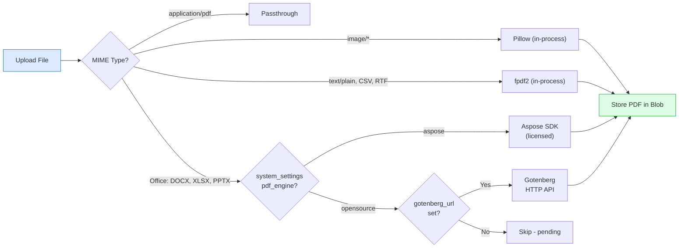

[Home](../../README.md) > [Guides](.) > **Developer Guide**

# AssuranceNet Developer Guide

> **TL;DR:** Everything you need to set up a local development environment, understand the codebase, and contribute to AssuranceNet. Covers backend (Python/FastAPI), frontend (React/TypeScript), Azure Functions (PDF conversion), database migrations, testing, linting, FSIS demo data, and the git workflow.

This guide covers everything you need to set up a local development environment, understand the codebase, and contribute to the AssuranceNet Document Management System -- an Azure-native replacement for Oracle UCM built for FSIS (Food Safety and Inspection Service).

---

## Table of Contents

1. [Development Environment Setup](#1-development-environment-setup)
2. [Backend Development (Python/FastAPI)](#2-backend-development-pythonfastapi)
3. [Frontend Development (React/TypeScript)](#3-frontend-development-reacttypescript)
4. [Azure Functions Development](#4-azure-functions-development)
5. [Database Migrations](#5-database-migrations)
6. [Testing](#6-testing)
7. [Linting & Code Quality](#7-linting--code-quality)
8. [Using FSIS Demo Data](#8-using-fsis-demo-data)
9. [Git Workflow](#9-git-workflow)

---

## 1. Development Environment Setup

### 📎 Prerequisites

| Tool | Version | Purpose |
|------|---------|---------|
| Python | 3.11+ | Backend API, Azure Functions |
| Node.js | 20+ | Frontend build tooling |
| Azure CLI | Latest | Azure resource interaction, local auth |
| ODBC Driver 18 for SQL Server | Latest | Azure SQL connectivity |
| Azure Functions Core Tools | 4.x | Local Functions development |
| Docker (optional) | Latest | Running Gotenberg locally (if using opensource engine with Office conversion) |

### 🚀 Clone and Initialize

```bash
git clone https://github.com/YOUR_ORG/ucm-azure-native-demo.git
cd ucm-azure-native-demo

# Run the initialization script (creates venvs, installs deps, copies .env)
./scripts/setup/init-dev.sh
```

The init script performs the following:

- [ ] Creates a Python virtual environment in `src/backend/.venv`
- [ ] Installs backend dependencies from `pyproject.toml` (including dev extras)
- [ ] Installs frontend dependencies via `npm install` in `src/frontend/`
- [ ] Copies `.env.example` to `.env` if one does not already exist

### ⚙️ Configure Environment Variables

Copy `.env.example` to `.env` at the project root and fill in values for your development environment:

```bash
cp .env.example .env
```

Key variables to configure:

| Variable | Description |
|----------|-------------|
| `ENVIRONMENT` | `dev` for local development |
| `AZURE_CLIENT_ID` | Service principal or managed identity client ID |
| `AZURE_TENANT_ID` | Entra ID tenant |
| `AZURE_STORAGE_ACCOUNT_NAME` | Dev storage account name |
| `AZURE_SQL_SERVER` | SQL server FQDN (e.g., `sql-assurancenet-dev.database.windows.net`) |
| `AZURE_SQL_DATABASE` | Database name (e.g., `sqldb-assurancenet-dev`) |
| `AZURE_KEY_VAULT_URI` | Key Vault URI |
| `ENTRA_TENANT_ID` | Entra ID tenant for JWT validation |
| `ENTRA_CLIENT_ID` | App registration client ID |
| `APPLICATIONINSIGHTS_CONNECTION_STRING` | App Insights connection string |

> [!WARNING]
> Never commit your `.env` file. It is included in `.gitignore`.

### ⌨️ Running the Backend

```bash
cd src/backend
source .venv/bin/activate      # On Windows: .venv\Scripts\activate
uvicorn app.main:app --reload
```

The API starts on `http://localhost:8000`. Interactive docs are available at `http://localhost:8000/api/docs` (Swagger UI) and `http://localhost:8000/api/redoc` (ReDoc). These are disabled in production.

### ⌨️ Running the Frontend

```bash
cd src/frontend
npm run dev
```

The frontend starts on `http://localhost:5173`.

### ⚙️ Vite Dev Proxy

The Vite development server proxies all `/api/*` requests to `http://localhost:8000`, so the frontend and backend work together seamlessly during local development without CORS issues. This is configured in `vite.config.ts`:

```typescript
server: {
  port: 5173,
  proxy: {
    "/api": {
      target: "http://localhost:8000",
      changeOrigin: true,
    },
  },
},
```

---

## 2. Backend Development (Python/FastAPI)

### 📁 Project Structure

```
📁 src/backend/
├── 📁 app/
│   ├── 📄 main.py              # FastAPI application entry point, lifespan, middleware
│   ├── 📄 config.py            # Pydantic-settings configuration (env vars)
│   ├── 📄 dependencies.py      # Dependency injection: Azure SDK clients (Blob, KeyVault)
│   ├── 📁 api/v1/
│   │   ├── 📄 router.py        # Aggregates all v1 routers
│   │   ├── 📄 health.py        # Health and readiness probe endpoints
│   │   ├── 📄 documents.py     # Document CRUD: upload, download, PDF, versions, delete
│   │   ├── 📄 investigations.py  # Investigation CRUD endpoints
│   │   ├── 📄 pdf_merge.py     # PDF merge endpoint
│   │   └── 📄 audit.py         # Audit log query endpoint
│   ├── 📁 services/
│   │   ├── 📄 blob_service.py    # Azure Blob Storage operations
│   │   ├── 📄 metadata_service.py  # Database CRUD for metadata
│   │   ├── 📄 audit_service.py   # NIST 800-53 AU-2/AU-3 audit logging
│   │   └── 📄 pdf_merge_service.py # Server-side PDF merge using pypdf
│   ├── 📁 models/
│   │   ├── 📄 enums.py           # StrEnum definitions
│   │   └── 📄 schemas.py         # Pydantic request/response schemas
│   ├── 📁 db/
│   │   ├── 📄 models.py          # SQLAlchemy ORM models
│   │   ├── 📄 session.py         # Async session factory for Azure SQL
│   │   └── 📁 migrations/        # Alembic migration scripts
│   ├── 📁 middleware/
│   │   ├── 📄 auth.py            # Entra ID JWT validation, UserClaims, require_role
│   │   ├── 📄 audit.py           # NIST-compliant audit event middleware
│   │   ├── 📄 correlation.py     # X-Correlation-ID propagation
│   │   └── 📄 logging.py         # structlog request/response logging
│   └── 📁 telemetry/
│       └── 📄 setup.py           # OpenTelemetry + Azure Monitor instrumentation
├── 📄 pyproject.toml         # Project metadata, dependencies, tool configuration
└── 📄 Dockerfile             # Production container image
```

### 💡 Adding a New API Endpoint

1. **Create or modify a router file** in `app/api/v1/`. If creating a new domain, create a new file (e.g., `app/api/v1/reports.py`):

   ```python
   """Report generation endpoints."""
   from fastapi import APIRouter
   router = APIRouter()

   @router.get("/summary")
   async def get_summary():
       return {"status": "ok"}
   ```

2. **Register the router** in `app/api/v1/router.py`:

   ```python
   from app.api.v1.reports import router as reports_router
   api_v1_router.include_router(reports_router, prefix="/reports", tags=["Reports"])
   ```

3. **Add authentication** if the endpoint requires it by using the `validate_token` or `require_role` dependency:

   ```python
   from typing import Annotated
   from fastapi import Depends
   from app.middleware.auth import UserClaims, validate_token, require_role

   @router.get("/protected")
   async def protected_endpoint(
       user: Annotated[UserClaims, Depends(validate_token)],
   ):
       return {"user": user.name}

   @router.delete("/admin-only")
   async def admin_endpoint(
       user: Annotated[UserClaims, Depends(require_role("Admin"))],
   ):
       return {"deleted": True}
   ```

4. **Inject services and DB sessions** using FastAPI's `Depends`:

   ```python
   from sqlalchemy.ext.asyncio import AsyncSession
   from app.db.session import get_db_session

   @router.get("/data")
   async def get_data(
       session: Annotated[AsyncSession, Depends(get_db_session)],
   ):
       # Use session for database queries
       ...
   ```

### 💡 Adding a New Service

Services live in `app/services/` and encapsulate business logic. Follow the existing pattern:

1. Create a new file (e.g., `app/services/report_service.py`).
2. Accept dependencies (database session, blob client) via constructor injection.
3. Use `structlog.get_logger()` for structured logging.

```python
"""Report generation service."""
import structlog
from sqlalchemy.ext.asyncio import AsyncSession

logger = structlog.get_logger()

class ReportService:
    def __init__(self, session: AsyncSession) -> None:
        self._session = session

    async def generate_summary(self, investigation_id: str) -> dict:
        logger.info("generating_summary", investigation_id=investigation_id)
        # Business logic here
        ...
```

### 🗄️ Adding a New Database Model + Alembic Migration

1. **Define the model** in `app/db/models.py` using SQLAlchemy 2.0 mapped columns:

   ```python
   class Report(Base):
       __tablename__ = "reports"

       id: Mapped[uuid.UUID] = mapped_column(Uuid, primary_key=True, default=uuid.uuid4)
       title: Mapped[str] = mapped_column(String(500), nullable=False)
       created_at: Mapped[datetime] = mapped_column(DateTime, nullable=False, default=datetime.utcnow)

       __table_args__ = (
           Index("ix_reports_created_at", "created_at"),
       )
   ```

2. **Generate the migration** (see section 5 below).
3. **Create matching Pydantic schemas** in `app/models/schemas.py`.

### 💡 Writing Pydantic Schemas

All request and response models live in `app/models/schemas.py`. Use Pydantic v2 features:

```python
from pydantic import BaseModel, Field

class ReportCreate(BaseModel):
    title: str = Field(min_length=1, max_length=500)
    description: str | None = None

class ReportResponse(BaseModel):
    id: UUID
    title: str
    created_at: datetime
    model_config = {"from_attributes": True}  # Enables ORM mode
```

### 📊 Using structlog for Logging

All backend code uses `structlog` for structured, JSON-formatted logging that integrates with Application Insights:

```python
import structlog
logger = structlog.get_logger()

logger.info("document_uploaded", document_id=str(document.id), version=version.version_number, size_bytes=len(data))
logger.warning("conversion_failed", document_id=str(document.id), version=version.version_number, error=str(e))
```

> [!TIP]
> Always include contextual key-value pairs rather than formatting strings. This enables effective log querying in Log Analytics.

### ⚙️ Dependency Injection Pattern

The project uses FastAPI's `Depends` system for dependency injection. Core dependencies are defined in `app/dependencies.py`:

| Dependency | Purpose |
|------------|---------|
| `get_settings()` | Cached application settings |
| `get_azure_credential()` | `DefaultAzureCredential` in dev, `ManagedIdentityCredential` in production |
| `get_blob_service_client()` | Azure Blob Storage client |
| `get_key_vault_client()` | Azure Key Vault client |
| `get_db_session()` | Async SQLAlchemy session (from `app/db/session.py`) |

### 🔒 Authentication

Authentication uses Entra ID (Azure AD) JWT tokens validated in `app/middleware/auth.py`:

- **`validate_token`**: Dependency that validates the Bearer token and returns `UserClaims` (oid, name, preferred_username, roles, tid).
- **`require_role(*roles)`**: Dependency factory that checks the user has at least one of the required roles. Returns 403 if not.
- JWKS keys are fetched from the Entra ID OpenID configuration endpoint and cached.

### 📊 Audit Logging Middleware

The `AuditMiddleware` in `app/middleware/audit.py` automatically logs audit events for all state-changing operations (POST, PUT, PATCH, DELETE) on `/api/*` paths. It captures user ID, IP address, user agent, resource path, HTTP method, status code, result, and correlation ID -- compliant with NIST 800-53 AU-2/AU-3 controls.

---

## 3. Frontend Development (React/TypeScript)

### 📁 Project Structure

```
📁 src/frontend/
├── 📁 src/
│   ├── 📄 main.tsx             # Application entry point, MSAL provider setup
│   ├── 📄 App.tsx              # Root component with routes, auth gate
│   ├── 📁 auth/
│   │   ├── 📄 AuthProvider.tsx   # MSAL React auth provider wrapper
│   │   ├── 📄 msal-config.ts     # MSAL configuration
│   │   └── 📄 useAuth.ts         # Custom hook: login, logout, getAccessToken, user
│   ├── 📁 api/
│   │   ├── 📄 client.ts          # Axios instance with auth interceptor
│   │   ├── 📄 documents.ts       # Document API calls
│   │   ├── 📄 investigations.ts  # Investigation API calls
│   │   └── 📄 types.ts           # TypeScript API response types
│   ├── 📁 components/
│   │   ├── 📁 documents/         # DocumentList, DocumentUpload, PdfMerge, etc.
│   │   ├── 📁 layout/            # AppShell, Header, Sidebar
│   │   └── 📁 ui/                # Button, FileDropzone, Modal, StatusBadge, Table
│   ├── 📁 hooks/
│   │   ├── 📄 useDocuments.ts    # React Query hooks for documents
│   │   ├── 📄 useInvestigations.ts  # React Query hooks for investigations
│   │   └── 📄 usePdfMerge.ts     # React Query hook for PDF merge
│   ├── 📁 pages/
│   │   ├── 📄 DashboardPage.tsx
│   │   ├── 📄 InvestigationsListPage.tsx
│   │   ├── 📄 InvestigationPage.tsx
│   │   └── 📄 AuditLogPage.tsx
│   └── 📁 styles/
│       └── 📄 globals.css        # Tailwind CSS imports and global styles
├── 📄 vite.config.ts         # Vite build configuration + dev proxy
├── 📄 tailwind.config.ts     # Tailwind CSS configuration
├── 📄 tsconfig.json          # TypeScript compiler options
└── 📄 package.json           # Dependencies and scripts
```

### 💡 Adding a New Page

1. **Create the page component** in `src/pages/`:

   ```tsx
   // src/pages/ReportsPage.tsx
   export function ReportsPage() {
     return (
       <div className="space-y-6">
         <h1 className="text-2xl font-bold text-gray-900">Reports</h1>
         {/* Page content */}
       </div>
     );
   }
   ```

2. **Add the route** in `src/App.tsx`:

   ```tsx
   import { ReportsPage } from "./pages/ReportsPage";

   // Inside <Routes> within <AuthenticatedTemplate>:
   <Route path="/reports" element={<ReportsPage />} />
   ```

3. **Add navigation** in the Sidebar component if needed.

### 💡 Adding a New API Call

1. **Add the API function** in `src/api/` (create a new file or add to an existing one):

   ```typescript
   // src/api/reports.ts
   import { apiClient } from "./client";

   export async function getReports(page = 1) {
     const response = await apiClient.get("/reports", { params: { page } });
     return response.data;
   }
   ```

2. **Create a React Query hook** in `src/hooks/`:

   ```typescript
   // src/hooks/useReports.ts
   import { useQuery } from "@tanstack/react-query";
   import { getReports } from "../api/reports";

   export function useReports(page = 1) {
     return useQuery({
       queryKey: ["reports", page],
       queryFn: () => getReports(page),
     });
   }
   ```

3. **Use the hook** in your page component:

   ```tsx
   const { data, isLoading, error } = useReports();
   ```

### 💡 Creating Components

Follow the existing composable pattern with Tailwind CSS utility classes:

- Small, focused components in `src/components/ui/` for reusable primitives.
- Domain-specific components in `src/components/documents/` (or a new domain folder).
- Use TypeScript interfaces for props. Export components as named exports.

### 🔒 Authentication with useAuth

The `useAuth` hook provides:

| Method/Property | Description |
|----------------|-------------|
| `login()` | Triggers MSAL redirect login |
| `logout()` | Triggers MSAL redirect logout |
| `getAccessToken()` | Silently acquires a JWT for API calls (falls back to redirect) |
| `user` | Current user object (`{ id, name, email }`) or `null` |
| `isAuthenticated` | Boolean indicating active session |

The `App.tsx` component uses MSAL's `AuthenticatedTemplate` and `UnauthenticatedTemplate` to gate all routes behind authentication.

### ⚙️ State Management with TanStack React Query

The project uses TanStack React Query (v5) for server state management. Patterns used:

- **`useQuery`** for data fetching with automatic caching and refetching.
- **`useMutation`** for state-changing operations (upload, delete) with automatic cache invalidation via `queryClient.invalidateQueries`.
- Query keys follow the convention `["resource", id, page]` for cache management.

> [!NOTE]
> There is no client-side state management library (e.g., Redux, Zustand). All application state is server-driven via React Query.

---

## 4. Azure Functions Development

### 📁 Project Structure

```
📁 src/functions/
├── 📄 function_app.py       # Azure Functions app registration, Event Grid trigger
├── 📄 pdf_converter.py      # Event handler: downloads blob, routes to converter, uploads PDF
├── 📄 host.json             # Functions host configuration
├── 📄 requirements.txt      # Python dependencies
├── 📄 Dockerfile            # Container image for deployment
└── 📁 services/
    ├── 📄 conversion_service.py   # Routes files to correct converter by content type
    ├── 📄 gotenberg_client.py     # HTTP client for Gotenberg PDF conversion service
    ├── 📄 image_converter.py      # PIL-based image-to-PDF conversion
    └── 📄 text_converter.py       # Text/RTF to PDF conversion
```

### 🏗️ How PDF Conversion Works

PDF conversion runs **in-process** during file upload in the FastAPI backend. The conversion engine is admin-configurable via the `system_settings` database table.



1. A document is uploaded via the API. The backend reads the `pdf_engine` setting from `system_settings`.
2. Based on the file's MIME type, it routes to the appropriate converter (in-process, no external Function required).
3. Images use Pillow, text/CSV use fpdf2, Office files use Aspose (if licensed) or Gotenberg (if URL configured).
4. The converted PDF is uploaded to `{record_id}/{document_id}/pdf/v{N}/{basename}.pdf`.
5. The `DocumentVersion.pdf_conversion_status` is updated to `completed`.

> **Note:** The Azure Functions pipeline (`src/functions/`) is an optional async alternative for high-volume scenarios. In the default architecture, PDF conversion runs in-process during upload.

### 💡 Adding a New Converter

1. Add your MIME type to the sets in `src/backend/app/services/pdf_conversion_service.py`.
2. Implement a `_convert_xxx(file_data, filename)` function that returns PDF bytes.
3. Add the routing logic in the `convert_to_pdf()` function.

### ⌨️ Testing Locally with Azure Functions Core Tools

```bash
cd src/functions

# Start the Functions runtime
func start

# The function will listen for Event Grid events on the local endpoint
# Use the Azure Storage Emulator or Azurite for local blob storage testing
```

> [!IMPORTANT]
> Ensure the `GOTENBERG_URL` environment variable points to a running Gotenberg instance (e.g., `http://localhost:3000` if running Gotenberg in Docker locally).

---

## 5. Database Migrations

The project uses Alembic for database schema migrations against Azure SQL. Configuration is in `src/backend/app/db/migrations/`.

### ⚙️ Alembic Workflow

The standard workflow: autogenerate a migration from model changes, review it, then apply.

### ⌨️ Creating a Migration

After modifying models in `app/db/models.py`:

```bash
cd src/backend
source .venv/bin/activate
alembic -c app/db/migrations/alembic.ini revision --autogenerate -m "add reports table"
```

> [!IMPORTANT]
> Always review the generated migration before applying -- autogenerate does not catch every change (e.g., data migrations, index renames).

### ⌨️ Applying Migrations

```bash
alembic -c app/db/migrations/alembic.ini upgrade head
```

### ⌨️ Rolling Back

```bash
# Roll back one migration
alembic -c app/db/migrations/alembic.ini downgrade -1

# Roll back to a specific revision
alembic -c app/db/migrations/alembic.ini downgrade <revision_id>
```

### 💡 Migration Best Practices

- [ ] **Always review autogenerated migrations.** Alembic may generate unnecessary operations or miss nuances.
- [ ] **Keep migrations small and focused.** One logical change per migration.
- [ ] **Include both `upgrade()` and `downgrade()` functions** -- every migration must be reversible.
- [ ] **Test migrations locally** before applying to staging or production.
- [ ] **Never modify a migration that has been applied** to shared environments. Create a new migration instead.
- [ ] **Name migrations descriptively**: `002_add_reports_table.py`, not `002_changes.py`.
- [ ] **Handle data migrations separately** from schema migrations where possible.

---

## 6. Testing

### 📁 Test Directory Structure

```
📁 tests/
├── 📁 backend/
│   ├── 📄 conftest.py                    # Shared fixtures (mock auth, test client, mock Azure SDK)
│   ├── 📁 unit/
│   │   ├── 📄 test_audit_service.py
│   │   ├── 📄 test_blob_service.py
│   │   ├── 📄 test_metadata_service.py
│   │   └── 📄 test_pdf_merge_service.py
│   └── 📁 integration/
│       ├── 📄 test_api_audit.py
│       ├── 📄 test_api_documents.py
│       └── 📄 test_api_pdf_merge.py
├── 📁 frontend/
│   ├── 📁 components/
│   │   ├── 📄 DocumentList.test.tsx
│   │   ├── 📄 DocumentUpload.test.tsx
│   │   └── 📄 PdfMerge.test.tsx
│   └── 📁 e2e/
│       └── 📄 document-workflow.spec.ts
├── 📁 functions/
│   ├── 📄 test_gotenberg_client.py
│   ├── 📄 test_image_converter.py
│   ├── 📄 test_pdf_converter.py
│   └── 📄 test_text_converter.py
└── 📁 infra/
    └── (Bicep validation tests)
```

### 🧪 Running Backend Tests

```bash
cd src/backend
source .venv/bin/activate
pytest ../../tests/backend/ -v
```

The `pyproject.toml` configures pytest to run with coverage reporting and an 80% minimum coverage threshold:

```
addopts = "--cov=app --cov-report=term-missing --cov-fail-under=80"
```

### 🧪 Running Frontend Tests

```bash
cd src/frontend
npx vitest run
```

For watch mode during development:

```bash
npx vitest
```

For coverage:

```bash
npx vitest run --coverage
```

### 🧪 Running Function Tests

```bash
cd src/backend   # Use the backend venv which has pytest
source .venv/bin/activate
pytest ../../tests/functions/ -v
```

### 💡 Writing Unit Tests

Unit tests mock external dependencies (Azure SDK, database) and test service logic in isolation.

```python
# Example: tests/backend/unit/test_blob_service.py
from unittest.mock import MagicMock
from app.services.blob_service import BlobService

def test_compute_checksum():
    data = b"test file content"
    checksum = BlobService.compute_checksum(data)
    assert len(checksum) == 64  # SHA-256 hex digest

def test_build_blob_path():
    mock_client = MagicMock()
    svc = BlobService(mock_client)
    path = svc.build_blob_path("INVESTIGATION-10001", "file-123", "report.docx")
    assert path == "INVESTIGATION-10001/file-123/blob/report.docx"
```

> [!TIP]
> Key patterns: Mock Azure SDK clients with `unittest.mock.MagicMock`. Use `conftest.py` for shared fixtures. Test service methods independently from HTTP endpoints.

### 💡 Writing Integration Tests

Integration tests use FastAPI's `TestClient` with mocked authentication:

```python
# Example: tests/backend/integration/test_api_documents.py
from fastapi.testclient import TestClient

def test_upload_document(client, mock_auth):
    """Test document upload through the full API stack."""
    response = client.post(
        "/api/v1/documents/upload/{investigation_id}",
        files={"file": ("test.pdf", b"PDF content", "application/pdf")},
    )
    assert response.status_code == 201
    assert "document_id" in response.json()
```

### 🧪 Writing E2E Tests (Playwright)

End-to-end tests are in `tests/frontend/e2e/` and use Playwright:

```bash
cd src/frontend
npx playwright test
```

### 📊 Coverage Requirements

Maintain a minimum of **80% code coverage** for backend code. The CI pipeline enforces this threshold. Frontend components should have tests for key user interactions.

---

## 7. Linting & Code Quality

### ⌨️ Ruff (Python Linting + Formatting)

Ruff is configured in `pyproject.toml` with a comprehensive rule set including pycodestyle, pyflakes, isort, pep8-naming, pyupgrade, flake8-bugbear, flake8-bandit, and more.

```bash
cd src/backend
source .venv/bin/activate

# Lint check
ruff check app/

# Auto-fix lint issues
ruff check app/ --fix

# Format code
ruff format app/

# Check formatting without modifying
ruff format app/ --check
```

> [!NOTE]
> Line length is set to 120 characters. Target Python version is 3.11.

### ⌨️ mypy (Type Checking)

```bash
cd src/backend
mypy app/ --ignore-missing-imports
```

mypy is configured in strict mode in `pyproject.toml`.

### ⌨️ ESLint (TypeScript/React)

```bash
cd src/frontend
npx eslint src/
```

Includes the `react-hooks` plugin for hook rules enforcement.

### ⌨️ TypeScript Compiler Check

```bash
cd src/frontend
npx tsc --noEmit
```

### ⚙️ Pre-commit Hooks

The project uses `pre-commit` (listed in dev dependencies). Install hooks:

```bash
pre-commit install
```

Pre-commit runs Ruff, mypy, and ESLint checks automatically before each commit.

---

## 8. Using FSIS Demo Data

The project includes a seed script that populates the system with realistic FSIS (Food Safety and Inspection Service) investigation data sourced from public USDA datasets.

### ⌨️ Running the Seed Script

```bash
# Full run: download files + create investigations + upload documents
AUTH_TOKEN=$(az account get-access-token --resource api://YOUR_CLIENT_ID --query accessToken -o tsv)
./scripts/setup/seed-data.sh

# Download FSIS files only (no API calls)
./scripts/setup/seed-data.sh --download-only

# Skip downloads if files already exist
AUTH_TOKEN=$TOKEN ./scripts/setup/seed-data.sh --skip-download

# Dry run to see what would be done
./scripts/setup/seed-data.sh --dry-run
```

### 📋 Available Demo Investigations

The seed script creates eight realistic FSIS investigations:

| Record ID | Title | Purpose |
|-----------|-------|---------|
| INVESTIGATION-10001 | FY2025 Annual Sampling Program | Annual microbiological and chemical sampling across federally inspected establishments |
| INVESTIGATION-10002 | National Residue Program - Chemical Testing Q2 | Quarterly residue monitoring for veterinary drugs, pesticides, and contaminants |
| INVESTIGATION-10003 | Microbiology Baseline Data Collection - Poultry | Salmonella and Campylobacter prevalence baseline survey |
| INVESTIGATION-10004 | Humane Handling Verification - District 50 | Humane handling and slaughter compliance review |
| INVESTIGATION-10005 | MPI Directory Establishment Audit | Meat, Poultry, and Egg Products Inspection Directory audit |
| INVESTIGATION-10006 | Quarterly Enforcement Review FY2024 | Enforcement, investigations, and analysis activities review |
| INVESTIGATION-10007 | STEC Sampling Results Analysis | Shiga toxin-producing E. coli sampling results from raw beef |
| INVESTIGATION-10008 | Import Sampling Program Compliance | Imported meat/poultry sampling at ports of entry |

### 📁 Sample Files from FSIS Science Data

All demo files are downloaded from https://www.fsis.usda.gov/science-data and stored in `temp/fsis-demo-data/`. These are real public documents published by USDA FSIS.

### 📋 Demo Data Categories

| Category | Example Files | File Types |
|----------|--------------|------------|
| Sampling Plans | FY2025 and FY2024 Annual Sampling Plans | PDF |
| Residue Reports | QSR Residue Tolerances Summary Report | PDF |
| Microbiology Data | Sampling Summary Reports (FY2024A, FY2021) | PDF |
| Establishment Directories | MPI Directory by Establishment Number and Name | CSV |
| Reference Documents | Red Book, Blue Book, CSV Data Guide | PDF |

> [!NOTE]
> Each investigation is associated with 2 relevant FSIS files that are uploaded as documents, triggering the PDF conversion pipeline for non-PDF files (e.g., the CSV establishment directories).

---

## 9. Git Workflow

### 🔄 Branch Naming

| Prefix | Purpose | Example |
|--------|---------|---------|
| `feature/` | New features | `feature/report-generation` |
| `bugfix/` | Bug fixes | `bugfix/pdf-conversion-timeout` |
| `hotfix/` | Production hotfixes | `hotfix/auth-token-expiry` |

### 🔄 Pull Request Process

1. **Create a branch** from `main`:
   ```bash
   git checkout -b feature/my-feature main
   ```

2. **Implement the feature** with incremental, well-described commits.

3. **Run all tests locally** before pushing:
   ```bash
   # Backend
   cd src/backend && pytest ../../tests/backend/ -v

   # Frontend
   cd src/frontend && npx vitest run

   # Functions
   pytest tests/functions/ -v

   # Linting
   cd src/backend && ruff check app/ && ruff format app/ --check
   cd src/frontend && npx eslint src/ && npx tsc --noEmit
   ```

4. **Push and create a PR** targeting `main`.

5. **PR review** -- at least one reviewer must approve before merge.

6. **Merge** once CI checks pass and approval is given. Use squash merge for feature branches.

### 🔄 CI Checks That Must Pass

All of the following checks run in the CI pipeline and must pass before a PR can be merged:

- [ ] Ruff lint and format check (Python)
- [ ] mypy type check (Python)
- [ ] pytest with 80% coverage minimum (Backend)
- [ ] ESLint (TypeScript/React)
- [ ] TypeScript compiler check (`tsc --noEmit`)
- [ ] Vitest (Frontend unit tests)
- [ ] Bicep lint (`az bicep build`) for infrastructure changes

---

> **Navigation:** [Guides Home](README.md) | [User Guide](user-guide.md) | [Deployment Guide](deployment-guide.md) | [Operations Guide](operations-guide.md) | [Best Practices](best-practices.md) | [Troubleshooting](troubleshooting.md)
