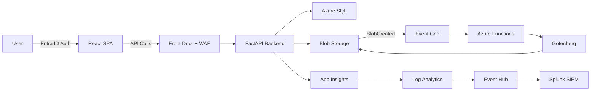
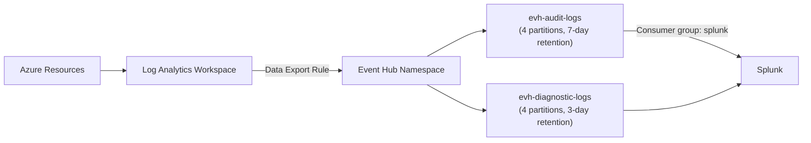

[Home](../../README.md) > [Guides](.) > **Operations Guide**

# AssuranceNet Operations Guide

> **TL;DR:** Day-to-day operational procedures for maintaining system health and reliability. Covers health monitoring, dashboards, KQL queries, alert response, routine maintenance, scaling, backup/recovery, security operations, and Splunk integration. Intended for operations engineers, SREs, and on-call personnel.

This guide covers the day-to-day operational procedures for the AssuranceNet Document Management System -- the Azure-native replacement for Oracle UCM serving FSIS (Food Safety and Inspection Service). It is intended for operations engineers, SREs, and on-call personnel responsible for maintaining system health and reliability.

---

## Table of Contents

1. [System Architecture Overview](#1-system-architecture-overview)
2. [Health Monitoring](#2-health-monitoring)
3. [Monitoring Dashboards](#3-monitoring-dashboards)
4. [Common KQL Queries](#4-common-kql-queries)
5. [Alert Response Procedures](#5-alert-response-procedures)
6. [Routine Maintenance](#6-routine-maintenance)
7. [Scaling Operations](#7-scaling-operations)
8. [Backup & Recovery](#8-backup--recovery)
9. [Security Operations](#9-security-operations)
10. [Splunk Integration](#10-splunk-integration)

---

## 1. System Architecture Overview

### 🏗️ Component Diagram

Refer to the architecture diagrams in `docs/architecture/` and `docs/diagrams/` for detailed visual representations. At a high level, the system consists of:

| Component | Technology | Purpose |
|-----------|-----------|---------|
| **Frontend** | React SPA on Azure Static Web Apps | User interface, served via Azure Front Door |
| **Backend API** | FastAPI on Azure App Service (Linux containers) | REST API for document management |
| **PDF Conversion** | Azure Functions + Event Grid + Gotenberg on Container Apps | Automatic document-to-PDF conversion |
| **Data Layer** | Azure Blob Storage + Azure SQL Database | Documents (blobs) and metadata/audit logs (SQL) |
| **Security** | Azure Key Vault, Managed Identities, Entra ID, Defender | Identity, secrets, and threat protection |
| **Monitoring** | Application Insights, Log Analytics, Event Hub | Observability and Splunk integration |

### 📁 Resource Groups

The infrastructure is organized into five resource groups per environment:

| Resource Group | Naming Pattern | Purpose |
|----------------|---------------|---------|
| **Network** | `rg-assurancenet-network-{env}` | VNet, subnets, NSGs, Azure Front Door, private DNS zones |
| **App** | `rg-assurancenet-app-{env}` | App Service, Static Web App, Azure Functions, Container Apps (Gotenberg) |
| **Data** | `rg-assurancenet-data-{env}` | Azure Blob Storage, Azure SQL Server/Database, Event Grid |
| **Security** | `rg-assurancenet-security-{env}` | Azure Key Vault, Managed Identities |
| **Monitoring** | `rg-assurancenet-monitoring-{env}` | Log Analytics Workspace, Application Insights (x3), Event Hub (Splunk), Azure Dashboard, Budgets |

### 🏗️ Data Flow Summary



1. User authenticates via Microsoft Entra ID through the React frontend.
2. Frontend calls the FastAPI backend through Azure Front Door.
3. Backend validates JWT, processes requests, and interacts with Azure SQL (metadata) and Blob Storage (files).
4. Document uploads to Blob Storage trigger an Event Grid event.
5. Azure Functions receive the event and convert the document to PDF using Gotenberg (Container Apps) or built-in converters.
6. Converted PDFs are stored back in Blob Storage alongside the originals.
7. All operations are logged to Application Insights and the audit log table (NIST 800-53 compliant).
8. Log Analytics data is exported to Event Hub for Splunk SIEM integration.

---

## 2. Health Monitoring

### ⚡ Health Endpoint (Liveness)

```
GET /api/v1/health
```

Returns HTTP 200 if the application process is running. This is a lightweight liveness probe that does not check external dependencies.

**Response:**
```json
{
  "status": "healthy",
  "environment": "prod",
  "version": "0.1.0"
}
```

Use this endpoint for Azure App Service health probes and load balancer liveness checks.

### ⚡ Readiness Endpoint

```
GET /api/v1/health/ready
```

Checks connectivity to critical dependencies. Returns HTTP 200 only when all checks pass.

**Response (healthy):**
```json
{
  "status": "ready",
  "checks": {
    "database": true,
    "storage": true
  }
}
```

**Response (degraded):**
```json
{
  "status": "not_ready",
  "checks": {
    "database": true,
    "storage": false
  }
}
```

Checks performed:

| Check | Method |
|-------|--------|
| **Database** | Executes `SELECT 1` against Azure SQL to verify connectivity |
| **Storage** | Calls `get_container_properties()` on the `assurancenet-documents` container |

> [!IMPORTANT]
> Use this endpoint for App Service readiness probes. Failed readiness checks indicate the application should not receive traffic.

### ⚙️ Azure Monitor Health Checks

Configure App Service health checks in the Azure Portal or via Bicep:

| Setting | Value |
|---------|-------|
| Path | `/api/v1/health` |
| Interval | 30 seconds |
| Unhealthy threshold | 3 consecutive failures |

### ⚡ Gotenberg Health

The Gotenberg container on Azure Container Apps exposes a health probe at its root port (3000). Container Apps manages health probing and restart automatically. Verify manually:

```bash
# From within the VNet or via Container Apps console
curl http://ca-gotenberg-{env}:3000/health
```

---

## 3. Monitoring Dashboards

### 📊 Azure Dashboard

**Dashboard name**: `dash-assurancenet-ops-{env}`

Located in the Monitoring resource group, this dashboard provides four key panels:

| Panel | KQL Query | Purpose |
|-------|-----------|---------|
| API Requests (24h) | `AppRequests \| where TimeGenerated > ago(24h) \| summarize count() by bin(TimeGenerated, 1h) \| render timechart` | Request volume trends |
| API Latency Percentiles (24h) | `AppRequests \| where TimeGenerated > ago(24h) \| summarize percentile(DurationMs, 50), percentile(DurationMs, 95), percentile(DurationMs, 99) by bin(TimeGenerated, 5m) \| render timechart` | P50/P95/P99 latency tracking |
| Errors by Type (24h) | `AppExceptions \| where TimeGenerated > ago(24h) \| summarize count() by bin(TimeGenerated, 1h), ProblemId \| render barchart` | Error categorization and trends |
| Application Insights Monitor | Linked to `appi-backend-{env}` | Live metrics and health overview |

### 📊 Application Insights

Three Application Insights instances are deployed per environment:

| Instance | Name Pattern | Monitors |
|----------|-------------|----------|
| Backend | `appi-backend-{env}` | FastAPI application (requests, dependencies, exceptions) |
| Functions | `appi-functions-{env}` | Azure Functions (PDF conversion triggers, execution) |
| Frontend | `appi-frontend-{env}` | React SPA (page views, browser exceptions, user flows) |

Key Application Insights features for operations:

- **Live Metrics**: Real-time request rate, failure rate, and dependency calls
- **Failures**: Exception drill-down with full stack traces and correlation IDs
- **Performance**: Request duration distribution, dependency performance, slowest operations
- **Application Map**: Visual dependency graph showing health of each component

### 🗄️ Log Analytics

The Log Analytics workspace `law-assurancenet-{env}` aggregates all logs. Retention is set to 90 days for standard logs, and 3 years (1,095 days) for `SecurityEvent` tables in production (NIST 800-53 AU-11 compliance).

> [!NOTE]
> In non-production environments, a daily ingestion cap of 5 GB is applied to control costs.

---

## 4. Common KQL Queries

Use these queries in Log Analytics or Application Insights Logs.

### 🔧 Recent API Errors (Last Hour)

```kql
AppExceptions
| where TimeGenerated > ago(1h)
| project TimeGenerated, ProblemId, ExceptionType, OuterMessage, OperationName, AppRoleName
| order by TimeGenerated desc
| take 50
```

### ⚡ Slow Requests (Over 3 Seconds)

```kql
AppRequests
| where TimeGenerated > ago(1h)
| where DurationMs > 3000
| project TimeGenerated, Name, DurationMs, ResultCode, Url, AppRoleName
| order by DurationMs desc
| take 50
```

### 🔧 PDF Conversion Failures

```kql
FunctionAppLogs
| where TimeGenerated > ago(24h)
| where Level == "Error"
| where Message contains "PDF conversion failed" or Message contains "conversion_failed"
| project TimeGenerated, HostInstanceId, Message, ExceptionMessage
| order by TimeGenerated desc
```

### 🔒 Authentication Failures

```kql
AppRequests
| where TimeGenerated > ago(1h)
| where ResultCode in ("401", "403")
| project TimeGenerated, Name, ResultCode, ClientIP, Url
| order by TimeGenerated desc
| summarize FailureCount=count() by ClientIP, ResultCode, bin(TimeGenerated, 5m)
```

### 🗄️ Storage Operations

```kql
AppDependencies
| where TimeGenerated > ago(1h)
| where DependencyType == "Azure blob"
| summarize
    TotalCalls=count(),
    FailedCalls=countif(Success == false),
    AvgDurationMs=avg(DurationMs),
    P95DurationMs=percentile(DurationMs, 95)
  by bin(TimeGenerated, 5m)
| render timechart
```

### 📊 Audit Log Queries

```kql
// All audit events in the last 24 hours
AppTraces
| where TimeGenerated > ago(24h)
| where Message contains "audit_event"
| extend EventData = parse_json(Message)
| project
    TimeGenerated,
    EventType = tostring(EventData.event_type),
    UserId = tostring(EventData.user_id),
    ResourcePath = tostring(EventData.resource_path),
    Method = tostring(EventData.method),
    StatusCode = toint(EventData.status_code),
    Result = tostring(EventData.result),
    CorrelationId = tostring(EventData.correlation_id)
| order by TimeGenerated desc

// Document uploads by user (last 7 days)
AppTraces
| where TimeGenerated > ago(7d)
| where Message contains "audit_event" and Message contains "document.upload"
| extend EventData = parse_json(Message)
| summarize UploadCount=count() by UserId=tostring(EventData.user_id)
| order by UploadCount desc
```

### 📊 Error Rate Percentage

```kql
AppRequests
| where TimeGenerated > ago(1h)
| summarize
    TotalRequests=count(),
    ErrorRequests=countif(toint(ResultCode) >= 500)
  by bin(TimeGenerated, 5m)
| extend ErrorRate = round(100.0 * ErrorRequests / TotalRequests, 2)
| project TimeGenerated, TotalRequests, ErrorRequests, ErrorRate
| render timechart
```

---

## 5. Alert Response Procedures

### 📋 Severity Definitions

| Severity | Category | Examples | Response Time | Escalation |
|----------|----------|---------|---------------|------------|
| **Sev 0** | Critical | API 5xx rate > 5%, blob storage unavailable, database unreachable | 15 minutes | Immediate page to on-call + engineering lead |
| **Sev 1** | Error | P95 latency > 5s, PDF conversion failure rate > 20%, authentication service degraded | 30 minutes | On-call engineer |
| **Sev 2** | Warning | Storage capacity > 80%, SQL DTU > 90%, daily error count anomaly | 4 hours | Ticket to operations team |
| **Sev 3** | Info | Cost trend anomaly, non-critical dependency degradation, log volume spike | Next business day | Ticket for review |

### 🔧 Sev 0: Critical -- API 5xx Error Rate > 5%

> [!CAUTION]
> This is a service-impacting incident. Users are receiving errors. Respond within 15 minutes.

**Symptoms**: Users receiving 500 errors, health check failures, alert from Azure Monitor.

**Triage steps**:

- [ ] Check `/api/v1/health/ready` to identify which dependency is failing
- [ ] Run the "Recent API Errors" KQL query to identify the exception type
- [ ] Check App Service instance health in Azure Portal (restart if a single instance is unhealthy)
- [ ] Verify Azure SQL connectivity: check SQL Server firewall rules, VNet integration, and server status
- [ ] Verify Blob Storage: check storage account status, check private endpoint DNS resolution
- [ ] Review recent deployments -- roll back if error correlates with a deployment

**Recovery**:
- Restart App Service if transient: `az webapp restart -n app-assurancenet-{env} -g rg-assurancenet-app-{env}`
- Scale out if load-related: increase App Service Plan instance count.
- If database: check SQL Server status in Azure Portal, verify Entra ID authentication is functional.

### 🔧 Sev 0: Storage Unavailable

**Symptoms**: Document uploads failing, readiness check reporting `"storage": false`.

**Triage steps**:

- [ ] Check storage account status in Azure Portal
- [ ] Verify private endpoint DNS resolution from the App Service VNet
- [ ] Check managed identity role assignments (Storage Blob Data Contributor)
- [ ] Look for Azure Service Health advisories in the region

### 🔧 Sev 1: High Latency

**Symptoms**: P95 request latency exceeding 5 seconds.

**Triage steps**:

- [ ] Run the "Slow Requests" KQL query to identify which endpoints are slow
- [ ] Check Azure SQL DTU utilization -- scale up if consistently > 80%
- [ ] Check App Insights dependency calls for slow external dependencies
- [ ] Review if a specific operation (e.g., large file upload, PDF merge) is causing spikes

### 🔧 Sev 1: PDF Conversion Failures

**Symptoms**: Documents stuck in "pending" or "processing" status, Function app errors.

**Triage steps**:

- [ ] Run the "PDF Conversion Failures" KQL query
- [ ] Check Event Grid subscription health and delivery metrics
- [ ] Verify Gotenberg container is running: check Container Apps replicas and logs
- [ ] Check Functions app logs for specific error messages
- [ ] Verify Functions can reach Gotenberg via the internal VNet (container apps are configured as internal)

---

## 6. Routine Maintenance

### ⚙️ Certificate Rotation

TLS certificates for the public endpoint are managed automatically by Azure Front Door. No manual rotation is required. Front Door uses Azure-managed certificates that auto-renew.

> [!TIP]
> If custom domain certificates are added in the future, configure auto-renewal through Key Vault integration.

### 🗄️ Database Maintenance

Azure SQL Database handles the following automatically:
- Index tuning (automatic tuning enabled)
- Statistics updates
- Backup management (see section 8)
- Patching and updates

No manual maintenance windows are required.

**Periodic review** (monthly): Check Azure SQL Advisor recommendations in the Azure Portal for performance optimization suggestions.

### 🗄️ Storage Lifecycle Management

Blob Storage lifecycle management is configured in the Bicep templates:

| Feature | Configuration |
|---------|--------------|
| Soft delete | 30 days retention for deleted blobs |
| Container soft delete | 30 days retention |
| Versioning | Enabled with change feed (90-day retention) |
| Tier management | Defined in storage module lifecycle rules |

These are automatic. No manual intervention needed.

### 📊 Log Retention Management

| Log Store | Retention | Configuration |
|-----------|-----------|---------------|
| Log Analytics (standard) | 90 days | Configured in `monitoring.bicep` |
| Log Analytics (SecurityEvent, prod) | 3 years (1,095 days) | NIST 800-53 AU-11 compliance |
| Event Hub (audit) | 7 days message retention | Before Splunk ingestion |
| Event Hub (diagnostic) | 3 days message retention | Before Splunk ingestion |
| Application Insights | Follows Log Analytics retention | Workspace-based mode |

> [!NOTE]
> Review retention settings annually against compliance requirements.

### 💡 Cost Review

Monthly cost review process:

- [ ] Check budget alerts in the Monitoring resource group (`budgets` module)
- [ ] Review cost breakdown by resource group in Azure Cost Management
- [ ] Verify non-production environments have appropriate caps (e.g., 5 GB/day Log Analytics ingestion cap for dev)
- [ ] Check for orphaned resources or unused reserved capacity
- [ ] Review Gotenberg Container Apps scaling -- ensure min replicas are 0 in non-production to avoid idle costs

---

## 7. Scaling Operations

### ⚡ App Service

The FastAPI backend runs on Azure App Service with a Linux container.

**Scale up** (vertical -- more powerful instance):
```bash
az appservice plan update \
  --name plan-assurancenet-{env} \
  --resource-group rg-assurancenet-app-{env} \
  --sku P2v3
```

**Scale out** (horizontal -- more instances):
```bash
az appservice plan update \
  --name plan-assurancenet-{env} \
  --resource-group rg-assurancenet-app-{env} \
  --number-of-workers 3
```

> [!TIP]
> Configure autoscale rules in Azure Monitor for automatic scaling based on CPU or request count.

### ⚡ Gotenberg (Container Apps)

Gotenberg runs on Azure Container Apps with HTTP-based autoscaling:

| Setting | Value |
|---------|-------|
| Min replicas | 0 (scales to zero when idle) |
| Max replicas | 5 |
| Scale rule | HTTP concurrent requests = 5 per replica |

To adjust scaling:
```bash
az containerapp update \
  --name ca-gotenberg-{env} \
  --resource-group rg-assurancenet-app-{env} \
  --min-replicas 1 \
  --max-replicas 10
```

> [!TIP]
> Setting min replicas to 1 in production eliminates cold-start latency for the first PDF conversion request.

Each Gotenberg replica is allocated 1.0 vCPU and 2 GiB memory. For larger Office documents, consider increasing memory:
```bash
az containerapp update \
  --name ca-gotenberg-{env} \
  --resource-group rg-assurancenet-app-{env} \
  --cpu 2.0 --memory 4Gi
```

### ⚡ Azure SQL

**DTU scaling** (change service tier):
```bash
az sql db update \
  --name sqldb-assurancenet-{env} \
  --server sql-assurancenet-{env} \
  --resource-group rg-assurancenet-data-{env} \
  --service-objective S3
```

> [!NOTE]
> Monitor DTU utilization in Azure Metrics. If consistently above 80%, scale up. If below 30%, consider scaling down to reduce costs. For production workloads requiring more granular control, consider migrating to the vCore pricing model.

### ⚡ Storage

Azure Blob Storage scales automatically. There are no throughput units or capacity limits to manage for standard storage accounts. Storage performance is bounded by:

| Limit | Value |
|-------|-------|
| Per-account (ingress) | 20,000 requests/second |
| Per-account (egress) | 30 Gbps |
| Per-blob | 500 requests/second |

These limits are well above expected AssuranceNet usage. No manual scaling is required.

### ⚡ Event Hub

The Event Hub namespace is configured with Standard tier, 2 throughput units, and auto-inflate up to 10 TUs.

To manually adjust throughput units:
```bash
az eventhubs namespace update \
  --name evhns-assurancenet-splunk-{env} \
  --resource-group rg-assurancenet-monitoring-{env} \
  --capacity 4
```

> [!NOTE]
> Monitor `IncomingMessages` and `ThrottledRequests` metrics. If throttling occurs, increase capacity.

---

## 8. Backup & Recovery

### 🗄️ Blob Storage

| Protection Layer | Configuration | Recovery Method |
|------------------|--------------|-----------------|
| Soft delete | 30 days retention | Undelete via Azure Portal or `az storage blob undelete` |
| Versioning | Enabled | Restore previous version via Portal or API |
| Geo-redundant storage (GRS) | Production only (Standard_GRS) | Automatic replication to paired region |
| Change feed | 90-day retention | Audit trail of all blob changes |
| Non-production | Standard_LRS | Local redundancy only |

**Recover a deleted blob**:
```bash
az storage blob undelete \
  --account-name stassurancenet{env} \
  --container-name assurancenet-documents \
  --name "{record_id}/{file_id}/blob/{filename}" \
  --auth-mode login
```

**Restore a previous version**:
Use Azure Portal > Storage Account > Containers > browse to blob > Versions tab, or use the REST API to promote a specific version.

### 🗄️ Azure SQL

| Protection | Configuration | Recovery |
|------------|--------------|----------|
| Automatic backups | 7-35 day retention (depends on tier) | Point-in-time restore |
| Long-term retention | Configure as needed for compliance | Restore from LTR backup |
| Geo-replication | Available for production | Failover to secondary |

**Point-in-time restore**:
```bash
az sql db restore \
  --dest-name sqldb-assurancenet-{env}-restored \
  --name sqldb-assurancenet-{env} \
  --server sql-assurancenet-{env} \
  --resource-group rg-assurancenet-data-{env} \
  --time "2026-03-10T12:00:00Z"
```

> [!NOTE]
> This creates a new database from the backup. After verifying the restored data, swap the connection or rename databases as needed.

### 🔒 Key Vault

| Protection | Configuration |
|------------|--------------|
| Soft delete | 90 days (enabled by default, cannot be disabled) |
| Purge protection | Enabled (prevents permanent deletion during soft-delete period) |

**Recover a deleted secret**:
```bash
az keyvault secret recover \
  --vault-name kv-assurancenet-{env} \
  --name secret-name
```

### 🔧 Disaster Recovery Procedures

**Scenario: Primary region outage**

> [!CAUTION]
> Region failover is a significant operation. Confirm the outage with Azure Service Health before initiating failover.

- [ ] Confirm Azure Service Health advisory for the affected region
- [ ] If Blob Storage uses GRS, initiate account failover: `az storage account failover --name stassurancenet{env}`
- [ ] For Azure SQL, initiate geo-failover to the secondary region (if geo-replication is configured)
- [ ] Update Front Door to route traffic to a secondary backend if deployed
- [ ] Notify stakeholders and update the status page

**Scenario: Data corruption**

- [ ] Identify the time range of corruption
- [ ] For Blob Storage: use versioning to restore blobs to pre-corruption versions
- [ ] For Azure SQL: perform point-in-time restore to just before the corruption event
- [ ] Audit the cause using the audit log and correlation IDs

---

## 9. Security Operations

### 🔒 Microsoft Defender for Cloud

The following Defender plans are enabled at the subscription level:

| Plan | Scope |
|------|-------|
| Defender for App Services | Backend API protection |
| Defender for SQL Servers | Azure SQL threat detection |
| Defender for Storage (V2) | Blob storage anomaly detection |
| Defender for Key Vault | Secret access anomaly detection |

**Weekly review**:
- [ ] Open Microsoft Defender for Cloud in Azure Portal
- [ ] Review the Secure Score and any regressions
- [ ] Triage new security recommendations
- [ ] Review active security alerts and resolve or dismiss with justification

### 🔒 NIST 800-53 Compliance Score

The system is designed for NIST 800-53 compliance with specific focus on:

| Control | Implementation |
|---------|---------------|
| **AU-2/AU-3** | Audit events captured by `AuditMiddleware` and `AuditService` |
| **AU-11** | Log retention (3 years for security events in production) |
| **AC-2** | Access control via Entra ID roles |
| **SC-8** | TLS 1.2 minimum enforced across all services |

**Monthly review**:
- [ ] Check the Regulatory Compliance dashboard in Defender for Cloud
- [ ] Review NIST 800-53 control compliance percentage
- [ ] Address any non-compliant controls
- [ ] Document exceptions with compensating controls

### 🔒 Security Alert Triage

When a Defender for Cloud alert fires:

- [ ] **Assess severity** using the Defender classification (High, Medium, Low)
- [ ] **Check affected resource** -- which resource group and service
- [ ] **Review the alert details** for indicators of compromise
- [ ] **Cross-reference with audit logs** using the time range and affected user/resource
- [ ] **Determine if it is a true positive** or false positive
- [ ] **For true positives**: Follow incident response procedures, rotate affected credentials, disable compromised accounts
- [ ] **For false positives**: Dismiss with documented justification, consider creating a suppression rule

### 🔒 Access Review Procedures

**Quarterly** (or as required by policy):

- [ ] Review Entra ID app role assignments for the AssuranceNet application
- [ ] Verify that the `AssuranceNet-SQL-Admins` Entra ID group membership is current
- [ ] Review managed identity role assignments (Storage Blob Data Contributor, Key Vault access)
- [ ] Audit Key Vault access policies and RBAC assignments
- [ ] Review and remove any unused service principals or app registrations

### 🔒 Key Rotation Procedures

| Key/Secret | Rotation Method | Frequency |
|------------|----------------|-----------|
| Managed Identity credentials | Automatic (Azure-managed) | No action required |
| Entra ID app registration secrets | Rotate in Entra ID, update Key Vault | Every 90 days |
| Storage account keys | Not used (Entra ID auth only, `allowSharedKeyAccess: false`) | N/A |
| SQL Server passwords | Not used (Entra ID auth only, `azureADOnlyAuthentication: true`) | N/A |
| Event Hub connection strings | Rotate via `az eventhubs namespace authorization-rule keys renew` | Every 180 days |
| TLS certificates | Azure-managed via Front Door | Automatic |

> [!TIP]
> The system uses Entra ID authentication (managed identities) wherever possible, eliminating the need for most secret rotation.

---

## 10. Splunk Integration

### 🏗️ Architecture

Log data flows from Azure to Splunk through the following path:



### ⚙️ Event Hub Configuration

| Setting | Value |
|---------|-------|
| Namespace | `evhns-assurancenet-splunk-{env}` |
| Tier | Standard |
| Throughput Units | 2 (auto-inflate to 10) |
| TLS | 1.2 minimum |
| Public access | Disabled (private endpoint only) |
| Audit hub partitions | 4 |
| Audit hub retention | 7 days |
| Diagnostic hub partitions | 4 |
| Diagnostic hub retention | 3 days |
| Consumer group | `splunk` (on audit hub) |

### ✅ Verification Steps

- [ ] **Verify Event Hub is receiving messages**:
  ```bash
  az eventhubs eventhub show \
    --namespace-name evhns-assurancenet-splunk-{env} \
    --resource-group rg-assurancenet-monitoring-{env} \
    --name evh-audit-logs \
    --query "messageRetentionInDays"
  ```

- [ ] **Check Event Hub metrics** in Azure Portal:
  - Navigate to the Event Hub namespace.
  - Review Incoming Messages, Outgoing Messages, and Throttled Requests.
  - Ensure Outgoing Messages (Splunk reads) are keeping pace with Incoming Messages.

- [ ] **Verify Log Analytics Data Export**:
  ```bash
  az monitor log-analytics workspace data-export list \
    --resource-group rg-assurancenet-monitoring-{env} \
    --workspace-name law-assurancenet-{env}
  ```

- [ ] **Check Splunk consumer group lag**:
  - In Azure Portal, navigate to the Event Hub > Consumer Groups > `splunk`.
  - Monitor offset lag -- a growing lag indicates Splunk is not consuming fast enough.

### 📊 Log Categories and Splunk Indexes

| Azure Log Category | Event Hub | Suggested Splunk Index | Description |
|--------------------|-----------|----------------------|-------------|
| Audit events (application) | evh-audit-logs | `assurancenet_audit` | NIST 800-53 compliant audit trail |
| Application exceptions | evh-diagnostic-logs | `assurancenet_app` | Application errors and warnings |
| API request telemetry | evh-diagnostic-logs | `assurancenet_app` | Request/response metrics |
| Azure platform diagnostics | evh-diagnostic-logs | `assurancenet_infra` | Resource-level diagnostic logs |
| Security events | evh-audit-logs | `assurancenet_security` | Authentication, authorization events |

### 🔧 Troubleshooting Splunk Forwarding

**Problem: No data appearing in Splunk**

- [ ] Verify the Data Export rule is active in Log Analytics
- [ ] Check Event Hub Incoming Messages metric -- if zero, the export rule is not working
- [ ] Verify the private endpoint for Event Hub is properly configured and DNS resolves
- [ ] Check the Splunk Add-on configuration: ensure the Event Hub connection string, consumer group (`splunk`), and event hub names are correct
- [ ] Review Splunk internal logs for connection errors to the Event Hub endpoint

**Problem: Data lag (events arriving late in Splunk)**

- [ ] Check Event Hub Throttled Requests metric -- if non-zero, increase throughput units
- [ ] Verify Splunk consumer group offset lag is not growing
- [ ] Check if auto-inflate is enabled and the max throughput units are sufficient:
  ```bash
  az eventhubs namespace show \
    --name evhns-assurancenet-splunk-{env} \
    --resource-group rg-assurancenet-monitoring-{env} \
    --query "{autoInflate:isAutoInflateEnabled, maxTU:maximumThroughputUnits, currentCapacity:sku.capacity}"
  ```
- [ ] If lag persists, increase the number of Splunk consumers or Event Hub partitions

**Problem: Missing audit events**

- [ ] Verify the audit middleware is active in the backend (check `app/middleware/audit.py`)
- [ ] Confirm Application Insights is ingesting audit traces: run the Audit Log KQL query in section 4
- [ ] Check that the Data Export rule includes the relevant tables (e.g., `AppTraces`)
- [ ] Verify Event Hub `evh-audit-logs` is receiving messages specifically (not just the diagnostic hub)

**Problem: Event Hub throttling**

> [!NOTE]
> Current capacity: 2 throughput units (TU), each supporting 1 MB/s ingress and 2 MB/s egress. Auto-inflate is enabled up to 10 TU.

If auto-inflate is insufficient, manually increase:
```bash
az eventhubs namespace update \
  --name evhns-assurancenet-splunk-{env} \
  --resource-group rg-assurancenet-monitoring-{env} \
  --capacity 5 \
  --maximum-throughput-units 20
```

Consider upgrading to Premium tier for dedicated capacity if Standard tier limits are consistently hit.

---

> **Navigation:** [Guides Home](README.md) | [User Guide](user-guide.md) | [Deployment Guide](deployment-guide.md) | [Developer Guide](developer-guide.md) | [Best Practices](best-practices.md) | [Troubleshooting](troubleshooting.md)
