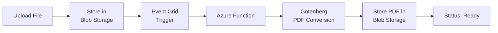
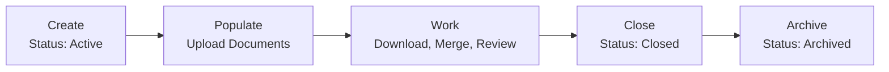

[Home](../../README.md) > [Guides](.) > **User Guide**

# AssuranceNet Document Management System -- User Guide

**Version:** 1.0
**Audience:** FSIS staff and administrators
**Last Updated:** March 2026

> **TL;DR:** AssuranceNet is the FSIS replacement for Oracle UCM. It lets you organize documents by investigation, upload files with automatic PDF conversion, merge multiple PDFs, track version history, and review audit logs -- all through your organizational Microsoft account.

---

## Table of Contents

1. [Getting Started](#1-getting-started)
2. [Dashboard](#2-dashboard)
3. [Managing Investigations](#3-managing-investigations)
4. [Document Management](#4-document-management)
5. [PDF Operations](#5-pdf-operations)
6. [Version History](#6-version-history)
7. [Audit Log (Admin)](#7-audit-log-admin)
8. [FSIS-Specific Workflows](#8-fsis-specific-workflows)
9. [Tips and Best Practices](#9-tips-and-best-practices)
10. [Troubleshooting](#10-troubleshooting)

---

## 1. Getting Started

### 📋 What Is AssuranceNet?

AssuranceNet Document Management is the FSIS replacement for Oracle Universal Content Manager (UCM). It provides a modern, Azure-native platform for storing, organizing, converting, and auditing food safety investigation documents. If you previously used Oracle UCM to manage investigation files, AssuranceNet is where that work now takes place.

Key capabilities include:

- Organizing documents by investigation record
- Uploading files with automatic PDF conversion
- Merging multiple documents into a single PDF
- Full version history for every document
- Comprehensive audit logging for regulatory compliance

### 🔒 Signing In

AssuranceNet uses your organizational Microsoft account through Microsoft Entra ID (formerly Azure Active Directory). You do not need to create a separate account.

1. Open the AssuranceNet URL provided by your administrator in your web browser.
2. You will see a landing page with the title "AssuranceNet Document Management" and a **Sign in with Microsoft** button.
3. Click **Sign in with Microsoft**. Your browser will redirect to the Microsoft login page.
4. Enter your FSIS organizational email address and password. If your organization requires multi-factor authentication (MFA), complete that step as prompted.
5. After successful authentication, you will be redirected back to AssuranceNet and land on the Dashboard.

> [!TIP]
> If you are already signed in to other Microsoft services in the same browser, the sign-in may happen automatically without prompting for credentials.

### 💡 Navigating the Application

Once signed in, AssuranceNet displays a consistent layout on every page:

| Area | Description |
|------|-------------|
| **Header** | Shown across the top of the screen. Displays the application name and your account information. |
| **Sidebar** | A navigation panel on the left with links to Dashboard, Investigations, and Audit Log (admin only). |
| **Main Content Area** | The central area where page content is displayed. |

Click any item in the sidebar to navigate. The currently active page is highlighted.

### 📎 Browser Requirements

AssuranceNet is a modern web application. Use one of the following browsers for the best experience:

| Browser | Minimum Version |
|---------|----------------|
| Microsoft Edge | 100 or later |
| Google Chrome | 100 or later |
| Mozilla Firefox | 100 or later |
| Apple Safari | 15 or later |

> [!NOTE]
> JavaScript must be enabled. Pop-up blockers should allow downloads from the AssuranceNet domain. Internet Explorer is not supported.

---

## 2. Dashboard

The Dashboard is the first page you see after signing in. It provides a quick overview of your organization's document management activity.

### 📊 Overview Statistics

Three summary cards are displayed at the top of the Dashboard:

| Card | Description |
|------|-------------|
| **Total Investigations** | The total number of investigation records in the system across all statuses (active, closed, archived). |
| **Active** | The count of investigations currently in "active" status. These are investigations that are open and may still receive new documents. |
| **Documents** | The combined number of documents across all investigations. |

These numbers update automatically each time you visit the Dashboard.

### 📋 Recent Investigations

Below the summary cards, a **Recent Investigations** list shows the five most recent investigation records. Each entry displays:

- The investigation title
- The record ID (for example, `INVESTIGATION-00042`)
- The number of documents attached

Click any investigation in the list to go directly to its detail page, where you can view and manage its documents.

### 💡 Quick Navigation

If you need to see all investigations or create a new one, click **Investigations** in the sidebar. To return to the Dashboard at any time, click **Dashboard** in the sidebar or click the application name in the header.

---

## 3. Managing Investigations

### 📋 What Is an Investigation?

An investigation in AssuranceNet represents an FSIS investigation record. Each investigation serves as a container for related documents. Investigations map to the types of work FSIS conducts, such as sampling programs, residue testing, microbiology baseline studies, or establishment inspections.

Every investigation has:

- A **Record ID** in the format `INVESTIGATION-XXXXX` (for example, `INVESTIGATION-00042`). This is a unique identifier that links the investigation to your FSIS records.
- A **Title** that describes the investigation (up to 500 characters).
- An optional **Description** for additional context.
- A **Status** that tracks the investigation lifecycle.
- A **Created By** field showing who created the record.
- Timestamps for creation and last update.
- A count of attached documents.

### 🚀 Creating a New Investigation

1. Navigate to the **Investigations** page using the sidebar.
2. Click the **New Investigation** button.
3. Fill in the required fields:
   - **Record ID** -- Enter the identifier in the format `INVESTIGATION-XXXXX`, where `XXXXX` is a numeric sequence (for example, `INVESTIGATION-00107`). This must be unique across the system.
   - **Title** -- Enter a descriptive title for the investigation (for example, "Q3 2026 National Residue Program Quarterly Report").
   - **Description** (optional) -- Add any additional context that will help colleagues understand the purpose of this investigation.
4. Click **Create**. The investigation is created with an "active" status and you are taken to its detail page.

> [!NOTE]
> If a record ID already exists, the system will display a conflict error. Choose a different record ID and try again.

### 💡 Viewing Investigation Details

From the Investigations list page, click on any investigation to open its detail page. The detail page shows:

- The investigation title, record ID, and description at the top.
- A document upload area.
- The PDF merge toolbar (appears when documents are selected).
- A table listing all documents attached to the investigation.

### ⚙️ Updating Investigation Status

Investigations follow a lifecycle with three statuses:

| Status | Meaning |
|--------|---------|
| **Active** | The investigation is open. Documents can be uploaded, downloaded, and managed. This is the default status for new investigations. |
| **Closed** | The investigation is complete. Documents remain accessible for reference and download. |
| **Archived** | The investigation has been archived for long-term retention. Documents remain accessible but the investigation is no longer considered current. |

To change an investigation's status, open the investigation detail page and use the status controls provided. Status changes are recorded in the audit log.

### 💡 Listing and Searching Investigations

The **Investigations** page displays all investigations in a paginated list. You can:

- **Filter by status** -- Use the status filter to show only active, closed, or archived investigations.
- **Page through results** -- Use the Previous and Next buttons at the bottom of the list. The default page size is 20 investigations.
- **Click to open** -- Click any investigation row to view its details and documents.

---

## 4. Document Management

Documents are the core of AssuranceNet. Every document belongs to an investigation and is stored securely in Azure Blob Storage with full versioning and audit trails.

### 💡 Uploading Documents

You can upload documents from any investigation's detail page.

**Using drag and drop:**

1. Open the investigation where you want to add documents.
2. Locate the upload area, which displays the text "Drag & drop files here, or click to browse."
3. Drag one or more files from your computer and drop them onto the upload area. The border will change color to indicate the drop zone is active.
4. The upload begins automatically. A progress indicator shows while files are being uploaded.
5. Once complete, the document list refreshes to show your new files.

**Using the file browser:**

1. Click anywhere in the upload area.
2. A file selection dialog opens. Navigate to and select the files you want to upload.
3. Click Open. The upload proceeds as described above.

**Upload limits:**

| Limit | Value |
|-------|-------|
| Maximum file size | **500 MB** per file |
| Multiple files | Supported (uploaded sequentially) |

### 📁 Supported File Types

AssuranceNet accepts a wide range of file formats commonly used in FSIS operations:

| Category | Formats |
|----------|---------|
| **Microsoft Word** | .doc, .docx |
| **Microsoft Excel** | .xls, .xlsx |
| **Microsoft PowerPoint** | .ppt, .pptx |
| **Microsoft Visio** | .vsd, .vsdx |
| **Microsoft Publisher** | .pub |
| **PDF** | .pdf |
| **Images** | .jpg, .jpeg, .png, .gif, .tiff, .bmp |
| **Text** | .txt, .csv, .rtf |

> [!NOTE]
> Files uploaded in PDF format are stored as-is and do not go through the conversion pipeline. All other supported formats are automatically queued for PDF conversion after upload.

### 📋 Understanding the Document List

The document list on each investigation's detail page displays a table with the following columns:

| Column | Description |
|--------|-------------|
| **Checkbox** | Select documents for PDF merge operations. Only documents with a "Ready" or "PDF" status can be selected. |
| **Filename** | The original name of the uploaded file. |
| **Size** | The file size displayed in a human-readable format (KB or MB). |
| **PDF Status** | The current state of PDF conversion. See the status descriptions below. |
| **Uploaded** | The date the document was uploaded. |
| **Actions** | Buttons to download the original file, download the PDF version, or delete the document. |

### 💡 Downloading Original Files

To download a document in its original format:

1. Find the document in the document list.
2. Click the **Original** link in the Actions column.
3. The file downloads to your browser's default download location with its original filename.

### 💡 Downloading PDF Versions

To download the PDF version of a document:

1. Find the document in the document list.
2. Verify that the PDF Status shows **Ready** (green badge) or **PDF** (gray badge).
3. Click the **PDF** link in the Actions column.
4. The PDF file downloads with the same base filename and a .pdf extension.

> [!NOTE]
> The PDF link is only available for documents whose conversion has completed successfully or that were uploaded as PDFs originally.

### ⚙️ Understanding PDF Conversion Status

Each document displays a PDF conversion status badge. The possible statuses are:

| Badge | Status | Meaning |
|-------|--------|---------|
| **Pending** (yellow) | `pending` | The document has been uploaded and is waiting to enter the PDF conversion pipeline. This is a brief transitional state. |
| **Converting...** (blue) | `processing` | The document is currently being converted to PDF. This typically takes a few seconds to a few minutes depending on file size and complexity. |
| **Ready** (green) | `completed` | PDF conversion completed successfully. You can download the PDF version and include this document in merge operations. |
| **Failed** (red) | `failed` | PDF conversion encountered an error. The original file is still available for download. Contact your administrator if this persists. |
| **PDF** (gray) | `not_required` | The file was uploaded as a PDF, so no conversion is needed. It is immediately available for PDF download and merge operations. |

### 📋 Viewing Document Details and Metadata

Each document stored in AssuranceNet has detailed metadata that you can review:

| Field | Description |
|-------|-------------|
| **File ID** | A unique system identifier for the document (UUID format). |
| **Original Filename** | The name of the file as it was uploaded. |
| **Content Type** | The MIME type of the file. |
| **File Size** | The exact size of the file in bytes. |
| **SHA-256 Checksum** | A cryptographic hash of the file contents for integrity verification. |
| **Blob Path** | The storage path in Azure Blob Storage (pattern: `{record_id}/{file_id}/blob/{filename}`). |
| **Version ID** | The Azure Blob Storage version identifier for the current version. |
| **Uploaded By** | The name and ID of the user who uploaded the file. |
| **Upload Date** | When the file was uploaded. |
| **PDF Conversion Status** | Whether PDF conversion has been completed. |
| **PDF Conversion Date** | When the PDF was generated (if applicable). |

### ⚠️ Deleting Documents

AssuranceNet uses **soft delete** for document removal. When you delete a document, it is marked as deleted but remains recoverable for 30 days.

> [!WARNING]
> After 30 days, soft-deleted documents are permanently removed. If you need to recover a deleted document within the 30-day window, contact your system administrator.

To delete a document:

1. Find the document in the document list.
2. Click the **Delete** link in the Actions column.
3. A confirmation dialog appears: "Delete [filename]?"
4. Click **OK** to confirm. The document is removed from the list.

All delete operations are recorded in the audit log.

---

## 5. PDF Operations

### ⚙️ Automatic PDF Conversion

When you upload a non-PDF document, AssuranceNet automatically converts it to PDF format in the background. This process works as follows:

1. You upload a file (for example, a .docx Word document).
2. The file is stored in Azure Blob Storage.
3. Azure Event Grid detects the new file and triggers an Azure Function.
4. The Azure Function sends the file to the Gotenberg conversion service (powered by LibreOffice) for PDF rendering.
5. The resulting PDF is stored alongside the original file in Blob Storage.
6. The document's PDF status is updated to "Ready."

> [!TIP]
> You do not need to take any action to initiate conversion. It happens automatically. The typical conversion time is a few seconds to a few minutes depending on file size and format complexity.

If a file is already in PDF format, the status is set to "PDF" (not_required) and no conversion occurs.

### 📊 Conversion Status Monitoring

You can monitor conversion progress by watching the **PDF Status** column in the document list:

- A **Pending** (yellow) badge means the document is queued.
- A **Converting...** (blue) badge means conversion is in progress.
- A **Ready** (green) badge means the PDF is available.
- A **Failed** (red) badge means conversion was unsuccessful.

> [!NOTE]
> If you have just uploaded several files, you may need to refresh the page after a minute or two to see updated statuses. The document list does not auto-refresh.

### 💡 On-Demand PDF Merge

You can combine multiple documents into a single merged PDF. This is useful for assembling complete investigation packages, compiling quarterly reports, or creating consolidated review documents.

**How to merge PDFs:**

1. Open the investigation that contains the documents you want to merge.
2. In the document list, use the checkboxes in the left column to select the documents you want to include. Only documents with a "Ready" or "PDF" status can be selected (the checkbox is disabled for documents still pending conversion or that failed).
3. As you select documents, a blue toolbar appears above the document list showing the number of selected files and a **Merge PDFs** button.
4. Click **Merge PDFs**. The system combines the selected documents into a single PDF.
5. The merged PDF downloads automatically to your computer. The filename follows the pattern `{record_id}-merged.pdf` (for example, `INVESTIGATION-00042-merged.pdf`).
6. The selection clears after a successful merge.

> [!IMPORTANT]
> The merged PDF is generated on demand and streamed directly to your browser. It is **not** saved in AssuranceNet. If you need the merged file again, perform the merge again or save the downloaded file.

### ⚠️ Merge Limitations

| Limit | Value |
|-------|-------|
| Minimum documents per merge | 2 |
| Maximum documents per merge | 50 |
| Maximum combined file size | 500 MB |
| Persistence | Not stored -- download only |

If you exceed these limits, the system displays an error message. Reduce your selection and try again.

---

## 6. Version History

### 🏗️ How Versioning Works

AssuranceNet uses Azure Blob Storage native versioning to maintain a complete history of every document. Each time a document is modified or re-uploaded, a new version is created automatically. Previous versions are preserved and remain accessible.

Version history is maintained at the storage level, which means:

- Every version is an immutable snapshot of the file at a point in time.
- Versions cannot be edited or tampered with after creation.
- Each version has its own unique version ID assigned by Azure Blob Storage.

### 💡 Viewing Version History

To view the version history of a document:

1. Open the investigation containing the document.
2. Find the document in the document list and click to expand its details or access version history.
3. The version history panel displays a list of all versions, from most recent to oldest.

Each version entry shows:

| Field | Description |
|-------|-------------|
| **Date and Time** | When this version was created, displayed in your local time zone. |
| **Size** | The file size of this specific version (may differ between versions if the file was modified). |
| **Current** | A green "Current" badge indicates which version is the active (most recent) version. |

### 💡 Downloading a Specific Version

To download a previous version of a document:

1. Open the version history panel for the document.
2. Find the version you need.
3. Click the **Download** link next to that version.
4. The file downloads with a filename that includes the version identifier.

> [!TIP]
> This allows you to retrieve any historical version of a document, which is particularly valuable for compliance and audit purposes.

### 📋 Version Metadata

Each version is identified by the following metadata:

| Field | Description |
|-------|-------------|
| **Version ID** | A unique string assigned by Azure Blob Storage. This is the authoritative identifier for the version. |
| **Last Modified** | The timestamp when this version was created. |
| **Content Length** | The size of the file in bytes for this version. |
| **Is Current** | A boolean indicating whether this is the active (latest) version of the document. |

---

## 7. Audit Log (Admin)

### 🔒 Who Can Access the Audit Log

The Audit Log page is restricted to users with the **Admin** role. This role is assigned through Microsoft Entra ID group memberships by your organization's IT administrators. If you navigate to the Audit Log page without the Admin role, you will see a message indicating that no entries were found or that access is restricted.

> [!NOTE]
> If you believe you should have access to the Audit Log and do not, contact your IT administrator to request the Admin role assignment.

### 📊 What Is Logged

AssuranceNet maintains a comprehensive audit trail of all significant actions in the system. The following events are recorded:

| Event Type | Description |
|------------|-------------|
| `document.upload` | A document was uploaded to an investigation. |
| `document.download` | A document (original or PDF) was downloaded. |
| `document.delete` | A document was soft-deleted. |
| `document.merge` | Multiple documents were merged into a single PDF. |
| `document.version_access` | A specific historical version of a document was accessed. |
| `document.pdf_converted` | A document's PDF conversion completed. |
| `investigation.create` | A new investigation was created. |
| `investigation.update` | An investigation's title, description, or status was modified. |
| `auth.login` | A user signed in. |
| `auth.logout` | A user signed out. |
| `auth.denied` | An authentication or authorization attempt was denied. |

### 📋 Audit Record Fields

Each audit log entry contains the following fields:

| Field | Description |
|-------|-------------|
| **Timestamp** | The date and time the event occurred, in UTC. |
| **Event Type** | The category of event (for example, `document.upload`). |
| **User** | The user principal name (email) of the user who performed the action, or the user ID if the name is not available. |
| **Action** | The type of operation: `create`, `read`, `update`, `delete`, or `merge`. |
| **Result** | The outcome: `success`, `failure`, or `denied`. |
| **Resource ID** | The identifier of the affected resource (document file ID, investigation ID, etc.). |
| **IP Address** | The IP address from which the request originated. |
| **Correlation ID** | A unique identifier that links related log entries across a single request. Useful for troubleshooting and tracing operations through the system. |
| **Details** | Additional context about the event (for example, the filename of an uploaded document, the number of files in a merge operation). |

### 💡 Filtering and Searching Audit Logs

The Audit Log page displays entries in a paginated table with 50 entries per page. You can:

- **Page through results** using the **Previous** and **Next** buttons at the bottom of the page.
- **View entry counts** -- The page shows "Showing X of Y entries" to indicate your position in the full log.
- **Filter by event type** -- Narrow results to a specific event type (for example, show only `document.upload` events).
- **Filter by user** -- View events for a specific user.
- **Filter by resource** -- View all events related to a specific document or investigation.
- **Filter by date range** -- Specify start and end dates to limit results to a time window.

Results are displayed in reverse chronological order (most recent events first).

### 🔒 NIST 800-53 Compliance Context

The audit logging system in AssuranceNet is designed to support compliance with NIST 800-53 Rev 5 security controls, which are required for federal information systems:

| Control | Description |
|---------|-------------|
| **AU-2 (Event Logging)** | All document and investigation operations are logged with the event types listed above. |
| **AU-3 (Content of Audit Records)** | Each record includes timestamp, user identity, event type, action, result, resource identifier, IP address, and correlation ID. |
| **AU-11 (Audit Record Retention)** | Audit records are retained for 90 days in the interactive query interface, with a 3-year archive for long-term compliance. |

---

## 8. FSIS-Specific Workflows

The following sections describe how common FSIS document management scenarios map to AssuranceNet operations.

### 💡 Sampling Program Document Management

FSIS sampling programs generate periodic documents that need to be stored, versioned, and made accessible to program staff.

**Typical documents:** Annual Sampling Plans, Quarterly sampling reports, Sampling schedule updates, Results summaries

**Recommended workflow:**

1. Create an investigation for each sampling program year or cycle. Example: `INVESTIGATION-20260` with title "FY2026 Annual Sampling Program."
2. Upload the Annual Sampling Plan document at the start of the fiscal year.
3. As quarterly reports are generated, upload them to the same investigation. Each report is timestamped and versioned automatically.
4. When the fiscal year ends, update the investigation status to "Closed."
5. Use the PDF merge feature to assemble a complete year-end package by selecting all quarterly reports and the annual plan.

### 💡 National Residue Program Documents

The National Residue Program (NRP) produces several key reference documents and periodic reports.

**Typical documents:** Red Book (Compound and Animal Evaluation), Blue Book (Scheduled Sampling Plans), Quarterly Residue Reports, Annual Residue Data Summary

**Recommended workflow:**

1. Create a dedicated investigation for each fiscal year of the NRP. Example: `INVESTIGATION-20261` with title "FY2026 National Residue Program."
2. Upload the current Red Book and Blue Book at the beginning of the program year.
3. Upload quarterly reports as they become available.
4. When updated editions of reference books are released, upload the new versions. AssuranceNet versioning preserves the previous editions automatically.
5. Use the version history feature to access older editions when needed for reference or audit purposes.

### 💡 Microbiology Data Management

Microbiology programs at FSIS produce baseline studies and periodic surveillance reports.

**Typical documents:** Baseline survey reports, Quarterly Salmonella and Campylobacter performance reports, Exploratory sampling results, Method validation documents

**Recommended workflow:**

1. Create an investigation per baseline study or surveillance cycle. Example: `INVESTIGATION-20262` with title "Broiler Baseline Study 2026."
2. Upload raw data files, analysis reports, and summary documents to the investigation.
3. Use PDF merge to compile quarterly surveillance reports into a single downloadable package for distribution.
4. Archive the investigation after the study period concludes.

### 💡 Establishment Directory Management

FSIS maintains directories of inspected establishments that are updated periodically.

**Typical documents:** MPI Directory CSV files, Establishment listing updates, Regulatory correspondence

**Recommended workflow:**

1. Create an investigation for directory management. Example: `INVESTIGATION-20263` with title "MPI Directory 2026."
2. Upload each directory update as a new document. The version history tracks every update.
3. When you need to reference a specific point-in-time version of the directory, use version history to download that exact file.

### 💡 Inspection Task Documentation

Field inspection activities generate various supporting documents.

**Typical documents:** Inspection checklists, Non-compliance reports, Photographs of conditions, Corrective action plans

**Recommended workflow:**

1. Create an investigation tied to the specific inspection case. Example: `INVESTIGATION-20264` with title "Establishment 12345 - Routine Inspection March 2026."
2. Upload photographs, completed checklists, and reports as documents within the investigation.
3. Use PDF merge to create a consolidated inspection report that includes all relevant documents.
4. Once the inspection case is resolved, close the investigation.
5. If the case is later referenced in enforcement actions, the full document trail remains accessible with complete version history and audit records.

### 📋 Investigation Lifecycle Summary

A typical investigation in AssuranceNet follows this lifecycle:

1. **Create** -- A new investigation is created with status "Active." Record ID and title are assigned.
2. **Populate** -- Documents are uploaded to the investigation over time. Each upload is versioned and audit-logged.
3. **Work** -- Staff download originals and PDFs, merge documents for review packages, and reference version history as needed.
4. **Close** -- When the investigation's purpose is fulfilled, the status is changed to "Closed." Documents remain fully accessible.
5. **Archive** -- For long-term retention, the status is changed to "Archived." The investigation and all its documents continue to be accessible for compliance and historical reference.

---

## 9. Tips and Best Practices

### 💡 File Naming Conventions

Consistent file naming makes it easier to identify documents in the list and in merged PDFs.

- Include the date in filenames when relevant: `2026-Q1-Residue-Report.docx`
- Use descriptive names rather than generic ones: `Broiler-Baseline-Summary.xlsx` rather than `report.xlsx`
- Avoid special characters in filenames. Stick to letters, numbers, hyphens, and underscores.
- Keep filenames reasonably short (under 100 characters) for readability in the document list.

### 💡 Organizing Documents by Investigation

- Create one investigation per logical work unit (one inspection case, one program year, one baseline study).
- Avoid putting unrelated documents in the same investigation. It is better to have more focused investigations than fewer overloaded ones.
- Use the investigation description field to record context that may not be obvious from the title alone.

### 💡 When to Merge PDFs vs. Download Individually

| Use Case | Recommendation |
|----------|---------------|
| Need a single combined document for email/printing/review | **Merge PDFs** |
| Assembling a report package with multiple components | **Merge PDFs** |
| Sharing with stakeholders without AssuranceNet access | **Merge PDFs** |
| Need to edit the original file | **Download individually** |
| Only need one or two specific documents | **Download individually** |
| Need the file in its original format (Word, Excel, etc.) | **Download individually** |

### 💡 Checking Conversion Status Before Merging

Before initiating a PDF merge, verify that all documents you want to include have a "Ready" (green) or "PDF" (gray) status. Documents that are still "Pending" or "Converting" cannot be included in a merge. If some documents have not finished converting, wait a few minutes and refresh the page before trying again.

### 🔒 Using Checksums for Data Integrity Verification

Every document in AssuranceNet has a SHA-256 checksum computed at upload time. This checksum is a cryptographic fingerprint of the file's contents. You can use it to:

- **Verify download integrity.** After downloading a file, compute its SHA-256 checksum locally and compare it to the value shown in AssuranceNet. If they match, the file was not corrupted during download.
- **Confirm document identity.** If two documents have the same SHA-256 checksum, their contents are identical, regardless of filename.
- **Support audit and legal processes.** The checksum provides a tamper-evident record that a specific file was stored in the system at a specific time.

To compute a SHA-256 checksum on your workstation:

| Platform | Command |
|----------|---------|
| Windows (PowerShell) | `Get-FileHash -Algorithm SHA256 .\filename.docx` |
| macOS/Linux | `sha256sum filename.docx` |

---

## 10. Troubleshooting

### 🔧 "Sign in failed" or Authentication Errors

| Possible Cause | What to Try |
|----------------|-------------|
| Browser cookies are blocked or expired. | Clear your browser cookies for the Microsoft login domain, then try again. |
| Your Entra ID account is not provisioned for AssuranceNet. | Contact your IT administrator to verify that your account has been granted access to the AssuranceNet application in Microsoft Entra ID. |
| Browser is outdated. | Update to the latest version of Edge, Chrome, Firefox, or Safari. |
| Using a private/incognito window. | Some organizations restrict authentication in private browsing. Try a regular browser window. |
| Multi-factor authentication (MFA) issue. | Ensure your MFA device is available and configured. If MFA is failing, contact your IT helpdesk. |

### 🔧 Upload Fails

| Possible Cause | What to Try |
|----------------|-------------|
| File exceeds the 500 MB size limit. | Reduce the file size or split it into smaller parts before uploading. |
| Network connection was interrupted. | Check your internet connection and try uploading again. |
| Unsupported file format. | Verify the file is one of the supported types listed in Section 4. |
| The investigation does not exist or was deleted. | Return to the Investigations list and confirm the investigation is still present. |
| Browser timeout on large files. | For very large files, ensure you have a stable network connection. Avoid navigating away from the page during upload. |

### 🔧 PDF Conversion Stuck on "Pending"

If a document remains in "Pending" status for more than 10 minutes:

1. **Wait and refresh.** There may be a temporary delay in the Azure Event Grid trigger pipeline. Refresh the page after a few minutes.
2. **Check other documents.** If all recently uploaded documents are stuck on "Pending," there may be a system-wide delay. Contact your administrator.
3. **File format.** Some file formats may take longer to process than others. Very large files or files with complex formatting may require additional processing time.

> [!NOTE]
> The original file is always available for download regardless of conversion status.

### 🔧 PDF Conversion Shows "Failed"

A "Failed" status means the conversion service was unable to produce a PDF from the original file. Common reasons include:

- The file uses a format variant not supported by the converter (for example, a password-protected document or a corrupted file).
- The file is very large with complex embedded content (high-resolution images, embedded videos, or macros).

**What to do:**

1. Download the original file and try saving it as PDF manually from the native application (for example, use "Save As PDF" in Microsoft Word).
2. Upload the manually-created PDF to the same investigation.
3. If the issue persists across many files, contact your system administrator with the filename and record ID.

### 🔧 Cannot Access Audit Logs

The Audit Log page requires the **Admin** role. If you see a message indicating no audit entries or that access is restricted:

1. Confirm that you need audit log access for your role.
2. Contact your IT administrator and request the "Admin" app role for the AssuranceNet application in Microsoft Entra ID.
3. After the role is assigned, sign out and sign back in for the changes to take effect.

### 🔧 Download Not Starting

| Possible Cause | What to Try |
|----------------|-------------|
| Pop-up blocker is intercepting the download. | Configure your browser to allow pop-ups and downloads from the AssuranceNet domain. |
| Browser download settings. | Check your browser's download settings. Some browsers require you to choose a download location each time, and the dialog may be hidden behind other windows. |
| Network timeout. | For large files, the download may take time to start. Wait a moment and check your downloads folder. |
| The document was deleted. | If the document was recently removed, it may no longer be available for download. |

### 🔧 General Tips for Resolving Issues

- **Refresh the page.** Many transient issues resolve with a page refresh.
- **Clear browser cache.** If the application behaves unexpectedly, clearing your browser cache and cookies for the AssuranceNet domain often resolves the issue.
- **Try a different browser.** If an issue persists in one browser, try another supported browser to determine if the problem is browser-specific.
- **Contact your administrator.** For persistent issues, provide your administrator with the following details: the action you were trying to perform, the investigation record ID (if applicable), the document filename (if applicable), the approximate time the issue occurred, and any error messages displayed.

---

*This guide covers the AssuranceNet Document Management System as deployed for FSIS. For technical documentation, architecture details, or API references, refer to the project documentation at `docs/architecture/`. For operational procedures, refer to the runbooks at `docs/runbooks/`.*

---

> **Navigation:** [Guides Home](README.md) | [Deployment Guide](deployment-guide.md) | [Developer Guide](developer-guide.md) | [Operations Guide](operations-guide.md) | [Best Practices](best-practices.md) | [Troubleshooting](troubleshooting.md)
