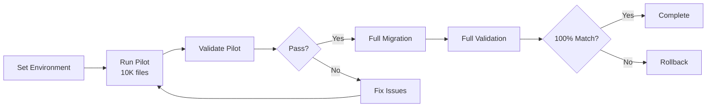

[Home](../../README.md) > [Runbooks](.) > **Data Migration Runbook**

# Data Migration Execution Runbook

> **TL;DR:** Step-by-step execution plan for migrating documents from Oracle UCM to AssuranceNet, including pilot validation, full migration, and rollback procedures. For migration strategy overview, see [Data Migration Strategy](../architecture/data-migration.md). For FSIS demo data setup, see [scripts/setup/fsis-demo-data.json](../../scripts/setup/fsis-demo-data.json).

---

## Table of Contents

- [Pre-Migration Checklist](#-pre-migration-checklist)
- [Execution](#-execution)
- [Rollback](#-rollback)
- [Post-Migration](#-post-migration)

---

## 📎 Pre-Migration Checklist

> [!IMPORTANT]
> All items must be completed and verified before starting the migration.

- [ ] Azure infrastructure deployed and validated
- [ ] UCM export path accessible from migration host
- [ ] Storage account connectivity verified
- [ ] SQL database schema migrated (Alembic)
- [ ] Migration scripts tested with pilot batch

---

## 📦 Execution



### ⚙️ Step 1: Set Environment

```bash
export AZURE_STORAGE_ACCOUNT_NAME=stassurancenetdev
export UCM_EXPORT_PATH=/mnt/ucm-export
export MIGRATION_BATCH_SIZE=10000
export MIGRATION_MAX_WORKERS=20
export MIGRATION_BATCH_ID=batch-$(date +%Y%m%d)
```

---

### 🧪 Step 2: Run Pilot (10K files)

```bash
python scripts/migration/migrate_ucm_to_blob.py
```

> [!NOTE]
> The pilot batch processes the first 10,000 files. Monitor progress via logs and the migration status table.

---

### ✅ Step 3: Validate Pilot

```bash
python scripts/migration/validate_migration.py
```

> [!WARNING]
> Do not proceed to full migration if the pilot validation shows any checksum mismatches or missing files.

---

### 📦 Step 4: Full Migration

Repeat Step 2 with full export path. Monitor progress via logs.

---

### ✅ Step 5: Full Validation

```bash
python scripts/migration/validate_migration.py
# Expect: 100% checksum match, all metadata populated
```

---

## 🔧 Rollback (if needed)

> [!CAUTION]
> Rollback will remove all migrated data from Azure. This action requires manual confirmation.

```bash
python scripts/migration/rollback_migration.py
# Requires typing 'CONFIRM' to proceed
```

---

## ✅ Post-Migration

- [ ] File count matches UCM inventory
- [ ] SHA-256 checksums verified for 100% of files
- [ ] PDF conversion completed for eligible files
- [ ] Application switched to Azure backend
- [ ] 30-day parallel run monitoring started

> [!TIP]
> Keep Oracle UCM running in read-only mode for 30 days after migration. This provides a safety net for any issues discovered post-cutover.

---

> **Related:** [Data Migration Strategy](../architecture/data-migration.md) | [Deployment Runbook](deployment.md) | [Operations Guide](../guides/operations-guide.md)
