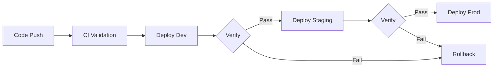

[Home](../../README.md) > [Runbooks](.) > **Deployment Runbook**

# Deployment Runbook

> **TL;DR:** Concise deployment steps for infrastructure, backend, frontend, and database. For comprehensive step-by-step instructions covering Portal, CLI, PowerShell, Bicep, and GitHub Actions methods, see the [Deployment Guide](../guides/deployment-guide.md).

---

## Table of Contents

- [Prerequisites](#-prerequisites)
- [Infrastructure Deployment](#-infrastructure-deployment)
- [Backend Deployment](#-backend-deployment)
- [Frontend Deployment](#-frontend-deployment)
- [Database Migration](#-database-migration)
- [Post-Deployment Verification](#-post-deployment-verification)

---

## 📎 Prerequisites

- [ ] Azure CLI installed and authenticated (`az login`)
- [ ] GitHub Actions secrets configured (OIDC federated credentials)
- [ ] Entra ID app registrations created

> [!IMPORTANT]
> Ensure all prerequisites are met before proceeding. Missing any of these will cause deployment failures.

---

## 📦 Infrastructure Deployment

### Dev (automatic on push to main)

Triggers when `infra/**` files change on `main` branch.

### Manual deployment

```bash
# Validate
az deployment sub what-if --location eastus \
  --template-file infra/main.bicep \
  --parameters infra/parameters/dev.bicepparam

# Deploy
az deployment sub create --location eastus \
  --template-file infra/main.bicep \
  --parameters infra/parameters/dev.bicepparam
```

> [!WARNING]
> Always run `what-if` before deploying to production. Review the output carefully before applying changes.

---

## 📦 Backend Deployment

- [ ] Push to `main` with changes in `src/backend/`
- [ ] CI runs: ruff lint, mypy, pytest
- [ ] Deploys to App Service dev environment
- [ ] Smoke test passes:

```bash
curl https://app-assurancenet-api-dev.azurewebsites.net/api/v1/health
```

---

## 📦 Frontend Deployment

- [ ] Push to `main` with changes in `src/frontend/`
- [ ] CI runs: eslint, tsc, vitest
- [ ] Builds with Vite, deploys to Static Web App

---

## 🗄️ Database Migration

```bash
# Via GitHub Actions workflow dispatch
# Or manually:
cd src/backend/app/db/migrations
alembic upgrade head
```

> [!CAUTION]
> Always test migrations in dev/staging before running against production. Database downgrades may result in data loss.

---

## ✅ Post-Deployment Verification

- [ ] Health endpoint returns 200
- [ ] Readiness endpoint shows all checks passing
- [ ] Frontend loads and auth flow works
- [ ] Document upload/download works
- [ ] PDF conversion pipeline triggers



---

> **Related:** [Deployment Guide](../guides/deployment-guide.md) | [Incident Response](incident-response.md) | [Operations Guide](../guides/operations-guide.md)
