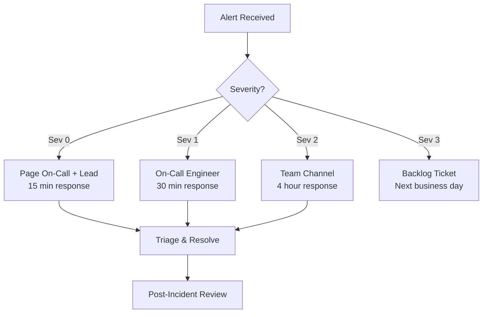

[Home](../../README.md) > [Runbooks](.) > **Incident Response Runbook**

# Incident Response Runbook

> **TL;DR:** Severity classification, triage procedures, and escalation paths for AssuranceNet incidents. For detailed troubleshooting steps organized by symptom, see the [Troubleshooting Guide](../guides/troubleshooting.md). For monitoring and alert procedures, see the [Operations Guide](../guides/operations-guide.md).

---

## Table of Contents

- [Severity Classification](#-severity-classification)
- [Common Scenarios](#-common-scenarios)
- [Escalation](#-escalation)

---

## 📋 Severity Classification

| Sev | Definition | Response Time | Examples |
|-----|-----------|---------------|---------|
| **0** | Service down | 15 min | API 5xx > 5%, storage unavailable |
| **1** | Degraded | 30 min | High latency, PDF failures |
| **2** | Minor issue | 4 hours | Warning alerts, capacity |
| **3** | Informational | Next business day | Trend anomalies |



---

## 🔧 Common Scenarios

### API 5xx Spike

> [!IMPORTANT]
> Severity 0 -- Respond within 15 minutes.

- [ ] Check App Insights exceptions:
  ```kql
  AppExceptions | where TimeGenerated > ago(1h)
  ```
- [ ] Check App Service logs: Azure Portal > App Service > Log Stream
- [ ] Verify database connectivity: readiness endpoint
- [ ] Check for deployment in progress

---

### PDF Conversion Failures

> [!WARNING]
> Severity 1 -- Documents may accumulate in "pending" status.

- [ ] Check Function App logs:
  ```kql
  FunctionAppLogs | where Level == "Error"
  ```
- [ ] Verify Gotenberg health: Container Apps > Logs
- [ ] Check Event Grid dead-letter container for failed events
- [ ] Verify storage connectivity from Functions subnet

---

### Authentication Issues

- [ ] Check Entra ID sign-in logs
- [ ] Verify MSAL configuration matches app registration
- [ ] Check JWT audience/issuer settings
- [ ] Verify Front Door is forwarding auth headers

---

### Storage Access Denied

- [ ] Verify Managed Identity role assignments
- [ ] Check Private Endpoint DNS resolution
- [ ] Verify storage account firewall rules
- [ ] Check for key rotation events in Key Vault audit

---

## 📊 Escalation

| Severity | Action |
|----------|--------|
| **Sev 0/1** | Page on-call engineer immediately |
| **Sev 2** | Notify team channel, assign during business hours |
| **Sev 3** | Log in backlog for next sprint |

> [!TIP]
> Always collect correlation IDs, timestamps, and affected user information before escalating. This speeds up root cause analysis.

---

> **Related:** [Troubleshooting Guide](../guides/troubleshooting.md) | [Operations Guide](../guides/operations-guide.md) | [Deployment Runbook](deployment.md)
