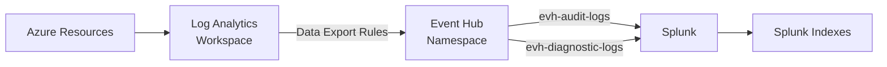

[Home](../../README.md) > [Runbooks](.) > **Splunk Integration Runbook**

# Splunk Integration Verification Runbook

> **TL;DR:** Steps to verify and troubleshoot the Log Analytics to Event Hub to Splunk log forwarding pipeline. For monitoring architecture details, see [Monitoring & Telemetry](../architecture/monitoring-telemetry.md). For operational procedures, see [Operations Guide](../guides/operations-guide.md).

---

## Table of Contents

- [Architecture](#-architecture)
- [Setup Verification](#-setup-verification)
- [Log Categories in Splunk](#-log-categories-in-splunk)
- [Troubleshooting](#-troubleshooting)

---

## 🏗️ Architecture



> [!NOTE]
> The Splunk Add-on for Microsoft Cloud Services consumes events from Event Hub using the `splunk` consumer group on the audit hub.

---

## ✅ Setup Verification

### ⚙️ 1. Verify Event Hub

```bash
az eventhubs namespace show --name evhns-assurancenet-splunk-dev -g rg-assurancenet-monitoring-dev
```

---

### ⚙️ 2. Verify Data Export Rules

Check Log Analytics workspace > Data Export for active rules targeting:

| Export Rule Target | Log Types |
|-------------------|-----------|
| `evh-audit-logs` | SecurityEvent, audit_log custom table |
| `evh-diagnostic-logs` | All diagnostic categories |

---

### 🔒 3. Verify Splunk Connectivity

- [ ] Splunk Add-on for Microsoft Cloud Services installed
- [ ] Azure Event Hubs Data Receiver role assigned to Splunk identity
- [ ] Consumer group `splunk` exists on audit hub

---

## 📊 Log Categories in Splunk

| Source | Event Hub | Splunk Index |
|--------|----------|-------------|
| Application audit events | evh-audit-logs | main |
| Azure Activity Logs | evh-diagnostic-logs | azure_activity |
| Blob Storage access | evh-diagnostic-logs | azure_storage |
| SQL security audit | evh-diagnostic-logs | azure_sql |
| Key Vault audit | evh-diagnostic-logs | azure_security |
| Front Door WAF | evh-diagnostic-logs | azure_waf |

---

## 🔧 Troubleshooting

> [!TIP]
> Work through these steps in order. Most Splunk integration issues stem from Event Hub connectivity or data export rule misconfiguration.

- [ ] Check Event Hub metrics for incoming/outgoing messages
- [ ] Verify Splunk data input is running
- [ ] Check Splunk `_internal` logs for ingestion errors
- [ ] Verify network connectivity (Private Endpoint if applicable)

| Symptom | Likely Cause | Resolution |
|---------|-------------|------------|
| No data in Splunk | Data Export rule inactive | Re-enable export rule in Log Analytics |
| Partial data | Consumer group lag | Increase Splunk consumers or Event Hub TUs |
| Connection errors | Private Endpoint DNS | Verify DNS resolution to private IP |
| Throttled messages | Insufficient throughput | Increase Event Hub throughput units |

---

> **Related:** [Monitoring & Telemetry](../architecture/monitoring-telemetry.md) | [Operations Guide](../guides/operations-guide.md) | [Incident Response](incident-response.md)
